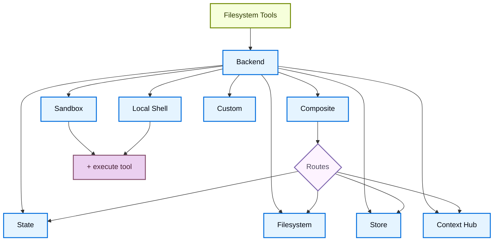

# 백엔드 (Backends)

> 원문: https://docs.langchain.com/oss/python/deepagents/backends
>
> Deep Agents의 파일 시스템 백엔드를 선택하고 구성합니다. 경로별 라우팅, 가상 파일 시스템 구현, 정책 적용 방법을 다룹니다.

---

Deep Agents는 `ls`, `read_file`, `write_file`, `edit_file`, `glob`, `grep` 같은 도구를 통해 에이전트에 파일 시스템 표면을 노출합니다. 이 도구들은 플러그형 백엔드를 통해 동작합니다. `read_file` 도구는 모든 백엔드에서 이미지 파일(`.png`, `.jpg`, `.jpeg`, `.gif`, `.webp`)을 기본 지원하며, 멀티모달 콘텐츠 블록으로 반환합니다.

샌드박스와 [`LocalShellBackend`](https://reference.langchain.com/python/deepagents/backends/local_shell/LocalShellBackend)는 추가로 `execute` 도구를 제공합니다.

이 페이지에서는 다음 방법을 설명합니다.

- [백엔드 선택](#-백엔드-지정)
- [경로별 다른 백엔드로 라우팅](#-서로-다른-백엔드로-라우팅)
- [자체 가상 파일 시스템 구현](#-가상-파일-시스템-사용) (예: S3, Postgres)
- 파일 시스템 접근에 대한 [권한 설정](#-권한permissions)
- 백엔드 프로토콜 [준수](#-프로토콜-레퍼런스)

---

## 📖 목차

1. [빠른 시작](#-빠른-시작)
2. [기본 내장 백엔드](#-기본-내장-백엔드)
   - [StateBackend](#statebackend)
   - [FilesystemBackend (로컬 디스크)](#filesystembackend-로컬-디스크)
   - [LocalShellBackend (로컬 셸)](#localshellbackend-로컬-셸)
   - [StoreBackend (LangGraph store)](#storebackend-langgraph-store)
   - [ContextHubBackend](#contexthubbackend)
   - [CompositeBackend (라우터)](#compositebackend-라우터)
3. [백엔드 지정](#-백엔드-지정)
4. [서로 다른 백엔드로 라우팅](#-서로-다른-백엔드로-라우팅)
5. [가상 파일 시스템 사용](#-가상-파일-시스템-사용)
6. [권한(Permissions)](#-권한permissions)
7. [정책 훅 추가](#-정책-훅-추가)
8. [백엔드 팩토리에서 마이그레이션](#-백엔드-팩토리에서-마이그레이션)
9. [프로토콜 레퍼런스](#-프로토콜-레퍼런스)

---

## 🚀 빠른 시작

다음은 deep agent에 빠르게 적용할 수 있는 사전 빌드된 파일 시스템 백엔드 목록입니다.

| 기본 내장 백엔드 | 설명 |
| --- | --- |
| [기본값(Default)](#statebackend) | `agent = create_deep_agent(model="google_genai:gemini-3.1-pro-preview")` <br /> 스레드 스코프. 에이전트의 기본 파일 시스템 백엔드는 `langgraph` 상태에 저장됩니다. 파일은 (체크포인터를 통해) 동일 스레드의 여러 턴에 걸쳐 유지되며, 다른 스레드와는 공유되지 않습니다. |
| [로컬 파일 시스템 영속화](#filesystembackend-로컬-디스크) | `agent = create_deep_agent(model="google_genai:gemini-3.1-pro-preview", backend=FilesystemBackend(root_dir="/Users/nh/Desktop/"))` <br /> 로컬 머신의 파일 시스템에 deep agent가 접근할 수 있게 합니다. 에이전트가 접근 가능한 루트 디렉터리를 지정할 수 있습니다. 전달하는 `root_dir`은 반드시 절대 경로여야 합니다. |
| [영속 스토어(LangGraph store)](#storebackend-langgraph-store) | `agent = create_deep_agent(model="google_genai:gemini-3.1-pro-preview", backend=StoreBackend())` <br /> 에이전트에 *스레드 간 영속되는* 장기 저장소 접근 권한을 부여합니다. 여러 실행에 걸쳐 적용되는 장기 메모리나 지시 사항을 저장하기에 적합합니다. |
| [Context Hub](#contexthubbackend) | `agent = create_deep_agent(model="google_genai:gemini-3.1-pro-preview", backend=ContextHubBackend("my-agent"))` <br /> 별도의 LangGraph 스토어를 프로비저닝하지 않고 LangSmith Hub 리포지토리에 파일을 영속적으로 저장합니다. |
| [Sandbox](https://docs.langchain.com/oss/python/deepagents/sandboxes) | `agent = create_deep_agent(model="google_genai:gemini-3.1-pro-preview", backend=sandbox)` <br /> 격리된 환경에서 코드를 실행합니다. 샌드박스는 파일 시스템 도구와 함께 셸 명령 실행을 위한 `execute` 도구를 제공합니다. Modal, Daytona, Deno, 로컬 VFS 중에서 선택할 수 있습니다. |
| [Local shell](#localshellbackend-로컬-셸) | `agent = create_deep_agent(model="google_genai:gemini-3.1-pro-preview", backend=LocalShellBackend(root_dir=".", env={"PATH": "/usr/bin:/bin"}))` <br /> 호스트에서 직접 파일 시스템과 셸 실행을 수행합니다. 격리가 없으므로 통제된 개발 환경에서만 사용하세요. 아래 [보안 고려 사항](#localshellbackend-로컬-셸)을 참고하세요. |
| [Composite](#compositebackend-라우터) | 기본은 스레드 스코프, `/memories/`만 스레드 간 영속. Composite 백엔드는 최대한의 유연성을 제공합니다. 파일 시스템의 서로 다른 경로를 서로 다른 백엔드로 지정할 수 있습니다. 바로 붙여 넣어 사용할 수 있는 예시는 아래 Composite 라우팅 섹션을 참고하세요. |



---

## 🧩 기본 내장 백엔드

### StateBackend

```python
from deepagents import create_deep_agent
from deepagents.backends import StateBackend

# By default we provide a StateBackend
agent = create_deep_agent(model="google_genai:gemini-3.1-pro-preview")

# Under the hood, it looks like
agent2 = create_deep_agent(
    model="google_genai:gemini-3.1-pro-preview",
    backend=StateBackend(),
)
```

**동작 방식:**

- 파일을 [`StateBackend`](https://reference.langchain.com/python/deepagents/backends/state/StateBackend)를 통해 현재 스레드의 LangGraph 에이전트 상태에 저장합니다.
- 체크포인트를 통해 동일 스레드의 여러 에이전트 턴에 걸쳐 유지됩니다. 파일은 다른 스레드와 공유되지 않습니다.

> [!WARNING]
> 그래프 내부에서 사용되도록 설계되었습니다. 그래프 실행 외부에서 백엔드 메서드를 호출(예: `state_backend.upload_files(...)`)해도 그래프가 실행되기 전까지는 반영되지 않습니다.

**적합한 사용 사례:**

- 에이전트가 중간 결과를 기록하는 스크래치 패드
- 에이전트가 조각조각 다시 읽을 수 있는 대용량 도구 출력의 자동 축출(eviction)

이 백엔드는 슈퍼바이저 에이전트와 서브에이전트 사이에 공유되며, 서브에이전트가 작성한 파일은 해당 서브에이전트 실행이 끝난 뒤에도 LangGraph 에이전트 상태에 남아 있습니다. 이 파일들은 슈퍼바이저 에이전트와 다른 서브에이전트가 계속 사용할 수 있습니다.

### FilesystemBackend (로컬 디스크)

[`FilesystemBackend`](https://reference.langchain.com/python/deepagents/backends/filesystem/FilesystemBackend)는 구성 가능한 루트 디렉터리 아래에서 실제 파일을 읽고 씁니다.

> [!WARNING]
> 이 백엔드는 에이전트에게 파일 시스템 직접 읽기/쓰기 권한을 부여합니다. 적절한 환경에서만 신중히 사용하세요.
>
> **적합한 사용 사례:**
>
> - 로컬 개발용 CLI (코딩 어시스턴트, 개발 도구)
> - CI/CD 파이프라인 (아래 보안 고려 사항 참고)
>
> **부적합한 사용 사례:**
>
> - 웹 서버 또는 HTTP API — 대신 `StateBackend`, `StoreBackend`, [샌드박스 백엔드](https://docs.langchain.com/oss/python/deepagents/sandboxes)를 사용하세요.
>
> **보안 위험:**
>
> - 에이전트가 시크릿(API 키, 자격증명, `.env` 파일)을 포함해 접근 가능한 모든 파일을 읽을 수 있음
> - 네트워크 도구와 결합하면 SSRF 공격으로 시크릿이 유출될 수 있음
> - 파일 변경은 영구적이며 되돌릴 수 없음
>
> **권장 안전장치:**
>
> 1. 민감한 작업을 검토할 수 있도록 [Human-in-the-Loop (HITL) 미들웨어](https://docs.langchain.com/oss/python/deepagents/human-in-the-loop)를 활성화하세요.
> 2. 접근 가능한 파일 시스템 경로에서 시크릿을 제외하세요 (특히 CI/CD에서).
> 3. 파일 시스템 상호작용이 필요한 프로덕션 환경에서는 [샌드박스 백엔드](https://docs.langchain.com/oss/python/deepagents/sandboxes)를 사용하세요.
> 4. **반드시** `root_dir`과 함께 `virtual_mode=True`를 사용하여 경로 기반 접근 제한(`..`, `~`, 루트 외부 절대 경로 차단)을 활성화하세요. 기본값(`virtual_mode=False`)은 `root_dir`을 설정하더라도 보안을 제공하지 않습니다.

```python
from deepagents import create_deep_agent
from deepagents.backends import FilesystemBackend

agent = create_deep_agent(
    model="google_genai:gemini-3.1-pro-preview",
    backend=FilesystemBackend(root_dir=".", virtual_mode=True),
)
```

**동작 방식:**

- 구성 가능한 `root_dir` 아래에서 실제 파일을 읽고 씁니다.
- `virtual_mode=True`를 설정하여 `root_dir` 아래에서 경로를 샌드박싱하고 정규화할 수 있습니다.
- 안전한 경로 해석을 사용하고, 가능한 경우 위험한 심볼릭 링크 탐색을 방지하며, 빠른 `grep`을 위해 ripgrep을 사용할 수 있습니다.

**적합한 사용 사례:**

- 머신의 로컬 프로젝트
- CI 샌드박스
- 마운트된 영속 볼륨

### LocalShellBackend (로컬 셸)

> [!WARNING]
> 이 백엔드는 에이전트에게 파일 시스템 직접 읽기/쓰기 권한 **및** 호스트에서의 무제한 셸 실행 권한을 부여합니다. 극도로 주의해서 사용하고 적절한 환경에서만 사용하세요.
>
> **적합한 사용 사례:**
>
> - 로컬 개발용 CLI (코딩 어시스턴트, 개발 도구)
> - 에이전트 코드를 신뢰하는 개인 개발 환경
> - 적절한 시크릿 관리가 적용된 CI/CD 파이프라인
>
> **부적합한 사용 사례:**
>
> - 프로덕션 환경 (예: 웹 서버, API, 멀티 테넌트 시스템)
> - 신뢰할 수 없는 사용자 입력 처리 또는 신뢰할 수 없는 코드 실행
>
> **보안 위험:**
>
> - 에이전트가 사용자 권한으로 **임의의 셸 명령**을 실행할 수 있음
> - 에이전트가 시크릿(API 키, 자격증명, `.env` 파일)을 포함해 접근 가능한 모든 파일을 읽을 수 있음
> - 시크릿이 노출될 수 있음
> - 파일 변경과 명령 실행은 **영구적이며 되돌릴 수 없음**
> - 명령이 호스트 시스템에서 직접 실행됨
> - 명령이 CPU, 메모리, 디스크를 무제한으로 소비할 수 있음
>
> **권장 안전장치:**
>
> 1. 실행 전에 작업을 검토하고 승인할 수 있도록 [Human-in-the-Loop (HITL) 미들웨어](https://docs.langchain.com/oss/python/deepagents/human-in-the-loop)를 활성화하세요. **강력히 권장**합니다.
> 2. 전용 개발 환경에서만 실행하세요. 공유 환경이나 프로덕션 시스템에서는 절대 사용하지 마세요.
> 3. 셸 실행이 필요한 프로덕션 환경에서는 [샌드박스 백엔드](https://docs.langchain.com/oss/python/deepagents/sandboxes)를 사용하세요.
>
> **참고:** 셸 접근이 활성화된 상태에서는 명령이 시스템의 어떤 경로에도 접근할 수 있으므로 `virtual_mode=True`는 보안을 제공하지 않습니다.

```python
from deepagents import create_deep_agent
from deepagents.backends import LocalShellBackend

agent = create_deep_agent(
    model="google_genai:gemini-3.1-pro-preview",
    backend=LocalShellBackend(root_dir=".", virtual_mode=True, env={"PATH": "/usr/bin:/bin"}),
)
```

**동작 방식:**

- `FilesystemBackend`를 확장하여 호스트에서 셸 명령을 실행할 수 있는 `execute` 도구를 추가합니다.
- 명령은 `subprocess.run(shell=True)`로 머신에서 직접 실행되며 샌드박싱이 없습니다.
- `timeout`(기본 120초), `max_output_bytes`(기본 100,000), `env`, 환경 변수에 대한 `inherit_env`를 지원합니다.
- 셸 명령은 작업 디렉터리로 `root_dir`을 사용하지만 시스템의 어떤 경로에도 접근할 수 있습니다.

**적합한 사용 사례:**

- 로컬 코딩 어시스턴트와 개발 도구
- 에이전트를 신뢰하는 개발 중의 빠른 반복

### StoreBackend (LangGraph store)

```python
from deepagents import create_deep_agent
from deepagents.backends import StoreBackend
from langgraph.store.memory import InMemoryStore

agent = create_deep_agent(
    model="google_genai:gemini-3.1-pro-preview",
    backend=StoreBackend(
        namespace=lambda rt: (rt.server_info.user.identity,),
    ),
    store=InMemoryStore(),  # Good for local dev; omit for LangSmith Deployment
)
```

> [!NOTE]
> [LangSmith Deployment](https://docs.langchain.com/langsmith/deployment)에 배포할 때는 `store` 파라미터를 생략하세요. 플랫폼이 에이전트용 스토어를 자동으로 프로비저닝합니다.

> [!TIP]
> `namespace` 파라미터는 데이터 격리를 제어합니다. 멀티 유저 배포의 경우, 사용자 또는 테넌트별 데이터 격리를 위해 반드시 [네임스페이스 팩토리](https://docs.langchain.com/oss/python/deepagents/backends#namespace-factories)를 설정하세요.

**동작 방식:**

- [`StoreBackend`](https://reference.langchain.com/python/deepagents/backends/store/StoreBackend)는 런타임이 제공하는 LangGraph [`BaseStore`](https://reference.langchain.com/python/langchain-core/stores/BaseStore)에 파일을 저장하여 스레드 간 영속 저장을 가능하게 합니다.

**적합한 사용 사례:**

- 이미 LangGraph 스토어(예: Redis, Postgres, [`BaseStore`](https://reference.langchain.com/python/langchain-core/stores/BaseStore)를 백엔드로 사용하는 클라우드 구현)를 구성하여 실행 중인 경우
- 에이전트를 [LangSmith Deployment](https://docs.langchain.com/langsmith/deployment)를 통해 배포하는 경우 (스토어가 자동 프로비저닝됨)

#### 네임스페이스 팩토리(Namespace factories)

네임스페이스 팩토리는 `StoreBackend`가 데이터를 읽고 쓰는 위치를 제어합니다. LangGraph [`Runtime`](https://reference.langchain.com/python/langgraph/runtime/Runtime)을 받아 스토어 네임스페이스로 사용할 문자열 튜플을 반환합니다. 네임스페이스 팩토리를 사용해 사용자, 테넌트, 어시스턴트 간 데이터를 격리하세요.

`StoreBackend` 생성 시 `namespace` 파라미터로 네임스페이스 팩토리를 전달하세요.

```python
NamespaceFactory = Callable[[Runtime], tuple[str, ...]]
```

`Runtime`은 다음을 제공합니다.

- `rt.context` — LangGraph의 [context schema](https://langchain-ai.github.io/langgraph/concepts/runtime/)를 통해 전달되는 사용자 제공 컨텍스트 (예: `user_id`)
- `rt.server_info` — LangGraph 서버에서 실행 시 서버 관련 메타데이터(어시스턴트 ID, 그래프 ID, 인증된 사용자)
- `rt.execution_info` — 실행 식별 정보(스레드 ID, 실행 ID, 체크포인트 ID)

> [!NOTE]
> `Runtime` 인자는 `deepagents>=0.5.2`에서 사용 가능합니다. 이전 0.5.x 릴리스에서는 `BackendContext`를 전달했었습니다 — 아래 [`BackendContext`에서 마이그레이션](#backendcontext에서-마이그레이션)을 참고하세요. `rt.server_info`와 `rt.execution_info`는 `deepagents>=0.5.0`이 필요합니다.

**일반적인 네임스페이스 패턴:**

```python
from deepagents.backends import StoreBackend

# Per-user: each user gets their own isolated storage
backend = StoreBackend(
    namespace=lambda rt: (rt.server_info.user.identity,),  # [!code highlight]
)

# Per-assistant: all users of the same assistant share storage
backend = StoreBackend(
    namespace=lambda rt: (
        rt.server_info.assistant_id,  # [!code highlight]
    ),
)

# Per-thread: storage scoped to a single conversation
backend = StoreBackend(
    namespace=lambda rt: (
        rt.execution_info.thread_id,  # [!code highlight]
    ),
)
```

여러 구성 요소를 결합하여 더 세부적인 스코프를 만들 수 있습니다 — 예를 들어 사용자별/대화별 격리를 위해 `(user_id, thread_id)`를 사용하거나, 동일 스코프에서 여러 스토어 네임스페이스를 사용할 때 `"filesystem"` 같은 접미사를 붙여 모호성을 해소할 수 있습니다.

네임스페이스 구성 요소는 영숫자, 하이픈, 언더스코어, 점, `@`, `+`, 콜론, 틸드만 포함할 수 있습니다. 와일드카드(`*`, `?`)는 glob 인젝션을 방지하기 위해 거부됩니다.

> [!WARNING]
> `namespace` 파라미터는 v0.5.0에서 **필수**가 됩니다. 새로 작성하는 코드에서는 항상 명시적으로 설정하세요.

> [!NOTE]
> 네임스페이스 팩토리가 제공되지 않은 경우, 레거시 기본값은 LangGraph 설정 메타데이터의 `assistant_id`를 사용합니다. 이는 동일한 [어시스턴트](https://docs.langchain.com/langsmith/assistants)의 모든 사용자가 동일한 저장소를 공유한다는 뜻입니다. 멀티 유저 [going to production](https://docs.langchain.com/oss/python/deepagents/going-to-production)에서는 항상 네임스페이스 팩토리를 제공하세요.

### ContextHubBackend

```python
from deepagents import create_deep_agent
from deepagents.backends import ContextHubBackend

agent = create_deep_agent(
    model="google_genai:gemini-3.1-pro-preview",
    backend=ContextHubBackend("my-agent"),
)
```

`ContextHubBackend`는 LangSmith Hub 리포지토리에 파일을 저장합니다. `owner/name` 또는 `name` 형식의 리포지토리 식별자로 생성하세요.

> [!NOTE]
> `ContextHubBackend`를 사용하기 전에 `LANGSMITH_API_KEY`를 설정하세요.

**동작 방식:**

- 첫 사용 시 Hub 리포지토리 트리를 지연 로드(lazy)한 후, 인메모리 캐시에서 읽기를 처리합니다.
- 쓰기와 편집은 Hub 커밋으로 영속화하며, 성공 후 캐시를 업데이트합니다.
- 낙관적 부모 커밋 쓰기(`parent_commit`)를 사용합니다. 각 푸시는 알려진 최신 커밋 해시를 대상으로 합니다.

**동작과 제한:**

- 리포지토리가 존재하지 않으면 첫 풀(pull)은 빈 것으로 처리됩니다. 첫 성공적 쓰기로 리포지토리가 생성될 수 있습니다.
- 다른 작성자가 먼저 리포지토리를 진행시킨 경우, 오래된 부모 커밋 쓰기는 실패할 수 있습니다. 충돌 시 다시 풀하고 재시도하세요.
- `upload_files()`는 UTF-8 텍스트를 허용합니다. 비 UTF-8 파일은 경로별로 `invalid_path`로 거부됩니다.

**적합한 사용 사례:**

- 별도의 LangGraph `BaseStore`를 연결하지 않고 LangSmith 네이티브의 영속 파일 시스템 영속화
- 파일 시스템 변경에 대한 Hub 커밋 이력의 이점을 누릴 수 있는 워크플로

### CompositeBackend (라우터)

```python
from deepagents import create_deep_agent
from deepagents.backends import CompositeBackend, StateBackend, StoreBackend
from langgraph.store.memory import InMemoryStore

agent = create_deep_agent(
    model="google_genai:gemini-3.1-pro-preview",
    backend=CompositeBackend(
        default=StateBackend(),
        routes={
            "/memories/": StoreBackend(namespace=lambda _rt: ("memories",)),
        },
    ),
    store=InMemoryStore(),  # Store passed to create_deep_agent, not backend
)
```

**동작 방식:**

- [`CompositeBackend`](https://reference.langchain.com/python/deepagents/backends/composite/CompositeBackend)는 경로 프리픽스를 기반으로 파일 작업을 서로 다른 백엔드로 라우팅합니다.
- 목록과 검색 결과에서 원래 경로 프리픽스를 보존합니다.

**적합한 사용 사례:**

- 에이전트에 스레드 스코프 저장소와 스레드 간 저장소를 모두 제공하고 싶을 때, `CompositeBackend`로 `StateBackend`와 `StoreBackend`를 함께 제공할 수 있음
- 단일 파일 시스템의 일부로 에이전트에 제공하고 싶은 정보 소스가 여러 개 있는 경우
  - 예: `/memories/` 아래에 장기 메모리를 한 Store에 저장하고, `/docs/`에서는 문서에 접근하는 커스텀 백엔드를 사용

---

## ⚙️ 백엔드 지정

- 백엔드 인스턴스를 `create_deep_agent(model=..., backend=...)`로 전달하세요. 파일 시스템 미들웨어가 모든 도구에 그 백엔드를 사용합니다.
- 백엔드는 `BackendProtocol`을 구현해야 합니다 (예: `StateBackend()`, `FilesystemBackend(root_dir=".")`, `StoreBackend()`, `ContextHubBackend("my-agent")`).
- 생략하면 기본값은 `StateBackend()`입니다.

---

## 🔀 서로 다른 백엔드로 라우팅

네임스페이스의 일부를 서로 다른 백엔드로 라우팅하세요. 보통 `/memories/*`만 스레드 간 영속시키고 나머지는 스레드 스코프로 두는 방식이 흔합니다.

```python
from deepagents import create_deep_agent
from deepagents.backends import CompositeBackend, StateBackend, FilesystemBackend

agent = create_deep_agent(
    model="google_genai:gemini-3.1-pro-preview",
    backend=CompositeBackend(
        default=StateBackend(),
        routes={
            "/memories/": FilesystemBackend(root_dir="/deepagents/myagent", virtual_mode=True),
        },
    )
)
```

동작:

- `/workspace/plan.md` → `StateBackend` (스레드 스코프)
- `/memories/agent.md` → `/deepagents/myagent` 아래의 `FilesystemBackend`
- `ls`, `glob`, `grep`은 결과를 집계하고 원래 경로 프리픽스를 보여줍니다.

참고:

- 더 긴 프리픽스가 우선합니다(예: `"/memories/projects/"` 라우트가 `"/memories/"`를 오버라이드).
- StoreBackend 라우팅의 경우, `create_deep_agent(model=..., store=...)`로 store가 제공되거나 플랫폼이 프로비저닝하도록 해야 합니다.

---

## 🗂️ 가상 파일 시스템 사용

원격 또는 데이터베이스 파일 시스템(예: S3, Postgres)을 도구 네임스페이스로 투영하는 커스텀 백엔드를 만들 수 있습니다.

설계 가이드라인:

- 경로는 절대 경로(`/x/y.txt`)입니다. 저장소 키/행에 어떻게 매핑할지 결정하세요.
- `ls`와 `glob`을 효율적으로 구현하세요 (가능한 경우 서버 측 필터링, 그렇지 않으면 로컬 필터링).
- 외부 영속화(S3, Postgres 등)의 경우 쓰기/편집 결과에서 `files_update=None`(Python)을 반환하거나 `filesUpdate`(JS)를 생략하세요 — 인메모리 상태 백엔드만 files update 딕셔너리를 반환할 필요가 있습니다.
- 메서드 이름은 `ls`와 `glob`을 사용하세요.
- 누락된 파일이나 잘못된 패턴에 대해서는 `error` 필드를 가진 구조화된 결과 타입을 반환하세요(예외를 발생시키지 마세요).

S3 스타일 개요:

```python
from deepagents.backends.protocol import (
    BackendProtocol, WriteResult, EditResult, LsResult, ReadResult, GrepResult, GlobResult,
)

class S3Backend(BackendProtocol):
    def __init__(self, bucket: str, prefix: str = ""):
        self.bucket = bucket
        self.prefix = prefix.rstrip("/")

    def _key(self, path: str) -> str:
        return f"{self.prefix}{path}"

    def ls(self, path: str) -> LsResult:
        # List objects under _key(path); build FileInfo entries (path, size, modified_at)
        ...

    def read(self, file_path: str, offset: int = 0, limit: int = 2000) -> ReadResult:
        # Fetch object; return ReadResult(file_data=...) or ReadResult(error=...)
        ...

    def grep(self, pattern: str, path: str | None = None, glob: str | None = None) -> GrepResult:
        # Optionally filter server-side; else list and scan content
        ...

    def glob(self, pattern: str, path: str = "/") -> GlobResult:
        # Apply glob relative to path across keys
        ...

    def write(self, file_path: str, content: str) -> WriteResult:
        # Enforce create-only semantics; return WriteResult(path=file_path, files_update=None)
        ...

    def edit(self, file_path: str, old_string: str, new_string: str, replace_all: bool = False) -> EditResult:
        # Read → replace (respect uniqueness vs replace_all) → write → return occurrences
        ...
```

Postgres 스타일 개요:

- 테이블 `files(path text primary key, content text, created_at timestamptz, modified_at timestamptz)`
- 도구 작업을 SQL에 매핑:
  - `ls`는 `WHERE path LIKE $1 || '%'` 사용
  - `glob`은 SQL에서 필터링하거나 가져온 뒤 Python에서 glob 적용
  - `grep`은 확장자나 최근 수정 시각으로 후보 행을 가져온 뒤 라인을 스캔

---

## 🔒 권한(Permissions)

[권한(permissions)](https://docs.langchain.com/oss/python/deepagents/permissions)을 사용하여 에이전트가 읽고 쓸 수 있는 파일과 디렉터리를 선언적으로 제어할 수 있습니다. 권한은 기본 내장 파일 시스템 도구에 적용되며, 백엔드가 호출되기 전에 평가됩니다.

```python
from deepagents import create_deep_agent, FilesystemPermission

agent = create_deep_agent(
    model="google_genai:gemini-3.1-pro-preview",
    backend=CompositeBackend(
        default=StateBackend(),
        routes={
            "/memories/": StoreBackend(
                namespace=lambda rt: (rt.server_info.user.identity,),
            ),
            "/policies/": StoreBackend(
                namespace=lambda rt: (rt.context.org_id,),
            ),
        },
    ),
    permissions=[
        FilesystemPermission(
            operations=["write"],
            paths=["/policies/**"],
            mode="deny",
        ),
    ],
)
```

규칙 순서, 서브에이전트 권한, 컴포지트 백엔드와의 상호 작용을 포함한 전체 옵션은 [permissions guide](https://docs.langchain.com/oss/python/deepagents/permissions)를 참고하세요.

---

## 🛡️ 정책 훅 추가

경로 기반 허용/거부 규칙 외의 커스텀 검증 로직(레이트 리미팅, 감사 로깅, 콘텐츠 검사 등)이 필요하다면, 백엔드를 서브클래싱하거나 래핑하여 엔터프라이즈 규칙을 강제하세요.

선택된 프리픽스 아래의 쓰기/편집 차단(서브클래스):

```python
from deepagents.backends.filesystem import FilesystemBackend
from deepagents.backends.protocol import WriteResult, EditResult

class GuardedBackend(FilesystemBackend):
    def __init__(self, *, deny_prefixes: list[str], **kwargs):
        super().__init__(**kwargs)
        self.deny_prefixes = [p if p.endswith("/") else p + "/" for p in deny_prefixes]

    def write(self, file_path: str, content: str) -> WriteResult:
        if any(file_path.startswith(p) for p in self.deny_prefixes):
            return WriteResult(error=f"Writes are not allowed under {file_path}")
        return super().write(file_path, content)

    def edit(self, file_path: str, old_string: str, new_string: str, replace_all: bool = False) -> EditResult:
        if any(file_path.startswith(p) for p in self.deny_prefixes):
            return EditResult(error=f"Edits are not allowed under {file_path}")
        return super().edit(file_path, old_string, new_string, replace_all)
```

범용 래퍼(모든 백엔드와 함께 동작):

```python
from deepagents.backends.protocol import (
    BackendProtocol, WriteResult, EditResult, LsResult, ReadResult, GrepResult, GlobResult,
)

class PolicyWrapper(BackendProtocol):
    def __init__(self, inner: BackendProtocol, deny_prefixes: list[str] | None = None):
        self.inner = inner
        self.deny_prefixes = [p if p.endswith("/") else p + "/" for p in (deny_prefixes or [])]

    def _deny(self, path: str) -> bool:
        return any(path.startswith(p) for p in self.deny_prefixes)

    def ls(self, path: str) -> LsResult:
        return self.inner.ls(path)

    def read(self, file_path: str, offset: int = 0, limit: int = 2000) -> ReadResult:
        return self.inner.read(file_path, offset=offset, limit=limit)
    def grep(self, pattern: str, path: str | None = None, glob: str | None = None) -> GrepResult:
        return self.inner.grep(pattern, path, glob)
    def glob(self, pattern: str, path: str = "/") -> GlobResult:
        return self.inner.glob(pattern, path)
    def write(self, file_path: str, content: str) -> WriteResult:
        if self._deny(file_path):
            return WriteResult(error=f"Writes are not allowed under {file_path}")
        return self.inner.write(file_path, content)
    def edit(self, file_path: str, old_string: str, new_string: str, replace_all: bool = False) -> EditResult:
        if self._deny(file_path):
            return EditResult(error=f"Edits are not allowed under {file_path}")
        return self.inner.edit(file_path, old_string, new_string, replace_all)
```

---

## 🔁 백엔드 팩토리에서 마이그레이션

> [!WARNING]
> 백엔드 팩토리 패턴은 `deepagents` 0.5.0부터 **deprecated** 되었습니다. 팩토리 함수 대신 미리 생성된 백엔드 인스턴스를 직접 전달하세요.

이전에는 `StateBackend`와 `StoreBackend`와 같은 백엔드가 동작을 위한 런타임 컨텍스트(state, store)가 필요했기 때문에, 런타임 객체를 받는 팩토리 함수가 필요했습니다. 이제 백엔드는 LangGraph의 `get_config()`, `get_store()`, `get_runtime()` 헬퍼를 통해 내부적으로 이 컨텍스트를 해결하므로, 인스턴스를 직접 전달할 수 있습니다.

### 무엇이 변경되었나

| 이전(deprecated) | 이후 |
| --- | --- |
| `backend=lambda rt: StateBackend(rt)` | `backend=StateBackend()` |
| `backend=lambda rt: StoreBackend(rt)` | `backend=StoreBackend()` |
| `backend=lambda rt: CompositeBackend(default=StateBackend(rt), ...)` | `backend=CompositeBackend(default=StateBackend(), ...)` |
| `backend: (config) => new StateBackend(config)` | `backend: new StateBackend()` |
| `backend: (config) => new StoreBackend(config)` | `backend: new StoreBackend()` |

### Deprecated API

| Deprecated | 대체 |
| --- | --- |
| `create_deep_agent`의 `backend=`에 callable 전달 | 백엔드 인스턴스를 직접 전달 |
| `StateBackend(runtime)`의 `runtime` 생성자 인자 | `StateBackend()` (인자 불필요) |
| `StoreBackend(runtime)`의 `runtime` 생성자 인자 | `StoreBackend()` 또는 `StoreBackend(namespace=..., store=...)` |
| `WriteResult`와 `EditResult`의 `files_update` 필드 | 이제 백엔드가 내부적으로 상태 쓰기를 처리 |
| 미들웨어 write/edit 도구의 `Command` 래핑 | 도구는 일반 문자열을 반환하며, `Command(update=...)`가 필요 없음 |

> [!NOTE]
> 팩토리 패턴은 런타임에는 여전히 동작하며 deprecation 경고를 발생시킵니다. 다음 주요 버전 전에 직접 인스턴스를 사용하도록 코드를 갱신하세요.

### 마이그레이션 예시

```python
# Before (deprecated)
from deepagents import create_deep_agent
from deepagents.backends import CompositeBackend, StateBackend, StoreBackend

agent = create_deep_agent(
    model="google_genai:gemini-3.1-pro-preview",
    backend=lambda rt: CompositeBackend(
        default=StateBackend(rt),
        routes={"/memories/": StoreBackend(rt, namespace=lambda rt: (rt.server_info.user.identity,))},
    ),
)

# After
agent = create_deep_agent(
    model="google_genai:gemini-3.1-pro-preview",
    backend=CompositeBackend(
        default=StateBackend(),
        routes={"/memories/": StoreBackend(namespace=lambda rt: (rt.server_info.user.identity,))},
    ),
)
```

### `BackendContext`에서 마이그레이션

`deepagents>=0.5.2`(Python) 및 `deepagents>=1.9.1`(TypeScript)에서는 네임스페이스 팩토리가 `BackendContext` 래퍼 대신 LangGraph [`Runtime`](https://reference.langchain.com/python/langgraph/runtime/Runtime)을 직접 전달받습니다. 기존 `BackendContext` 형태는 하위 호환을 위한 `.runtime`과 `.state` 접근자를 통해 여전히 동작하지만, 이 접근자들은 deprecation 경고를 발생시키며 `deepagents>=0.7`에서 제거됩니다.

**무엇이 변경되었나:**

- 팩토리 인자는 이제 `BackendContext`가 아닌 `Runtime`입니다.
- `.runtime` 접근자를 제거하세요 — 예를 들어 `ctx.runtime.context.user_id`는 `rt.server_info.user.identity`가 됩니다.
- `ctx.state`에 대한 직접적인 대체물은 없습니다. 네임스페이스 정보는 실행의 수명 동안 읽기 전용이고 안정적이어야 하지만, 상태는 변경 가능하며 단계마다 바뀌기 때문에, 상태에서 네임스페이스를 유도하면 일관되지 않은 키 아래에 데이터가 저장될 위험이 있습니다. 에이전트 상태를 읽어야 하는 사용 사례가 있다면 [이슈를 등록](https://github.com/langchain-ai/deepagents/issues)해 주세요.

```python
# Before (deprecated, removed in v0.7)
StoreBackend(
    namespace=lambda ctx: (ctx.runtime.context.user_id,),  # [!code --]
)

# After
StoreBackend(
    namespace=lambda rt: (rt.server_info.user.identity,),  # [!code ++]
)
```

---

## 📚 프로토콜 레퍼런스

백엔드는 [`BackendProtocol`](https://reference.langchain.com/python/deepagents/backends/protocol/BackendProtocol)을 구현해야 합니다.

필수 메서드:

- `ls(path: str) -> LsResult`
  - 최소한 `path`를 포함한 엔트리를 반환하세요. 가능하면 `is_dir`, `size`, `modified_at`을 포함하세요. 결정적인 출력을 위해 `path`로 정렬하세요.
- `read(file_path: str, offset: int = 0, limit: int = 2000) -> ReadResult`
  - 성공 시 파일 데이터를 반환합니다. 파일이 없을 경우 `ReadResult(error="Error: File '/x' not found")`를 반환하세요.
- `grep(pattern: str, path: Optional[str] = None, glob: Optional[str] = None) -> GrepResult`
  - 구조화된 매치를 반환합니다. 오류 시 `GrepResult(error="...")`를 반환하세요(예외를 발생시키지 마세요).
- `glob(pattern: str, path: str = "/") -> GlobResult`
  - 매칭된 파일을 `FileInfo` 엔트리로 반환하세요(없으면 빈 리스트).
- `write(file_path: str, content: str) -> WriteResult`
  - Create-only. 충돌 시 `WriteResult(error=...)`를 반환합니다. 성공 시 `path`를 설정하고, state 백엔드의 경우 `files_update={...}`를 설정하세요. 외부 백엔드는 `files_update=None`을 사용해야 합니다.
- `edit(file_path: str, old_string: str, new_string: str, replace_all: bool = False) -> EditResult`
  - `replace_all=True`가 아닌 한 `old_string`의 고유성을 강제합니다. 찾지 못하면 오류를 반환하세요. 성공 시 `occurrences`를 포함하세요.

지원 타입:

- `LsResult(error, entries)` — 성공 시 `entries`는 `list[FileInfo]`, 실패 시 `None`.
- `ReadResult(error, file_data)` — 성공 시 `file_data`는 `FileData` 딕셔너리, 실패 시 `None`.
- `GrepResult(error, matches)` — 성공 시 `matches`는 `list[GrepMatch]`, 실패 시 `None`.
- `GlobResult(error, matches)` — 성공 시 `matches`는 `list[FileInfo]`, 실패 시 `None`.
- `WriteResult(error, path, files_update)`
- `EditResult(error, path, files_update, occurrences)`
- `FileInfo` 필드: `path`(필수), 선택적으로 `is_dir`, `size`, `modified_at`.
- `GrepMatch` 필드: `path`, `line`, `text`.
- `FileData` 필드: `content`(str), `encoding`(`"utf-8"` 또는 `"base64"`), `created_at`, `modified_at`.
