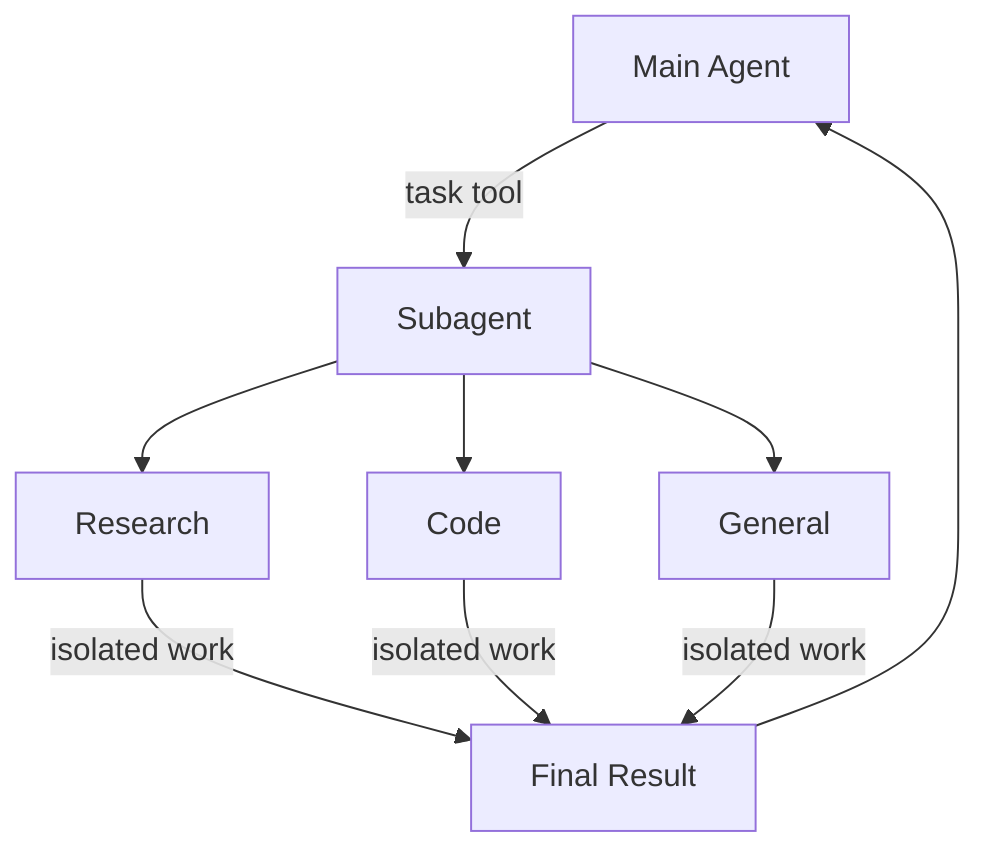

# Deep Agents 서브에이전트 (Subagents)

> 원문: https://docs.langchain.com/oss/python/deepagents/subagents
>
> 작업을 위임하고 컨텍스트를 깨끗하게 유지하기 위해 서브에이전트(subagent)를 사용하는 방법을 학습합니다.

---

## 📖 목차

1. [서브에이전트란?](#-서브에이전트란)
2. [왜 서브에이전트를 사용하는가?](#-왜-서브에이전트를-사용하는가)
3. [Configuration (구성)](#-configuration-구성)
4. [Custom subagents (커스텀 서브에이전트)](#-custom-subagents-커스텀-서브에이전트)
5. [SubAgent / CompiledSubAgent 사용](#-subagent--compiledsubagent-사용)
6. [Streaming (스트리밍)](#-streaming-스트리밍)
7. [Structured output (구조화된 출력)](#-structured-output-구조화된-출력)
8. [general-purpose 서브에이전트](#-general-purpose-서브에이전트)
9. [모범 사례 (Best practices)](#-모범-사례-best-practices)
10. [흔한 패턴 (Common patterns)](#-흔한-패턴-common-patterns)
11. [컨텍스트 관리 (Context management)](#-컨텍스트-관리-context-management)
12. [트러블슈팅 (Troubleshooting)](#-트러블슈팅-troubleshooting)

---

## 📌 서브에이전트란?

Deep agent는 작업을 위임하기 위해 **서브에이전트(subagents)** 를 생성할 수 있습니다. `subagents` 파라미터로 커스텀 서브에이전트를 지정할 수 있습니다. 서브에이전트는 [컨텍스트 격리(context quarantine)](https://www.dbreunig.com/2025/06/26/how-to-fix-your-context.html#context-quarantine)(메인 에이전트의 컨텍스트를 깨끗하게 유지)와 전문화된 지시 사항 제공에 유용합니다.

이 페이지는 슈퍼바이저(supervisor)가 서브에이전트가 완료될 때까지 차단되는 **동기식(synchronous) 서브에이전트**를 다룹니다. 장시간 실행되는 작업, 병렬 워크스트림, 또는 도중에 방향을 조정하고 취소가 필요한 경우에는 [Async subagents](https://docs.langchain.com/oss/python/deepagents/async-subagents)를 참고하세요.



---

## 🎯 왜 서브에이전트를 사용하는가?

서브에이전트는 **컨텍스트 비대화 문제(context bloat problem)** 를 해결합니다. 에이전트가 큰 출력을 갖는 도구(웹 검색, 파일 읽기, 데이터베이스 쿼리)를 사용할 때 컨텍스트 윈도우는 중간 결과로 빠르게 채워집니다. 서브에이전트는 이러한 세부 작업을 격리합니다. 메인 에이전트는 수십 개의 도구 호출이 아닌 최종 결과만 받습니다.

**서브에이전트를 사용해야 할 때:**

* ✅ 메인 에이전트의 컨텍스트를 어수선하게 만들 수 있는 다단계 작업
* ✅ 커스텀 지시 사항이나 도구가 필요한 전문화된 도메인
* ✅ 다른 모델 능력이 필요한 작업
* ✅ 메인 에이전트를 고수준 조정에 집중시키고 싶을 때

**서브에이전트를 사용하지 말아야 할 때:**

* ❌ 단순하고 단일 단계의 작업
* ❌ 중간 컨텍스트를 유지해야 할 때
* ❌ 오버헤드가 이점을 능가할 때

---

## ⚙️ Configuration (구성)

`subagents`는 딕셔너리 또는 [`CompiledSubAgent`](https://reference.langchain.com/python/deepagents/middleware/subagents/CompiledSubAgent) 객체의 리스트여야 합니다. 두 가지 타입이 있습니다.

### 기본 서브에이전트 (Default subagent)

Deep Agents는 동일한 이름의 동기 서브에이전트를 직접 제공하지 않는 한 자동으로 동기식 `general-purpose` 서브에이전트를 추가합니다.

`general-purpose` 서브에이전트는 기본적으로 파일 시스템 도구를 갖고 있으며 추가 도구/미들웨어로 커스터마이징 가능합니다.

* 교체하려면 자신의 `general-purpose`라는 이름의 서브에이전트를 전달합니다.
* 자동 추가된 버전을 이름 변경하거나 다시 프롬프트하려면 활성 [harness profile](https://docs.langchain.com/oss/python/deepagents/profiles#harness-profiles)에 `general_purpose_subagent=GeneralPurposeSubagentProfile(...)`을 설정합니다.
* 비활성화하려면 아래의 [서브에이전트 없이 실행하기](#서브에이전트-없이-실행하기-running-without-subagents)를 참고하세요.

### 서브에이전트 없이 실행하기 (Running without subagents)

`task` 도구 없이 에이전트를 실행하려면 두 가지를 수행하세요.

1. 활성 [harness profile](https://docs.langchain.com/oss/python/deepagents/profiles#harness-profiles)에 `general_purpose_subagent=GeneralPurposeSubagentProfile(enabled=False)`를 설정합니다.
2. `create_deep_agent`에 `subagents=`로 동기 서브에이전트를 전달하지 않습니다.

Deep Agents는 동기 서브에이전트가 최소 하나 존재할 때만 `SubAgentMiddleware`(및 `task` 도구)를 첨부합니다. 기본 서브에이전트도 호출자 제공 서브에이전트도 없으면 에이전트는 위임 없이 실행됩니다.

비동기 서브에이전트는 영향을 받지 않습니다. 자체 미들웨어와 도구를 통해 흐르며, [Async subagents](https://docs.langchain.com/oss/python/deepagents/async-subagents)에 설명되어 있습니다.

> 💡 여기서 `excluded_middleware`에 손을 대지 마세요. `SubAgentMiddleware`는 필수 스캐폴딩이며 이를 나열하면 `ValueError`가 발생합니다. `general_purpose_subagent.enabled = False` 옵션이 지원되는 경로입니다.

---

## 🧩 Custom subagents (커스텀 서브에이전트)

`subagents` 파라미터를 사용하여 특정 도구를 가진 전문화된 서브에이전트를 정의할 수 있습니다. 예를 들어 코드 리뷰어, 웹 리서처, 또는 테스트 실행자로 활용할 수 있습니다.

대부분의 사용 사례에서는 서브에이전트를 [SubAgent 딕셔너리](#subagent-딕셔너리-기반)로 정의하세요. 복잡한 워크플로의 경우 [`CompiledSubAgent`](#compiledsubagent)를 사용하세요.

### SubAgent (딕셔너리 기반)

서브에이전트를 [`SubAgent`](https://reference.langchain.com/python/deepagents/middleware/subagents/SubAgent) 스펙에 맞춰 다음 필드를 갖는 딕셔너리로 정의합니다.

| 필드 | 타입 | 설명 |
|-----|-----|-----|
| `name` | `str` | **필수.** 서브에이전트의 고유 식별자. 메인 에이전트가 `task()` 도구를 호출할 때 이 이름을 사용합니다. 서브에이전트 이름은 `AIMessage`의 메타데이터 및 스트리밍에 사용되어 에이전트를 구분하는 데 도움이 됩니다. |
| `description` | `str` | **필수.** 이 서브에이전트가 무엇을 하는지에 대한 설명. 구체적이고 동작 지향적이어야 합니다. 메인 에이전트가 언제 위임할지 결정할 때 사용합니다. |
| `system_prompt` | `str` | **필수.** 서브에이전트를 위한 지시 사항. 커스텀 서브에이전트는 자체적으로 정의해야 합니다. 도구 사용 가이드와 출력 형식 요구사항을 포함하세요.<br />메인 에이전트로부터 상속하지 않습니다. |
| `tools` | `list[Callable]` | 선택. 서브에이전트가 사용할 수 있는 도구. 최소한으로 유지하고 필요한 것만 포함하세요.<br />기본적으로 메인 에이전트로부터 상속. 지정되면 상속된 도구를 완전히 오버라이드합니다. |
| `model` | `str` \| `BaseChatModel` | 선택. 메인 에이전트의 모델을 오버라이드. 생략 시 메인 에이전트의 모델을 사용합니다.<br />기본적으로 메인 에이전트로부터 상속. `'openai:gpt-5.4'`(`'provider:model'` 형식) 같은 모델 식별자 문자열이나 LangChain 채팅 모델 객체(`init_chat_model("gpt-5.4")` 또는 `ChatOpenAI(model="gpt-5.4")`)를 전달할 수 있습니다. |
| `middleware` | `list[Middleware]` | 선택. 커스텀 동작, 로깅, 또는 레이트 리밋을 위한 추가 미들웨어.<br />메인 에이전트로부터 상속하지 않습니다. |
| `interrupt_on` | `dict[str, bool]` | 선택. 특정 도구에 대해 [human-in-the-loop](https://docs.langchain.com/oss/python/deepagents/human-in-the-loop)를 구성. 서브에이전트 값이 메인 에이전트를 오버라이드. checkpointer 필요.<br />기본적으로 메인 에이전트로부터 상속. 서브에이전트 값이 기본값을 오버라이드. |
| `skills` | `list[str]` | 선택. [스킬(Skills)](https://docs.langchain.com/oss/python/deepagents/skills) 소스 경로. 지정 시 서브에이전트는 이 디렉토리에서 스킬을 로드합니다 (예: `["/skills/research/", "/skills/web-search/"]`). 이를 통해 서브에이전트가 메인 에이전트와 다른 스킬셋을 가질 수 있습니다.<br />메인 에이전트로부터 상속하지 않습니다. general-purpose 서브에이전트만 메인 에이전트의 스킬을 상속합니다. 서브에이전트가 스킬을 가지면 자체 독립적인 [`SkillsMiddleware`](https://reference.langchain.com/python/deepagents/middleware/skills/SkillsMiddleware) 인스턴스를 실행합니다. 스킬 상태는 완전히 격리됩니다. 서브에이전트의 로드된 스킬은 부모에게 보이지 않고 반대도 마찬가지입니다. |
| `response_format` | `ResponseFormat` | 선택. 서브에이전트를 위한 [Structured output](https://docs.langchain.com/oss/python/langchain/structured-output) 스키마. 설정되면 부모는 자유 형식 텍스트 대신 JSON으로 서브에이전트의 결과를 받습니다. Pydantic 모델, `ToolStrategy(...)`, `ProviderStrategy(...)`, 또는 raw 스키마 타입을 허용합니다. [Structured output](#-structured-output-구조화된-출력)을 참고하세요. |
| `permissions` | `list[FilesystemPermission]` | 선택. 서브에이전트를 위한 [파일 시스템 권한 규칙](https://docs.langchain.com/oss/python/deepagents/permissions). 설정 시 부모 에이전트의 권한을 **완전히 대체**합니다.<br />기본적으로 메인 에이전트로부터 상속. |

### CompiledSubAgent

복잡한 워크플로의 경우 사전 빌드된 LangGraph 그래프를 [`CompiledSubAgent`](https://reference.langchain.com/python/deepagents/middleware/subagents/CompiledSubAgent)로 사용합니다.

| 필드 | 타입 | 설명 |
|-----|-----|-----|
| `name` | `str` | **필수.** 서브에이전트의 고유 식별자. 서브에이전트 이름은 `AIMessage`의 메타데이터 및 스트리밍에 사용되어 에이전트를 구분하는 데 도움이 됩니다. |
| `description` | `str` | **필수.** 이 서브에이전트가 무엇을 하는지. |
| `runnable` | `Runnable` | **필수.** 컴파일된 LangGraph 그래프 (먼저 `.compile()`을 호출해야 함). |

---

## 🚀 SubAgent / CompiledSubAgent 사용

### SubAgent 사용

```python
import os
from typing import Literal

from deepagents import create_deep_agent
from tavily import TavilyClient

tavily_client = TavilyClient(api_key=os.environ["TAVILY_API_KEY"])


def internet_search(
    query: str,
    max_results: int = 5,
    topic: Literal["general", "news", "finance"] = "general",
    include_raw_content: bool = False,
):
    """Run a web search"""
    return tavily_client.search(
        query,
        max_results=max_results,
        include_raw_content=include_raw_content,
        topic=topic,
    )


research_subagent = {
    "name": "research-agent",
    "description": "Used to research more in depth questions",
    "system_prompt": "You are a great researcher",
    "tools": [internet_search],
    "model": "openai:gpt-5.4",  # 선택적 오버라이드, 기본은 메인 에이전트 모델
}
subagents = [research_subagent]

agent = create_deep_agent(
    model="google_genai:gemini-3.1-pro-preview",
    subagents=subagents,
)
```

### CompiledSubAgent 사용

더 복잡한 사용 사례에서는 [`CompiledSubAgent`](https://reference.langchain.com/python/deepagents/middleware/subagents/CompiledSubAgent)로 커스텀 서브에이전트를 제공할 수 있습니다. LangChain의 [`create_agent`](https://reference.langchain.com/python/langchain/agents/factory/create_agent)를 사용하거나 [graph API](https://docs.langchain.com/oss/python/langgraph/graph-api)로 커스텀 LangGraph 그래프를 만들어 커스텀 서브에이전트를 생성할 수 있습니다.

커스텀 LangGraph 그래프를 만든다면 그래프에 [`"messages"`라는 state 키](https://docs.langchain.com/oss/python/langgraph/quickstart#2-define-state)가 있어야 합니다.

```python
from deepagents import create_deep_agent, CompiledSubAgent
from langchain.agents import create_agent

# 커스텀 에이전트 그래프 생성
custom_graph = create_agent(
    model=your_model,
    tools=specialized_tools,
    prompt="You are a specialized agent for data analysis..."
)

# 커스텀 서브에이전트로 사용
custom_subagent = CompiledSubAgent(
    name="data-analyzer",
    description="Specialized agent for complex data analysis tasks",
    runnable=custom_graph
)

subagents = [custom_subagent]

agent = create_deep_agent(
    model="google_genai:gemini-3.1-pro-preview",
    tools=[internet_search],
    system_prompt=research_instructions,
    subagents=subagents
)
```

---

## 📡 Streaming (스트리밍)

트레이싱 정보 스트리밍 시 에이전트 이름은 메타데이터의 `lc_agent_name`으로 제공됩니다.
트레이싱 정보를 검토할 때 이 메타데이터로 어떤 에이전트에서 온 데이터인지 구분할 수 있습니다.

다음 예시는 `main-agent`라는 이름의 deep agent와 `research-agent`라는 이름의 서브에이전트를 생성합니다.

```python
import os
from typing import Literal
from tavily import TavilyClient
from deepagents import create_deep_agent

tavily_client = TavilyClient(api_key=os.environ["TAVILY_API_KEY"])

def internet_search(
    query: str,
    max_results: int = 5,
    topic: Literal["general", "news", "finance"] = "general",
    include_raw_content: bool = False,
):
    """Run a web search"""
    return tavily_client.search(
        query,
        max_results=max_results,
        include_raw_content=include_raw_content,
        topic=topic,
    )

research_subagent = {
    "name": "research-agent",
    "description": "Used to research more in depth questions",
    "system_prompt": "You are a great researcher",
    "tools": [internet_search],
    "model": "google_genai:gemini-3.1-pro-preview",  # 선택적 오버라이드
}
subagents = [research_subagent]

agent = create_deep_agent(
    model="google_genai:gemini-3.1-pro-preview",
    subagents=subagents,
    name="main-agent"
)
```

deep agent에 프롬프트하면, 서브에이전트나 deep agent가 실행하는 모든 에이전트 런(run)은 메타데이터에 에이전트 이름을 포함합니다.
이 경우 `"research-agent"`라는 이름의 서브에이전트는 관련 에이전트 런 메타데이터에 `{'lc_agent_name': 'research-agent'}`를 포함합니다.

---

## 🧱 Structured output (구조화된 출력)

서브에이전트는 [structured output](https://docs.langchain.com/oss/python/langchain/structured-output)을 지원하므로, 부모 에이전트는 자유 형식 텍스트 대신 예측 가능하고 파싱 가능한 JSON을 받습니다.

> 📘 서브에이전트의 구조화된 출력에는 `deepagents>=0.5.3`이 필요합니다.

서브에이전트 구성에 `response_format`을 전달합니다. 서브에이전트가 완료되면 그 구조화된 응답은 JSON으로 직렬화되어 부모 에이전트에 `ToolMessage` 콘텐츠로 반환됩니다. 스키마는 [`create_agent`](https://reference.langchain.com/python/langchain/agents/factory/create_agent)가 지원하는 모든 것을 받아들입니다. Pydantic 모델, `ToolStrategy(...)`, `ProviderStrategy(...)`, 또는 raw 스키마 타입입니다.

```python
from pydantic import BaseModel, Field

from deepagents import create_deep_agent


class ResearchFindings(BaseModel):
    """Structured findings from a research task."""
    summary: str = Field(description="Summary of findings")
    confidence: float = Field(description="Confidence score from 0 to 1")
    sources: list[str] = Field(description="List of source URLs")

research_subagent = {
    "name": "researcher",
    "description": "Researches topics and returns structured findings",
    "system_prompt": "Research the given topic thoroughly. Return your findings.",
    "tools": [web_search],
    "response_format": ResearchFindings,
}

agent = create_deep_agent(
    model="claude-sonnet-4-6",
    subagents=[research_subagent],
)

result = await agent.ainvoke(
    {"messages": [{"role": "user", "content": "Research recent advances in quantum computing"}]}
)

# 부모의 ToolMessage에는 JSON 직렬화된 구조화된 데이터가 포함됩니다:
# '{"summary": "...", "confidence": 0.87, "sources": ["https://..."]}'
```

`response_format`이 없으면 부모는 서브에이전트의 마지막 메시지 텍스트를 그대로 받습니다. 설정되면 부모는 항상 스키마와 일치하는 유효한 JSON을 받으며, 부모가 결과를 프로그래밍적으로 처리하거나 다운스트림 도구에 전달해야 할 때 유용합니다.

스키마 타입과 전략(도구 호출 vs. 프로바이더 네이티브)에 대한 자세한 내용은 [Structured output](https://docs.langchain.com/oss/python/langchain/structured-output)을 참고하세요.

---

## 🛠️ general-purpose 서브에이전트

사용자 정의 서브에이전트 외에도, 모든 deep agent는 항상 `general-purpose` 서브에이전트에 접근할 수 있습니다. 이 서브에이전트는:

* 메인 에이전트와 동일한 시스템 프롬프트를 가집니다.
* 동일한 모든 도구에 접근합니다.
* 동일한 모델을 사용합니다(오버라이드되지 않은 경우).
* 메인 에이전트로부터 스킬을 상속합니다(스킬이 구성된 경우).

### general-purpose 서브에이전트 오버라이드

`subagents` 리스트에 `name="general-purpose"`인 서브에이전트를 포함시켜 기본값을 교체합니다. general-purpose 서브에이전트에 대해 다른 모델, 도구, 또는 시스템 프롬프트를 구성할 때 사용합니다.

```python
from deepagents import create_deep_agent

# 메인 에이전트는 Gemini, general-purpose 서브에이전트는 GPT 사용
agent = create_deep_agent(
    model="google_genai:gemini-3.1-pro-preview",
    tools=[internet_search],
    subagents=[
        {
            "name": "general-purpose",
            "description": "General-purpose agent for research and multi-step tasks",
            "system_prompt": "You are a general-purpose assistant.",
            "tools": [internet_search],
            "model": "openai:gpt-5.4",  # 위임된 작업에 다른 모델 사용
        },
    ],
)
```

general-purpose 이름의 서브에이전트를 제공하면 기본 general-purpose 서브에이전트가 추가되지 않습니다. 사양이 완전히 이를 대체합니다.

기본 제공 general-purpose 서브에이전트를 교체가 아니라 완전히 제거하려면 활성 harness 프로파일의 general-purpose 서브에이전트 `enabled` 플래그를 `False`로 설정하세요.

### 언제 사용하는가

general-purpose 서브에이전트는 전문화된 동작 없이 컨텍스트 격리에 이상적입니다. 메인 에이전트는 복잡한 다단계 작업을 이 서브에이전트에 위임하고 중간 도구 호출의 비대화 없이 간결한 결과를 받을 수 있습니다.

> **예시:** 메인 에이전트가 10개의 웹 검색을 수행하고 컨텍스트를 결과로 채우는 대신, general-purpose 서브에이전트에 위임합니다. `task(name="general-purpose", task="Research quantum computing trends")`. 서브에이전트는 내부적으로 모든 검색을 수행하고 요약만 반환합니다.

### 스킬 상속 (Skills inheritance)

`create_deep_agent`로 [스킬](https://docs.langchain.com/oss/python/deepagents/skills)을 구성할 때:

* **General-purpose 서브에이전트**: 메인 에이전트의 스킬을 자동으로 상속합니다.
* **커스텀 서브에이전트**: 기본적으로 스킬을 상속하지 않습니다. 자체 스킬을 부여하려면 `skills` 파라미터를 사용하세요.

> 📘 `skills`로 구성된 서브에이전트만 `SkillsMiddleware` 인스턴스를 가집니다. `skills` 파라미터가 없는 커스텀 서브에이전트는 갖지 않습니다. 존재할 때 스킬 상태는 양방향으로 완전히 격리됩니다. 부모의 스킬은 자식에게 보이지 않고, 자식의 스킬은 부모에게 전파되지 않습니다.

```python
from deepagents import create_deep_agent

# 자체 스킬을 가진 research 서브에이전트
research_subagent = {
    "name": "researcher",
    "description": "Research assistant with specialized skills",
    "system_prompt": "You are a researcher.",
    "tools": [web_search],
    "skills": ["/skills/research/", "/skills/web-search/"],  # 서브에이전트 전용 스킬
}

agent = create_deep_agent(
    model="google_genai:gemini-3.1-pro-preview",
    skills=["/skills/main/"],  # 메인 에이전트와 GP 서브에이전트가 받음
    subagents=[research_subagent],  # /skills/research/ 및 /skills/web-search/만 받음
)
```

---

## 💡 모범 사례 (Best practices)

### 명확한 설명 작성

메인 에이전트는 설명을 사용해 어떤 서브에이전트를 호출할지 결정합니다. 구체적으로 작성하세요.

✅ **좋음:** `"Analyzes financial data and generates investment insights with confidence scores"`

❌ **나쁨:** `"Does finance stuff"`

### 시스템 프롬프트를 상세하게 유지

도구 사용 방법과 출력 형식에 대한 구체적인 가이드를 포함하세요.

```python
research_subagent = {
    "name": "research-agent",
    "description": "Conducts in-depth research using web search and synthesizes findings",
    "system_prompt": """You are a thorough researcher. Your job is to:

    1. Break down the research question into searchable queries
    2. Use internet_search to find relevant information
    3. Synthesize findings into a comprehensive but concise summary
    4. Cite sources when making claims

    Output format:
    - Summary (2-3 paragraphs)
    - Key findings (bullet points)
    - Sources (with URLs)

    Keep your response under 500 words to maintain clean context.""",
    "tools": [internet_search],
}
```

### 도구셋 최소화

서브에이전트에는 필요한 도구만 부여하세요. 이는 집중도와 보안을 향상시킵니다.

```python
# ✅ 좋음: 집중된 도구셋
email_agent = {
    "name": "email-sender",
    "tools": [send_email, validate_email],  # 이메일 관련만
}

# ❌ 나쁨: 너무 많은 도구
email_agent = {
    "name": "email-sender",
    "tools": [send_email, web_search, database_query, file_upload],  # 집중되지 않음
}
```

### 작업별로 모델 선택

다른 모델은 다른 작업에 탁월합니다.

```python
subagents = [
    {
        "name": "contract-reviewer",
        "description": "Reviews legal documents and contracts",
        "system_prompt": "You are an expert legal reviewer...",
        "tools": [read_document, analyze_contract],
        "model": "google_genai:gemini-3.1-pro-preview",  # 긴 문서를 위한 큰 컨텍스트
    },
    {
        "name": "financial-analyst",
        "description": "Analyzes financial data and market trends",
        "system_prompt": "You are an expert financial analyst...",
        "tools": [get_stock_price, analyze_fundamentals],
        "model": "openai:gpt-5.4",  # 수치 분석에 더 적합
    },
]
```

### 간결한 결과 반환

서브에이전트가 원시 데이터가 아닌 요약을 반환하도록 지시하세요.

```python
data_analyst = {
    "system_prompt": """Analyze the data and return:
    1. Key insights (3-5 bullet points)
    2. Overall confidence score
    3. Recommended next actions

    Do NOT include:
    - Raw data
    - Intermediate calculations
    - Detailed tool outputs

    Keep response under 300 words."""
}
```

---

## 🧩 흔한 패턴 (Common patterns)

### 여러 전문화된 서브에이전트

다른 도메인용 전문화된 서브에이전트를 만드세요.

```python
from deepagents import create_deep_agent

subagents = [
    {
        "name": "data-collector",
        "description": "Gathers raw data from various sources",
        "system_prompt": "Collect comprehensive data on the topic",
        "tools": [web_search, api_call, database_query],
    },
    {
        "name": "data-analyzer",
        "description": "Analyzes collected data for insights",
        "system_prompt": "Analyze data and extract key insights",
        "tools": [statistical_analysis],
    },
    {
        "name": "report-writer",
        "description": "Writes polished reports from analysis",
        "system_prompt": "Create professional reports from insights",
        "tools": [format_document],
    },
]

agent = create_deep_agent(
    model="google_genai:gemini-3.1-pro-preview",
    system_prompt="You coordinate data analysis and reporting. Use subagents for specialized tasks.",
    subagents=subagents
)
```

**워크플로:**

1. 메인 에이전트가 고수준 계획을 만듭니다.
2. 데이터 수집을 data-collector에 위임합니다.
3. 결과를 data-analyzer에 전달합니다.
4. 인사이트를 report-writer에 보냅니다.
5. 최종 출력을 컴파일합니다.

각 서브에이전트는 자신의 작업에만 집중된 깨끗한 컨텍스트에서 작업합니다.

---

## 🧠 컨텍스트 관리 (Context management)

[runtime context](https://docs.langchain.com/oss/python/langchain/runtime)로 부모 에이전트를 호출하면, 이 컨텍스트는 모든 서브에이전트에 자동으로 전파됩니다. 각 서브에이전트 실행은 부모의 `invoke`/`ainvoke` 호출에서 전달된 동일한 런타임 컨텍스트를 받습니다.

이는 서브에이전트 내부에서 실행되는 도구가 부모에게 제공한 컨텍스트 값에 접근할 수 있음을 의미합니다.

```python
from dataclasses import dataclass

from deepagents import create_deep_agent
from langchain.messages import HumanMessage
from langchain.tools import tool, ToolRuntime

@dataclass
class Context:
    user_id: str
    session_id: str

@tool
def get_user_data(query: str, runtime: ToolRuntime[Context]) -> str:
    """Fetch data for the current user."""
    user_id = runtime.context.user_id
    return f"Data for user {user_id}: {query}"

research_subagent = {
    "name": "researcher",
    "description": "Conducts research for the current user",
    "system_prompt": "You are a research assistant.",
    "tools": [get_user_data],
}

agent = create_deep_agent(
    model="google_genai:gemini-3.1-pro-preview",
    subagents=[research_subagent],
    context_schema=Context,
)

# 컨텍스트는 researcher 서브에이전트와 그 도구로 자동으로 흐릅니다
result = await agent.invoke(
    {"messages": [HumanMessage("Look up my recent activity")]},
    context=Context(user_id="user-123", session_id="abc"),
)
```

### 서브에이전트별 컨텍스트 (Per-subagent context)

모든 서브에이전트는 동일한 부모 컨텍스트를 받습니다. 특정 서브에이전트에 특화된 구성을 전달하려면 평면 `context` 매핑에 **네임스페이스 키**(예: `researcher:max_depth`처럼 서브에이전트 이름을 키 앞에 붙임)를 사용하거나, **컨텍스트 타입의 별도 필드로 그런 설정을 모델링**하세요.

```python
from dataclasses import dataclass

from langchain.messages import HumanMessage
from langchain.tools import tool, ToolRuntime

@dataclass
class Context:
    user_id: str
    researcher_max_depth: int | None = None
    fact_checker_strict_mode: bool | None = None

result = await agent.invoke(
    {"messages": [HumanMessage("Research this and verify the claims")]},
    context=Context(
        user_id="user-123",
        researcher_max_depth=3,
        fact_checker_strict_mode=True,
    ),
)

@tool
def verify_claim(claim: str, runtime: ToolRuntime[Context]) -> str:
    """Verify a factual claim."""
    strict_mode = runtime.context.fact_checker_strict_mode or False
    if strict_mode:
        return strict_verification(claim)
    return basic_verification(claim)
```

### 어떤 서브에이전트가 도구를 호출했는지 식별하기

부모와 여러 서브에이전트 간에 동일한 도구가 공유될 때, [스트리밍](#-streaming-스트리밍)에서 사용된 것과 동일한 `lc_agent_name` 메타데이터를 사용하여 어떤 에이전트가 호출을 시작했는지 확인할 수 있습니다.

```python
from langchain.tools import tool, ToolRuntime

@tool
def shared_lookup(query: str, runtime: ToolRuntime) -> str:
    """Look up information."""
    agent_name = runtime.config.get("metadata", {}).get("lc_agent_name")
    if agent_name == "fact-checker":
        return strict_lookup(query)
    return general_lookup(query)
```

두 패턴을 결합할 수 있습니다. 도구 동작 분기 시 `runtime.context`에서 에이전트별 설정을 읽고 `runtime.config` 메타데이터에서 `lc_agent_name`을 읽으세요.

```python
from langchain.tools import tool, ToolRuntime

@tool
def flexible_search(query: str, runtime: ToolRuntime[Context]) -> str:
    """Search with agent-specific settings."""
    agent_name = runtime.config.get("metadata", {}).get("lc_agent_name", "unknown")
    ctx = runtime.context
    if agent_name == "researcher":
        max_results = ctx.researcher_max_depth or 5
    else:
        max_results = 5
    include_raw = False

    return perform_search(query, max_results=max_results, include_raw=include_raw)
```

---

## 🔧 트러블슈팅 (Troubleshooting)

### 서브에이전트가 호출되지 않음

**문제**: 메인 에이전트가 위임 대신 작업을 직접 수행하려고 합니다.

**해결책**:

1. **설명을 더 구체적으로 작성:**

   ```python
   # ✅ 좋음
   {"name": "research-specialist", "description": "Conducts in-depth research on specific topics using web search. Use when you need detailed information that requires multiple searches."}

   # ❌ 나쁨
   {"name": "helper", "description": "helps with stuff"}
   ```

2. **메인 에이전트에게 위임을 지시:**

   ```python
   agent = create_deep_agent(
       model="google_genai:gemini-3.1-pro-preview",
       system_prompt="""...your instructions...

       IMPORTANT: For complex tasks, delegate to your subagents using the task() tool.
       This keeps your context clean and improves results.""",
       subagents=[...]
   )
   ```

### 컨텍스트가 여전히 비대화됨

**문제**: 서브에이전트를 사용해도 컨텍스트가 채워집니다.

**해결책**:

1. **서브에이전트에게 간결한 결과를 반환하도록 지시:**

   ```python
   system_prompt="""...

   IMPORTANT: Return only the essential summary.
   Do NOT include raw data, intermediate search results, or detailed tool outputs.
   Your response should be under 500 words."""
   ```

2. **큰 데이터는 파일 시스템 사용:**

   ```python
   system_prompt="""When you gather large amounts of data:
   1. Save raw data to /data/raw_results.txt
   2. Process and analyze the data
   3. Return only the analysis summary

   This keeps context clean."""
   ```

### 잘못된 서브에이전트가 선택됨

**문제**: 메인 에이전트가 작업에 부적절한 서브에이전트를 호출합니다.

**해결책**: 설명에서 서브에이전트를 명확하게 차별화하세요.

```python
subagents = [
    {
        "name": "quick-researcher",
        "description": "For simple, quick research questions that need 1-2 searches. Use when you need basic facts or definitions.",
    },
    {
        "name": "deep-researcher",
        "description": "For complex, in-depth research requiring multiple searches, synthesis, and analysis. Use for comprehensive reports.",
    }
]
```
