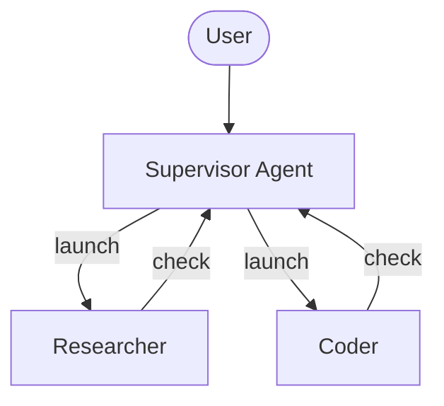
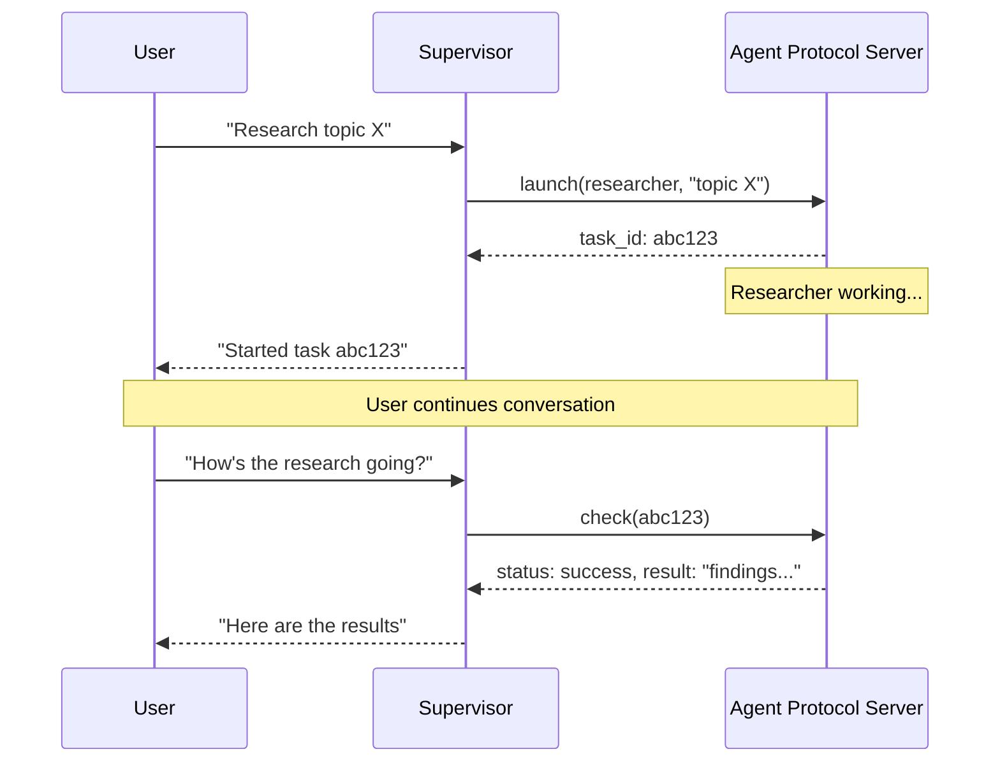

# Deep Agents 비동기 서브에이전트 (Async Subagents)

> 원문: https://docs.langchain.com/oss/python/deepagents/async-subagents
>
> 슈퍼바이저가 사용자와 계속 상호작용하는 동안 동시 실행되는 백그라운드 서브에이전트를 시작합니다.

---

## 📖 목차

1. [비동기 서브에이전트란?](#-비동기-서브에이전트란)
2. [언제 사용하는가?](#-언제-사용하는가)
3. [비동기 서브에이전트 구성](#-비동기-서브에이전트-구성)
4. [비동기 서브에이전트 도구 사용](#-비동기-서브에이전트-도구-사용)
5. [상태 관리 이해](#-상태-관리-이해)
6. [전송 방식 선택](#-전송-방식-선택-transport)
7. [배포 토폴로지 선택](#-배포-토폴로지-선택)
8. [모범 사례](#-모범-사례-best-practices)
9. [트러블슈팅](#-트러블슈팅-troubleshooting)
10. [참조 구현](#-참조-구현-reference-implementation)

---

## 📌 비동기 서브에이전트란?

**비동기(async) 서브에이전트**는 슈퍼바이저 에이전트가 즉시 반환되는 백그라운드 작업을 시작할 수 있게 해주어, 서브에이전트가 동시에 작업하는 동안 슈퍼바이저는 사용자와 계속 상호작용할 수 있도록 합니다. 슈퍼바이저는 어느 시점에서도 진행 상황을 확인하거나, 후속 지시를 보내거나, 작업을 취소할 수 있습니다.

이는 슈퍼바이저가 완료될 때까지 차단된 채 동기적으로 실행되는 [subagents](https://docs.langchain.com/oss/python/deepagents/subagents) 위에 구축됩니다. 작업이 장시간 실행되거나, 병렬화 가능하거나, 도중에 방향 조정이 필요한 경우 비동기 서브에이전트를 사용하세요.

> 📘 비동기 서브에이전트는 `deepagents` 0.5.0에서 사용 가능한 **프리뷰(preview) 기능**입니다. 프리뷰 기능은 활발히 개발 중이며 API가 변경될 수 있습니다.



> 📘 비동기 서브에이전트는 [Agent Protocol](https://github.com/langchain-ai/agent-protocol)을 구현하는 모든 서버와 통신합니다. [LangSmith Deployments](https://docs.langchain.com/langsmith/deployment)를 사용하거나 Agent Protocol 호환 서버를 직접 호스팅할 수 있습니다. 각 서브에이전트는 슈퍼바이저와 독립적으로 실행되며, 슈퍼바이저는 SDK를 통해 시작, 확인, 업데이트, 취소를 제어합니다.

---

## 🎯 언제 사용하는가?

| 차원 | Sync 서브에이전트 | Async 서브에이전트 |
|------|----------------|----------------|
| **실행 모델** | 슈퍼바이저가 서브에이전트 완료까지 블록 | 즉시 job ID 반환, 슈퍼바이저 계속 진행 |
| **동시성** | 병렬이지만 블로킹 | 병렬이며 논블로킹 |
| **중간 업데이트** | 불가능 | `update_async_task`로 후속 지시 가능 |
| **취소** | 불가능 | `cancel_async_task`로 실행 중인 작업 취소 |
| **상태성(Statefulness)** | 무상태 — 호출 간 영속 상태 없음 | 상태성 — 상호작용 간 자체 스레드에 상태 유지 |
| **적합한 경우** | 에이전트가 계속 진행 전 결과를 기다려야 하는 작업 | 채팅에서 대화형으로 관리되는 장시간 실행되는 복잡한 작업 |

---

## ⚙️ 비동기 서브에이전트 구성

비동기 서브에이전트를 [`AsyncSubAgent`](https://reference.langchain.com/python/deepagents/middleware/async_subagents/AsyncSubAgent) 사양 리스트로 정의하며, 각각이 Agent Protocol 서버를 가리킵니다.

```python
from deepagents import AsyncSubAgent, create_deep_agent

async_subagents = [
    AsyncSubAgent(
        name="researcher",
        description="Research agent for information gathering and synthesis",
        graph_id="researcher",
        # url 없음 → ASGI 전송 (동일 배포에 co-deployed)
    ),
    AsyncSubAgent(
        name="coder",
        description="Coding agent for code generation and review",
        graph_id="coder",
        # url="https://coder-deployment.langsmith.dev"  # 선택: 원격용 HTTP 전송
    ),
]

agent = create_deep_agent(
    model="google_genai:gemini-3.1-pro-preview",
    subagents=async_subagents,
)
```

| 필드 | 타입 | 설명 |
|-----|-----|-----|
| `name` | `str` | **필수.** 고유 식별자. 슈퍼바이저가 작업을 시작할 때 사용합니다. |
| `description` | `str` | **필수.** 이 서브에이전트가 무엇을 하는지. 슈퍼바이저는 이를 사용해 어떤 에이전트에 위임할지 결정합니다. |
| `graph_id` | `str` | **필수.** Agent Protocol 서버의 graph ID(또는 assistant ID). LangGraph 기반 배포의 경우 `langgraph.json`에 등록된 graph와 일치해야 합니다. |
| `url` | `str` | 선택. 생략 시 ASGI 전송(인프로세스) 사용. 설정 시 원격 Agent Protocol 서버에 HTTP 전송을 사용합니다. |
| `headers` | `dict[str, str]` | 선택. 원격 서버로의 요청에 사용할 추가 헤더. 자가 호스팅 Agent Protocol 서버에서 커스텀 인증에 사용합니다. |

LangGraph 기반 배포의 경우, co-deployed 설정에서는 모든 graph를 동일한 `langgraph.json`에 등록하세요.

```json
{
  "graphs": {
    "supervisor": "./src/supervisor.py:graph",
    "researcher": "./src/researcher.py:graph",
    "coder": "./src/coder.py:graph"
  }
}
```

---

## 🛠️ 비동기 서브에이전트 도구 사용

[`AsyncSubAgentMiddleware`](https://reference.langchain.com/python/deepagents/middleware/async_subagents/AsyncSubAgentMiddleware)는 슈퍼바이저에게 다섯 가지 도구를 제공합니다.

| 도구 | 목적 | 반환값 |
|-----|------|-------|
| `start_async_task` | 새 백그라운드 작업 시작 | Task ID (즉시) |
| `check_async_task` | 작업의 현재 상태와 결과 가져오기 | Status + 결과(완료된 경우) |
| `update_async_task` | 실행 중인 작업에 새 지시 보내기 | 확인 + 업데이트된 상태 |
| `cancel_async_task` | 실행 중인 작업 중지 | 확인 |
| `list_async_tasks` | 추적된 모든 작업과 라이브 상태 나열 | 모든 작업 요약 |

슈퍼바이저의 LLM은 다른 도구와 동일하게 이러한 도구를 호출합니다. 미들웨어가 스레드 생성, 실행 관리, 상태 영속성을 자동으로 처리합니다.

### 라이프사이클 이해

전형적인 상호작용은 다음 시퀀스를 따릅니다.



* **Launch**: 서버에 새 스레드를 생성하고 작업 설명을 입력으로 실행을 시작한 다음, 스레드 ID를 작업 ID로 반환합니다. 슈퍼바이저는 이 ID를 사용자에게 보고하고 완료를 폴링하지 않습니다.
* **Check**: 현재 실행 상태를 가져옵니다. 실행이 성공했다면 서브에이전트의 최종 출력을 추출하기 위해 스레드 상태를 검색합니다. 여전히 실행 중이면 사용자에게 그 사실을 보고합니다.
* **Update**: interrupt multitask 전략으로 같은 스레드에서 새 실행을 생성합니다. 이전 실행이 중단되고, 서브에이전트는 전체 대화 히스토리와 새 지시 사항으로 재시작합니다. 작업 ID는 동일합니다.
* **Cancel**: 서버에서 `runs.cancel()`을 호출하고 작업을 `"cancelled"`로 표시합니다.
* **List**: 추적된 모든 작업을 순회합니다. 종결되지 않은 작업의 경우 서버에서 병렬로 라이브 상태를 가져옵니다. 종결 상태(`success`, `error`, `cancelled`)는 캐시에서 반환됩니다.

---

## 🧠 상태 관리 이해

작업 메타데이터는 메시지 히스토리와 분리된 슈퍼바이저 graph의 전용 상태 채널(`async_tasks`)에 저장됩니다. 이는 deep agent가 컨텍스트 윈도우가 채워지면 [메시지 히스토리를 압축](https://docs.langchain.com/oss/python/deepagents/context-engineering#summarization)하기 때문에 중요합니다. 작업 ID가 도구 메시지에만 있다면 압축 중에 손실됩니다. 전용 채널은 슈퍼바이저가 여러 차례의 요약 후에도 `list_async_tasks`를 통해 항상 작업을 회상할 수 있도록 보장합니다.

추적된 각 작업은 작업 ID, 에이전트 이름, 스레드 ID, 실행 ID, 상태, 그리고 타임스탬프(`created_at`, `last_checked_at`, `last_updated_at`)를 기록합니다.

---

## 🚀 전송 방식 선택 (Transport)

### ASGI 전송 (co-deployed)

서브에이전트 사양에서 `url` 필드를 생략하면, LangGraph SDK는 ASGI 전송을 사용합니다. SDK 호출이 HTTP가 아닌 인프로세스 함수 호출을 통해 라우팅됩니다. LangGraph 기반 배포의 경우, 이는 두 graph가 동일한 `langgraph.json`에 등록되어 있어야 합니다.

ASGI 전송은 네트워크 지연을 제거하고 추가 인증 구성이 필요하지 않습니다. 서브에이전트는 여전히 자체 상태를 가진 별도 스레드로 실행됩니다. 이것이 권장 기본값입니다.

### HTTP 전송 (원격)

원격 Agent Protocol 서버로 네트워크를 통해 SDK 호출을 보내는 HTTP 전송으로 전환하려면 `url` 필드를 추가하세요.

```python
AsyncSubAgent(
    name="researcher",
    description="Research agent",
    graph_id="researcher",
    url="https://my-research-deployment.langsmith.dev",
)
```

LangGraph 배포의 경우, 인증은 환경 변수의 `LANGSMITH_API_KEY`(또는 `LANGGRAPH_API_KEY`)를 사용해 LangGraph SDK가 처리합니다. 자가 호스팅 Agent Protocol 서버는 다른 인증 메커니즘을 사용할 수 있습니다.

서브에이전트가 독립적인 스케일링, 다른 리소스 프로파일이 필요하거나, 다른 팀이 유지 관리하는 경우 HTTP 전송을 사용하세요.

---

## 🧩 배포 토폴로지 선택

### 단일 배포 (Single deployment)

단일 배포는 ASGI 전송을 사용하여 모든 에이전트가 동일한 서버에 co-deploy되는 것을 의미합니다. LangGraph 기반 배포의 경우 모든 graph를 하나의 `langgraph.json`에 등록하세요. 이는 권장되는 시작점입니다. 관리할 서버는 하나, 에이전트 간 네트워크 지연은 0입니다.

### 분리 배포 (Split deployment)

슈퍼바이저는 한 서버에, 서브에이전트는 HTTP 전송을 통해 다른 서버에 배치합니다. 서브에이전트가 다른 컴퓨팅 프로파일이나 독립적인 스케일링이 필요할 때 사용하세요.

### 하이브리드 (Hybrid)

하이브리드 배포에서는 일부 서브에이전트는 ASGI를 통해 co-deploy되고, 다른 서브에이전트는 HTTP를 통해 원격에 있습니다.

```python
async_subagents = [
    AsyncSubAgent(
        name="researcher",
        description="Research agent",
        graph_id="researcher",
        # url 없음 → ASGI (co-deployed)
    ),
    AsyncSubAgent(
        name="coder",
        description="Coding agent",
        graph_id="coder",
        url="https://coder-deployment.langsmith.dev",
        # url 있음 → HTTP (원격)
    ),
]
```

---

## 💡 모범 사례 (Best practices)

### 로컬 개발 시 워커 풀 크기 조정

`langgraph dev`로 로컬에서 실행할 때 동시 서브에이전트 실행을 수용하기 위해 워커 풀을 늘리세요. 각 활성 실행은 워커 슬롯을 차지합니다. 3개의 동시 서브에이전트 작업을 가진 슈퍼바이저는 4개의 슬롯(슈퍼바이저 1개 + 서브에이전트 3개)이 필요합니다. 부족하게 프로비저닝하면 시작이 큐에 쌓입니다.

```bash
langgraph dev --n-jobs-per-worker 10
```

### 명확한 서브에이전트 설명 작성

슈퍼바이저는 설명을 사용해 어떤 서브에이전트를 시작할지 결정합니다. 구체적이고 행동 지향적으로 작성하세요.

```python
# 좋음
AsyncSubAgent(
    name="researcher",
    description="Conducts in-depth research using web search. Use for questions requiring multiple searches and synthesis.",
    graph_id="researcher",
)

# 나쁨
AsyncSubAgent(
    name="helper",
    description="helps with stuff",
    graph_id="helper",
)
```

### 스레드 ID로 추적

LangGraph 기반 배포를 사용할 때 모든 비동기 서브에이전트 실행은 표준 LangGraph 실행이며, LangSmith에서 완전히 볼 수 있습니다. 슈퍼바이저의 트레이스에는 `launch`, `check`, `update`, `cancel`, `list`에 대한 도구 호출이 표시됩니다. 각 서브에이전트 실행은 스레드 ID로 연결된 별도의 트레이스로 나타납니다. 슈퍼바이저 오케스트레이션 트레이스를 서브에이전트 실행 트레이스와 연관시키려면 스레드 ID(작업 ID)를 사용하세요.

---

## 🔧 트러블슈팅 (Troubleshooting)

### 슈퍼바이저가 시작 직후 폴링

**문제**: 슈퍼바이저가 시작 직후 루프로 `check`를 호출하여 비동기 실행을 블로킹으로 만듭니다.

**해결책**: 미들웨어가 이를 방지하는 시스템 프롬프트 규칙을 주입합니다. 폴링이 지속되면 슈퍼바이저의 시스템 프롬프트에서 동작을 강화하세요.

```python
agent = create_deep_agent(
    model="google_genai:gemini-3.1-pro-preview",
    system_prompt="""...your instructions...

    After launching an async subagent, ALWAYS return control to the user.
    Never call check_async_task immediately after launch.""",
    subagents=async_subagents,
)
```

### 슈퍼바이저가 오래된 상태 보고

**문제**: 슈퍼바이저가 새 `check` 호출 대신 대화 히스토리의 이전 작업 상태를 참조합니다.

**해결책**: 미들웨어 프롬프트는 모델에게 "대화 히스토리의 작업 상태는 항상 오래된 것이다"라고 지시합니다. 그래도 발생한다면 상태를 보고하기 전에 항상 `check` 또는 `list`를 호출하도록 명시적 지시를 추가하세요.

### 작업 ID 조회 실패

**문제**: 슈퍼바이저가 작업 ID를 잘라내거나 재포맷하여 `check` 또는 `cancel`이 실패합니다.

**해결책**: 미들웨어 프롬프트는 모델에게 항상 전체 작업 ID를 사용하도록 지시합니다. 잘라내기가 지속되면 일반적으로 모델별 이슈입니다. 다른 모델을 시도하거나 시스템 프롬프트에 "always show the full task_id, never truncate or abbreviate it"을 추가하세요.

### 서브에이전트 시작이 실행 대신 큐에 쌓임

**문제**: 서브에이전트 시작이 멈추거나 시작에 오랜 시간이 걸립니다.

**해결책**: 워커 풀이 고갈된 것 같습니다. `--n-jobs-per-worker`로 풀 크기를 늘리세요. [워커 풀 크기 조정](#로컬-개발-시-워커-풀-크기-조정)을 참고하세요.

---

## 📚 참조 구현 (Reference implementation)

[async-deep-agents](https://github.com/langchain-ai/async-deep-agents) 리포지토리에는 Python과 TypeScript 모두에서 LangSmith Deployments에 배포되는 실행 가능한 예제가 있습니다. 슈퍼바이저와 함께 백그라운드 작업으로 실행되는 researcher 및 coder 서브에이전트를 보여줍니다.
