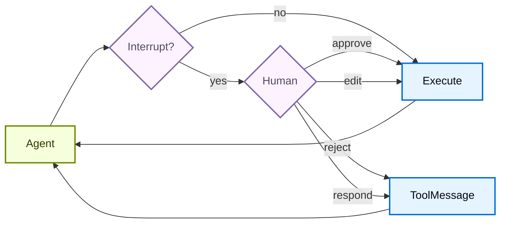

# Deep Agents Human-in-the-loop

> 원문: https://docs.langchain.com/oss/python/deepagents/human-in-the-loop
>
> 민감한 도구 작업에 대해 사람의 승인을 설정하는 방법을 학습합니다.

---

## 📖 목차

1. [📌 Human-in-the-loop 개요](#-human-in-the-loop-개요)
2. [⚙️ 기본 설정 (Basic configuration)](#-기본-설정-basic-configuration)
3. [🎯 결정 타입 (Decision types)](#-결정-타입-decision-types)
4. [🔄 인터럽트 처리 (Handle interrupts)](#-인터럽트-처리-handle-interrupts)
5. [🧮 여러 도구 호출 (Multiple tool calls)](#-여러-도구-호출-multiple-tool-calls)
6. [✏️ 도구 인자 편집 (Edit tool arguments)](#-도구-인자-편집-edit-tool-arguments)
7. [👥 서브에이전트 인터럽트 (Subagent interrupts)](#-서브에이전트-인터럽트-subagent-interrupts)
8. [💡 모범 사례 (Best practices)](#-모범-사례-best-practices)

---

일부 도구 작업은 민감하여 실행 전에 사람의 승인이 필요할 수 있습니다. Deep Agents는 LangGraph의 인터럽트 기능을 통해 Human-in-the-loop 워크플로를 지원합니다. `interrupt_on` 파라미터로 어떤 도구가 승인을 요구할지 설정할 수 있습니다.



---

## 📌 Human-in-the-loop 개요

Human-in-the-loop(HITL)은 모델이 도구를 실행하기 전에 사람이 검토·승인·편집·거부할 수 있도록 그래프 실행을 일시 중지하는 메커니즘입니다. 파일 삭제, 외부 메일 발송, 결제 트랜잭션처럼 되돌리기 어려운 작업을 안전하게 만들기 위해 사용합니다.

---

## ⚙️ 기본 설정 (Basic configuration)

`interrupt_on` 파라미터는 도구 이름을 인터럽트 설정에 매핑하는 딕셔너리를 받습니다. 각 도구는 다음 중 하나로 구성할 수 있습니다.

- **`True`**: 기본 동작으로 인터럽트 활성화 (approve, edit, reject, respond 허용)
- **`False`**: 이 도구는 인터럽트 비활성화
- **`{"allowed_decisions": [...]}`**: 허용 결정을 명시적으로 지정한 커스텀 설정

```python
from langchain.tools import tool
from deepagents import create_deep_agent
from langgraph.checkpoint.memory import MemorySaver


@tool
def remove_file(path: str) -> str:
    """Delete a file from the filesystem."""
    return f"Deleted {path}"


@tool
def fetch_file(path: str) -> str:
    """Read a file from the filesystem."""
    return f"Contents of {path}"


@tool
def notify_email(to: str, subject: str, body: str) -> str:
    """Send an email."""
    return f"Sent email to {to}"


# Human-in-the-loop에는 Checkpointer가 필수입니다
checkpointer = MemorySaver()

agent = create_deep_agent(
    model="google_genai:gemini-3.1-pro-preview",
    tools=[remove_file, fetch_file, notify_email],
    interrupt_on={
        "remove_file": True,  # Default: approve, edit, reject, respond
        "fetch_file": False,  # No interrupts needed
        "notify_email": {"allowed_decisions": ["approve", "reject"]},  # No editing
    },
    checkpointer=checkpointer,  # Required!
)
```

---

## 🎯 결정 타입 (Decision types)

`allowed_decisions` 리스트는 사람이 도구 호출을 검토할 때 취할 수 있는 행동을 제어합니다.

- **`"approve"`**: 에이전트가 제안한 원래 인자로 도구를 실행
- **`"edit"`**: 실행 전에 도구 인자를 수정
- **`"reject"`**: 이 도구 호출을 완전히 건너뜀
- **`"respond"`**: 실행을 건너뛰고 사람의 메시지를 도구 결과로 직접 반환 — "사용자에게 묻기(ask user)" 스타일의 도구에 사용

각 도구마다 어떤 결정이 가능한지 커스터마이즈할 수 있습니다.

```python
interrupt_on = {
    # 민감한 작업: 모든 옵션 허용
    "delete_file": {"allowed_decisions": ["approve", "edit", "reject"]},

    # 중간 위험: 승인 또는 거부만
    "write_file": {"allowed_decisions": ["approve", "reject"]},

    # 반드시 승인 (거부 불가)
    "critical_operation": {"allowed_decisions": ["approve"]},
}
```

---

## 🔄 인터럽트 처리 (Handle interrupts)

인터럽트가 발생하면 에이전트는 실행을 일시 중지하고 제어권을 반환합니다. 결과에서 인터럽트를 확인하고 그에 맞게 처리하세요.

```python
from langchain_core.utils.uuid import uuid7
from langgraph.types import Command

# 상태 영속화를 위한 thread_id가 포함된 config 생성
config = {"configurable": {"thread_id": str(uuid7())}}

# 에이전트 실행
result = agent.invoke(
    {"messages": [{"role": "user", "content": "Delete the file temp.txt"}]},
    config=config,
    version="v2",
)

# 실행이 인터럽트되었는지 확인
if result.interrupts:
    # 인터럽트 정보 추출
    interrupt_value = result.interrupts[0].value
    action_requests = interrupt_value["action_requests"]
    review_configs = interrupt_value["review_configs"]

    # 도구 이름 -> 리뷰 설정 매핑 생성
    config_map = {cfg["action_name"]: cfg for cfg in review_configs}

    # 대기 중인 작업을 사용자에게 표시
    for action in action_requests:
        review_config = config_map[action["name"]]
        print(f"Tool: {action['name']}")
        print(f"Arguments: {action['args']}")
        print(f"Allowed decisions: {review_config['allowed_decisions']}")

    # 사용자 결정 수집 (action_request별 하나씩, 순서대로)
    decisions = [
        {"type": "approve"}  # 사용자가 삭제를 승인함
    ]

    # 결정과 함께 실행 재개
    result = agent.invoke(
        Command(resume={"decisions": decisions}),
        config=config,  # 반드시 같은 config 사용!
        version="v2",
    )

# 최종 결과 처리
print(result.value["messages"][-1].content)
```

---

## 🧮 여러 도구 호출 (Multiple tool calls)

에이전트가 승인이 필요한 여러 도구를 호출하면, 모든 인터럽트가 하나의 인터럽트로 일괄(batch) 처리됩니다. 각 항목에 대한 결정을 **순서대로** 제공해야 합니다.

```python
config = {"configurable": {"thread_id": str(uuid7())}}

result = agent.invoke(
    {"messages": [{
        "role": "user",
        "content": "Delete temp.txt and send an email to admin@example.com"
    }]},
    config=config,
    version="v2",
)

if result.interrupts:
    interrupt_value = result.interrupts[0].value
    action_requests = interrupt_value["action_requests"]

    # 두 도구가 승인 필요
    assert len(action_requests) == 2

    # action_requests와 같은 순서로 결정 제공
    decisions = [
        {"type": "approve"},  # 첫 번째 도구: delete_file
        {"type": "reject"}    # 두 번째 도구: send_email
    ]

    result = agent.invoke(
        Command(resume={"decisions": decisions}),
        config=config,
        version="v2",
    )
```

---

## ✏️ 도구 인자 편집 (Edit tool arguments)

허용 결정에 `"edit"`이 포함되어 있으면 실행 전에 도구 인자를 수정할 수 있습니다.

```python
if result.interrupts:
    interrupt_value = result.interrupts[0].value
    action_request = interrupt_value["action_requests"][0]

    # 에이전트가 제안한 원래 인자
    print(action_request["args"])  # {"to": "everyone@company.com", ...}

    # 사용자가 수신자를 편집하기로 결정
    decisions = [{
        "type": "edit",
        "edited_action": {
            "name": action_request["name"],  # 도구 이름 반드시 포함
            "args": {"to": "team@company.com", "subject": "...", "body": "..."}
        }
    }]

    result = agent.invoke(
        Command(resume={"decisions": decisions}),
        config=config,
        version="v2",
    )
```

---

## 👥 서브에이전트 인터럽트 (Subagent interrupts)

서브에이전트를 사용할 때, [도구 호출에 대한 인터럽트](#-도구-호출에-대한-인터럽트)와 [도구 호출 내부의 인터럽트](#-도구-호출-내부의-인터럽트)를 모두 사용할 수 있습니다.

### 🎯 도구 호출에 대한 인터럽트

각 서브에이전트는 메인 에이전트 설정을 오버라이드하는 자체 `interrupt_on` 설정을 가질 수 있습니다.

```python
agent = create_deep_agent(
    model="google_genai:gemini-3.1-pro-preview",
    tools=[delete_file, read_file],
    interrupt_on={
        "delete_file": True,
        "read_file": False,
    },
    subagents=[{
        "name": "file-manager",
        "description": "Manages file operations",
        "system_prompt": "You are a file management assistant.",
        "tools": [delete_file, read_file],
        "interrupt_on": {
            # 오버라이드: 이 서브에이전트에서는 읽기에도 승인 필요
            "delete_file": True,
            "read_file": True,  # 메인 에이전트와 다름!
        }
    }],
    checkpointer=checkpointer
)
```

서브에이전트가 인터럽트를 발생시키면 처리 방식은 동일합니다 — 결과에서 `interrupts`를 확인하고 `Command`로 재개하세요.

### 🛠️ 도구 호출 내부의 인터럽트

서브에이전트의 도구는 `interrupt()`를 직접 호출하여 실행을 일시 중지하고 승인을 기다릴 수 있습니다.

```python
from langchain.agents import create_agent
from langchain_anthropic import ChatAnthropic
from langchain.messages import HumanMessage
from langchain.tools import tool
from langgraph.checkpoint.memory import InMemorySaver
from langgraph.types import Command, interrupt

from deepagents.graph import create_deep_agent
from deepagents.middleware.subagents import CompiledSubAgent


@tool(description="Request human approval before proceeding with an action.")
def request_approval(action_description: str) -> str:
    """Request human approval using the interrupt() primitive."""
    # interrupt()는 실행을 일시 중지하고 Command(resume=...)에 전달된 값을 반환합니다
    approval = interrupt({
        "type": "approval_request",
        "action": action_description,
        "message": f"Please approve or reject: {action_description}",
    })

    if approval.get("approved"):
        return f"Action '{action_description}' was APPROVED. Proceeding..."
    else:
        return f"Action '{action_description}' was REJECTED. Reason: {approval.get('reason', 'No reason provided')}"


def main():
    checkpointer = InMemorySaver()
    model = ChatAnthropic(
        model_name="claude-sonnet-4-6",
        max_tokens=4096,
    )

    compiled_subagent = create_agent(
        model=model,
        tools=[request_approval],
        name="approval-agent",
    )

    parent_agent = create_deep_agent(
        model="google_genai:gemini-3.1-pro-preview",
        checkpointer=checkpointer,
        subagents=[
            CompiledSubAgent(
                name="approval-agent",
                description="An agent that can request approvals",
                runnable=compiled_subagent,
            )
        ],
    )

    thread_id = "test_interrupt_directly"
    config = {"configurable": {"thread_id": thread_id}}

    print("Invoking agent - sub-agent will use request_approval tool...")

    result = parent_agent.invoke(
        {
            "messages": [
                HumanMessage(
                    content="Use the task tool to launch the approval-agent sub-agent. "
                    "Tell it to use the request_approval tool to request approval for 'deploying to production'."
                )
            ]
        },
        config=config,
        version="v2",
    )

    # 인터럽트 확인
    if result.interrupts:
        interrupt_value = result.interrupts[0].value
        print(f"\nInterrupt received!")
        print(f"  Type: {interrupt_value.get('type')}")
        print(f"  Action: {interrupt_value.get('action')}")
        print(f"  Message: {interrupt_value.get('message')}")

        print("\nResuming with Command(resume={'approved': True})...")
        result2 = parent_agent.invoke(
            Command(resume={"approved": True}),
            config=config,
            version="v2",
        )

        if not result2.interrupts:
            print("\nExecution completed!")
            # 도구 응답 찾기
            tool_msgs = [m for m in result2.value.get("messages", []) if m.type == "tool"]
            if tool_msgs:
                print(f"  Tool result: {tool_msgs[-1].content}")
        else:
            print("\nAnother interrupt occurred")
    else:
        print("\n  No interrupt - the model may not have called request_approval")


if __name__ == "__main__":
    main()
```

실행하면 다음과 같은 출력이 생성됩니다.

```python
Invoking agent - sub-agent will use request_approval tool...

Interrupt received!
  Type: approval_request
  Action: deploying to production
  Message: Please approve or reject: deploying to production

Resuming with Command(resume={'approved': True})...

Execution completed!
  Tool result: Great! The approval request has been processed. The action **"deploying to production"** was **APPROVED**. You can now proceed with the production deployment.
```

---

## 💡 모범 사례 (Best practices)

### 항상 체크포인터를 사용하세요

Human-in-the-loop는 인터럽트와 재개 사이에 에이전트 상태를 영속화하기 위해 체크포인터가 필요합니다.

```python
from langgraph.checkpoint.memory import MemorySaver

checkpointer = MemorySaver()
agent = create_deep_agent(
    model="google_genai:gemini-3.1-pro-preview",
    tools=[...],
    interrupt_on={...},
    checkpointer=checkpointer  # HITL에 필수
)
```

### 동일한 thread ID를 사용하세요

재개할 때는 동일한 `thread_id`가 포함된 동일한 config를 사용해야 합니다.

```python
# 첫 호출
config = {"configurable": {"thread_id": "my-thread"}}
result = agent.invoke(input, config=config, version="v2")

# 재개 (같은 config 사용)
result = agent.invoke(Command(resume={...}), config=config, version="v2")
```

### 결정 순서를 액션과 일치시키세요

`decisions` 리스트는 `action_requests`의 순서와 일치해야 합니다.

```python
if result.interrupts:
    interrupt_value = result.interrupts[0].value
    action_requests = interrupt_value["action_requests"]

    # 각 액션에 대해 순서대로 결정 하나씩 생성
    decisions = []
    for action in action_requests:
        decision = get_user_decision(action)  # 사용자 로직
        decisions.append(decision)

    result = agent.invoke(
        Command(resume={"decisions": decisions}),
        config=config,
        version="v2",
    )
```

### 위험 수준별로 설정을 맞추세요

도구의 위험 수준에 따라 다르게 구성하세요.

```python
interrupt_on = {
    # 고위험: 완전한 통제 (승인, 편집, 거부)
    "delete_file": {"allowed_decisions": ["approve", "edit", "reject"]},
    "send_email": {"allowed_decisions": ["approve", "edit", "reject"]},

    # 중간 위험: 편집 불가
    "write_file": {"allowed_decisions": ["approve", "reject"]},

    # 저위험: 인터럽트 없음
    "read_file": False,
    "list_files": False,
}
```

---

## 📚 참고

- [LangGraph 인터럽트](https://docs.langchain.com/oss/python/langgraph/use-interrupts)
- [Subagents](https://docs.langchain.com/oss/python/deepagents/subagents) — 서브에이전트별 인터럽트 설정
- [Permissions](https://docs.langchain.com/oss/python/deepagents/permissions) — 선언적 파일 시스템 접근 제어
- [Customization (Human-in-the-loop 섹션)](./02_deepagents_customization_ko.md#8-human-in-the-loop)
- [`create_deep_agent` API 레퍼런스](https://reference.langchain.com/python/deepagents/graph/create_deep_agent)
