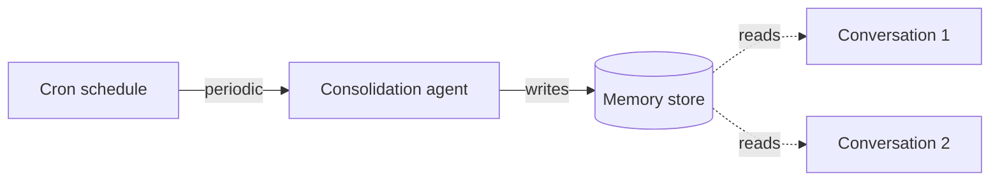

# Deep Agents 메모리 (Memory)

> 원문: https://docs.langchain.com/oss/python/deepagents/memory
>
> Deep Agents로 구축된 에이전트에 영속 메모리를 추가하여 대화 간 학습 및 개선이 가능하도록 만들기

---

## 📖 목차

1. [메모리란?](#-메모리란)
2. [메모리 동작 방식](#-메모리-동작-방식)
3. [스코프 기반 메모리](#-스코프-기반-메모리-scoped-memory)
4. [고급 사용법](#-고급-사용법-advanced-usage)
5. [Episodic 메모리](#-episodic-메모리)
6. [조직 단위 메모리](#-조직-단위-메모리-organization-level-memory)
7. [백그라운드 통합](#-백그라운드-통합-background-consolidation)
8. [읽기 전용 vs 쓰기 가능 메모리](#-읽기-전용-vs-쓰기-가능-메모리)
9. [동시 쓰기 & 다중 에이전트](#-동시-쓰기와-다중-에이전트)

---

## 📌 메모리란?

메모리(memory)는 에이전트가 **대화를 넘어서 학습하고 개선**할 수 있게 해줍니다. Deep Agents는 파일 시스템 기반 메모리를 **1급 시민(first class)** 으로 다룹니다. 에이전트는 메모리를 파일처럼 읽고 쓰며, [백엔드(backends)](https://docs.langchain.com/oss/python/deepagents/backends)를 통해 이러한 파일이 저장되는 위치를 제어할 수 있습니다.

> 📘 **이 페이지는 장기 메모리(long-term memory)를 다룹니다.** — 대화를 넘어서 영속되는 메모리에 대한 내용입니다. 단일 세션 내의 대화 히스토리 및 스크래치 파일 등의 단기 메모리(short-term memory)는 [context engineering](https://docs.langchain.com/oss/python/deepagents/context-engineering) 가이드를 참고하세요. 단기 메모리는 에이전트의 [상태(state)](https://docs.langchain.com/oss/python/langgraph/graph-api#state)의 일부로 자동 관리됩니다.

---

## 🚀 메모리 동작 방식

1. **에이전트에 메모리 파일을 지정합니다.** 에이전트 생성 시 `memory=` 파라미터에 파일 경로를 전달합니다. 또한 [스킬(skills)](https://docs.langchain.com/oss/python/deepagents/skills)을 `skills=` 파라미터로 전달하여, *어떻게* 작업을 수행할지에 대한 재사용 가능한 절차적 메모리(procedural memory)도 추가할 수 있습니다. [백엔드(backend)](https://docs.langchain.com/oss/python/deepagents/backends)는 파일이 어디에 저장되고 누가 접근할 수 있는지 제어합니다.
2. **에이전트가 메모리를 읽습니다.** 에이전트는 시작 시점에 메모리 파일을 시스템 프롬프트에 로드하거나, 대화 중에 필요할 때 읽을 수 있습니다. 예를 들어 [스킬](https://docs.langchain.com/oss/python/deepagents/skills)은 온디맨드 로딩 방식을 사용합니다. 시작 시에는 스킬 설명만 읽고, 작업에 매칭될 때만 전체 스킬 파일을 읽습니다. 이는 능력이 필요한 시점까지 컨텍스트를 가볍게 유지해줍니다.
3. **에이전트가 메모리를 업데이트합니다 (선택적).** 에이전트가 새로운 정보를 학습하면, 기본 내장된 `edit_file` 도구를 사용해 메모리 파일을 업데이트할 수 있습니다. 업데이트는 대화 중(기본값)에 발생하거나, 대화 사이에 [백그라운드 통합(background consolidation)](#-백그라운드-통합-background-consolidation)을 통해 수행될 수 있습니다. 변경 사항은 영속화되어 다음 대화에서 사용 가능합니다. 모든 메모리가 쓰기 가능한 것은 아닙니다. 개발자가 정의한 [스킬](https://docs.langchain.com/oss/python/deepagents/skills)과 [조직 정책(organization policies)](#-조직-단위-메모리-organization-level-memory)은 일반적으로 읽기 전용입니다. 자세한 내용은 [읽기 전용 vs 쓰기 가능 메모리](#-읽기-전용-vs-쓰기-가능-메모리)를 참고하세요.

가장 흔한 두 가지 패턴은 [에이전트 스코프 메모리(agent-scoped memory)](#에이전트-스코프-메모리-agent-scoped-memory)(모든 사용자가 공유)와 [사용자 스코프 메모리(user-scoped memory)](#사용자-스코프-메모리-user-scoped-memory)(사용자별 격리)입니다.

---

## 🎯 스코프 기반 메모리 (Scoped memory)

에이전트 메모리는 모든 사용자가 같은 메모리 파일에 접근하거나, 사용자별로 개별 메모리를 갖도록 스코프를 지정할 수 있습니다.

### 에이전트 스코프 메모리 (Agent-scoped memory)

에이전트에게 시간이 지나면서 진화하는 자체 영속 정체성(persistent identity)을 부여합니다. 에이전트 스코프 메모리는 모든 사용자가 공유하므로, 에이전트는 매 대화를 통해 자신만의 페르소나, 누적된 지식, 학습된 선호도를 쌓아갑니다. 사용자와 상호작용하면서 전문성을 발전시키고, 접근 방식을 개선하며, 무엇이 효과가 있었는지 기억합니다. 쓰기 권한이 있을 때는 [스킬](https://docs.langchain.com/oss/python/deepagents/skills)을 학습하고 업데이트할 수도 있습니다.

핵심은 백엔드 네임스페이스입니다. `(assistant_id,)`로 설정하면 이 에이전트의 모든 대화가 동일한 메모리 파일을 읽고 씁니다.

> 📘 `rt.server_info`에 접근하려면 `deepagents>=0.5.0` 이상이 필요합니다. 이전 버전에서는 대신 `get_config()["metadata"]["assistant_id"]`에서 assistant ID를 읽으세요.

```python
from deepagents import create_deep_agent
from deepagents.backends import CompositeBackend, StateBackend, StoreBackend

agent = create_deep_agent(
    model="google_genai:gemini-3.1-pro-preview",
    memory=["/memories/AGENTS.md"],
    skills=["/skills/"],
    backend=CompositeBackend(
        default=StateBackend(),
        routes={
            "/memories/": StoreBackend(
                namespace=lambda rt: (
                    rt.server_info.assistant_id,
                ),
            ),
            "/skills/": StoreBackend(
                namespace=lambda rt: (
                    rt.server_info.assistant_id,
                ),
            ),
        },
    ),
)
```

<details>
<summary><strong>전체 예시: 메모리 시드 및 호출</strong></summary>

스토어에 초기 메모리를 채워 넣은 다음, 두 개의 스레드에서 에이전트를 호출하여 에이전트가 학습한 내용을 기억하고 업데이트하는 모습을 확인합니다.

```python
from langchain_core.utils.uuid import uuid7

from deepagents import create_deep_agent
from deepagents.backends import CompositeBackend, StateBackend, StoreBackend
from deepagents.backends.utils import create_file_data
from langgraph.store.memory import InMemoryStore

store = InMemoryStore()  # LangSmith 배포 시에는 플랫폼 store 사용

# 메모리 파일 시드
store.put(
    ("my-agent",),
    "/memories/AGENTS.md",
    create_file_data("""## Response style
- Keep responses concise
- Use code examples where possible
"""),
)

# 스킬 시드
store.put(
    ("my-agent",),
    "/skills/langgraph-docs/SKILL.md",
    create_file_data("""---
name: langgraph-docs
description: Fetch relevant LangGraph documentation to provide accurate guidance.
---

# langgraph-docs

Use the fetch_url tool to read https://docs.langchain.com/llms.txt, then fetch relevant pages.
"""),
)

agent = create_deep_agent(
    model="google_genai:gemini-3.1-pro-preview",
    memory=["/memories/AGENTS.md"],
    skills=["/skills/"],
    backend=lambda rt: CompositeBackend(
        default=StateBackend(rt),
        routes={
            "/memories/": StoreBackend(
                rt, namespace=lambda rt: ("my-agent",)
            ),
            "/skills/": StoreBackend(
                rt, namespace=lambda rt: ("my-agent",)
            ),
        },
    ),
    store=store,
)

# Thread 1: 에이전트가 새로운 선호도를 학습하여 메모리에 저장
config1 = {"configurable": {"thread_id": str(uuid7())}}
agent.invoke(
    {"messages": [{"role": "user", "content": "I prefer detailed explanations. Remember that."}]},
    config=config1,
)

# Thread 2: 에이전트가 메모리를 읽고 선호도를 적용
config2 = {"configurable": {"thread_id": str(uuid7())}}
agent.invoke(
    {"messages": [{"role": "user", "content": "Explain how transformers work."}]},
    config=config2,
)
```

</details>

### 사용자 스코프 메모리 (User-scoped memory)

각 사용자에게 자체 메모리 파일을 부여합니다. 에이전트는 핵심 지시 사항은 고정된 상태로 유지하면서, 사용자별 선호도, 컨텍스트, 히스토리를 기억합니다. 사용자 스코프 백엔드에 저장된다면 사용자별 [스킬](https://docs.langchain.com/oss/python/deepagents/skills)도 가질 수 있습니다.

네임스페이스가 `(user_id,)`를 사용하므로 각 사용자는 메모리 파일의 격리된 복사본을 갖습니다. 사용자 A의 선호도는 사용자 B의 대화로 절대 누출되지 않습니다.

```python
from deepagents import create_deep_agent
from deepagents.backends import CompositeBackend, StateBackend, StoreBackend

agent = create_deep_agent(
    model="google_genai:gemini-3.1-pro-preview",
    memory=["/memories/preferences.md"],
    skills=["/skills/"],
    backend=CompositeBackend(
        default=StateBackend(),
        routes={
            "/memories/": StoreBackend(
                namespace=lambda rt: (rt.server_info.user.identity,),
            ),
            "/skills/": StoreBackend(
                namespace=lambda rt: (rt.server_info.user.identity,),
            ),
        },
    ),
)
```

<details>
<summary><strong>전체 예시: 사용자별 격리된 메모리</strong></summary>

사용자별 메모리를 시드한 다음, 두 명의 서로 다른 사용자로 에이전트를 호출합니다. 각 사용자는 자신의 선호도만 봅니다.

```python
from langchain_core.utils.uuid import uuid7

from deepagents import create_deep_agent
from deepagents.backends import CompositeBackend, StateBackend, StoreBackend
from deepagents.backends.utils import create_file_data
from langgraph.store.memory import InMemoryStore


store = InMemoryStore()  # LangSmith 배포 시에는 플랫폼 store 사용

# 두 사용자의 선호도 시드
store.put(
    ("user-alice",),
    "/memories/preferences.md",
    create_file_data("""## Preferences
- Likes concise bullet points
- Prefers Python examples
"""),
)
store.put(
    ("user-bob",),
    "/memories/preferences.md",
    create_file_data("""## Preferences
- Likes detailed explanations
- Prefers TypeScript examples
"""),
)

# Alice를 위한 스킬 시드
store.put(
    ("user-alice",),
    "/skills/langgraph-docs/SKILL.md",
    create_file_data("""---
name: langgraph-docs
description: Fetch relevant LangGraph documentation to provide accurate guidance.
---

# langgraph-docs

Use the fetch_url tool to read https://docs.langchain.com/llms.txt, then fetch relevant pages.
"""),
)

agent = create_deep_agent(
    model="google_genai:gemini-3.1-pro-preview",
    memory=["/memories/preferences.md"],
    skills=["/skills/"],
    backend=lambda rt: CompositeBackend(
        default=StateBackend(rt),
        routes={
            "/memories/": StoreBackend(
                rt,
                namespace=lambda rt: (rt.server_info.user.identity,),
            ),
            "/skills/": StoreBackend(
                rt,
                namespace=lambda rt: (rt.server_info.user.identity,),
            ),
        },
    ),
    store=store,
)

# 배포되면 인증된 각 요청이 `rt.server_info.user.identity`를
# 호출 사용자로 해석하므로, Alice와 Bob은 자동으로
# 자신의 선호도만 보게 됩니다.
agent.invoke(
    {"messages": [{"role": "user", "content": "How do I read a CSV file?"}]},
    config={"configurable": {"thread_id": str(uuid7())}},
)
```

</details>

---

## 🧩 고급 사용법 (Advanced usage)

메모리 경로와 스코프에 대한 기본 구성 외에도 더 고급 파라미터를 구성할 수 있습니다.

| 차원 (Dimension) | 답하는 질문 | 옵션 |
|----------------|---------|-----|
| **Duration (기간)** | 얼마나 지속되는가? | [단기(Short-term)](https://docs.langchain.com/oss/python/deepagents/context-engineering) (단일 대화) 또는 [장기(long-term)](#-스코프-기반-메모리-scoped-memory) (대화 간) |
| **Information type (정보 유형)** | 어떤 종류의 정보인가? | [Episodic](#-episodic-메모리) (과거 경험), [절차적(procedural)](https://docs.langchain.com/oss/python/deepagents/skills) (지시 사항과 스킬), [의미론적(semantic)](https://docs.langchain.com/oss/python/concepts/memory#semantic-memory) (사실) |
| **Scope (스코프)** | 누가 보고 수정할 수 있는가? | [사용자(User)](#사용자-스코프-메모리-user-scoped-memory), [에이전트(agent)](#에이전트-스코프-메모리-agent-scoped-memory), [조직(organization)](#-조직-단위-메모리-organization-level-memory) |
| **Update strategy (업데이트 전략)** | 메모리가 언제 쓰여지는가? | 대화 중(기본값) 또는 [대화 사이(between conversations)](#-백그라운드-통합-background-consolidation) |
| **Retrieval (검색)** | 메모리가 어떻게 읽혀지는가? | 프롬프트에 로드(기본값) 또는 온디맨드(예: [스킬](https://docs.langchain.com/oss/python/deepagents/skills)) |
| **Agent permissions (에이전트 권한)** | 에이전트가 메모리에 쓸 수 있는가? | [Read-write](#-읽기-전용-vs-쓰기-가능-메모리) (기본값) 또는 [읽기 전용(read-only)](#-읽기-전용-vs-쓰기-가능-메모리) (공유 정책용) |

---

## 🧠 Episodic 메모리

Episodic 메모리는 **과거 경험의 기록**을 저장합니다. 무엇이 일어났는지, 어떤 순서로 발생했는지, 결과가 어땠는지를 기록합니다. `AGENTS.md` 같은 파일에 저장된 사실과 선호도 같은 의미론적 메모리(semantic memory)와 달리, episodic 메모리는 전체 대화 컨텍스트를 보존하여 에이전트가 단순히 *무엇을* 배웠는지가 아니라 *어떻게* 문제를 해결했는지 회상할 수 있게 합니다.

Deep Agents는 이미 episodic 메모리를 지원하는 메커니즘인 [checkpointer](https://docs.langchain.com/oss/python/langgraph/persistence#checkpoints)를 사용합니다. 모든 대화는 체크포인트된 스레드로 영속화됩니다.

과거 대화를 검색 가능하게 만들려면, 스레드 검색을 도구로 감싸세요. `user_id`는 파라미터로 전달하기보다 런타임 컨텍스트에서 가져옵니다.

```python
from langgraph_sdk import get_client
from langchain.tools import tool, ToolRuntime

client = get_client(url="<DEPLOYMENT_URL>")


@tool
async def search_past_conversations(query: str, runtime: ToolRuntime) -> str:
    """Search past conversations for relevant context."""
    user_id = runtime.server_info.user.identity
    threads = await client.threads.search(
        metadata={"user_id": user_id},
        limit=5,
    )
    results = []
    for thread in threads:
        history = await client.threads.get_history(thread_id=thread["thread_id"])
        results.append(history)
    return str(results)
```

메타데이터 필터를 조정하여 사용자나 조직 단위로 스레드 검색을 스코프할 수 있습니다.

```python
# 특정 사용자의 대화 검색
threads = await client.threads.search(
    metadata={"user_id": user_id},
    limit=5,
)

# 조직 전반의 대화 검색
threads = await client.threads.search(
    metadata={"org_id": org_id},
    limit=5,
)
```

이는 복잡하고 다단계 작업을 수행하는 에이전트에 유용합니다. 예를 들어, 코딩 에이전트는 과거 디버깅 세션을 되돌아보고 가능한 근본 원인으로 바로 건너뛸 수 있습니다.

---

## 🛠️ 조직 단위 메모리 (Organization-level memory)

조직 단위 메모리는 사용자 스코프 메모리와 동일한 패턴을 따르지만, 사용자별 네임스페이스 대신 조직 전체 네임스페이스를 사용합니다. 조직의 모든 사용자와 에이전트에 적용되어야 하는 정책이나 지식에 사용하세요.

조직 메모리는 공유 상태를 통한 프롬프트 인젝션을 방지하기 위해 일반적으로 **읽기 전용**입니다. 자세한 내용은 [읽기 전용 vs 쓰기 가능 메모리](#-읽기-전용-vs-쓰기-가능-메모리)를 참고하세요.

```python
from deepagents import create_deep_agent
from deepagents.backends import CompositeBackend, StateBackend, StoreBackend

agent = create_deep_agent(
    model="google_genai:gemini-3.1-pro-preview",
    memory=[
        "/memories/preferences.md",
        "/policies/compliance.md",
    ],
    backend=CompositeBackend(
        default=StateBackend(),
        routes={
            "/memories/": StoreBackend(
                namespace=lambda rt: (rt.server_info.user.identity,),
            ),
            "/policies/": StoreBackend(
                namespace=lambda rt: (rt.context.org_id,),
            ),
        },
    ),
)
```

애플리케이션 코드에서 조직 메모리를 채워 넣습니다.

```python
from langgraph_sdk import get_client
from deepagents.backends.utils import create_file_data

client = get_client(url="<DEPLOYMENT_URL>")

await client.store.put_item(
    (org_id,),
    "/compliance.md",
    create_file_data("""## Compliance policies
- Never disclose internal pricing
- Always include disclaimers on financial advice
"""),
)
```

조직 단위 메모리가 읽기 전용으로 강제되도록 하려면 [permissions](https://docs.langchain.com/oss/python/deepagents/permissions)를 사용하거나, 커스텀 검증 로직을 위해 [policy hooks](https://docs.langchain.com/oss/python/deepagents/backends#add-policy-hooks)를 사용하세요.

---

## ⚙️ 백그라운드 통합 (Background consolidation)

기본적으로 에이전트는 대화 중에(핫 패스, hot path) 메모리를 작성합니다. 대안은 **대화 사이에** 메모리를 백그라운드 작업으로 처리하는 것입니다. 이를 **수면 시간 계산(sleep time compute)** 이라고도 합니다. 별도의 deep agent가 최근 대화를 검토하고, 핵심 사실을 추출하여, 기존 메모리와 병합합니다.

| 접근 방식 | 장점 | 단점 |
|---------|-----|-----|
| **Hot path** (대화 중) | 메모리를 즉시 사용 가능, 사용자에게 투명함 | 지연 시간 추가, 에이전트가 멀티태스킹해야 함 |
| **Background** (대화 사이) | 사용자 대상 지연 없음, 여러 대화에 걸쳐 종합 가능 | 다음 대화 전까지 메모리 사용 불가, 두 번째 에이전트 필요 |

대부분의 애플리케이션에는 hot path로 충분합니다. 지연 시간을 줄이거나 여러 대화에 걸쳐 메모리 품질을 향상시키려면 백그라운드 통합을 추가하세요.

권장 패턴은 메인 에이전트와 함께 **통합 에이전트(consolidation agent)** 를 배포하는 것입니다. 최근 대화 히스토리를 읽고, 핵심 사실을 추출하여, 메모리 스토어에 병합하는 deep agent이며, [cron 스케줄](#cron)로 트리거합니다. 사용자가 실제로 에이전트와 상호작용하는 빈도를 반영하는 주기를 선택하세요. 매일 꾸준한 트래픽이 있는 채팅 제품은 몇 시간마다 통합할 수 있지만, 주에 몇 번만 사용되는 도구는 야간이나 주간으로만 실행하면 됩니다. 사용자가 대화하는 것보다 훨씬 자주 통합하면 no-op 실행에 토큰만 소모합니다.

### 통합 에이전트 (Consolidation agent)

통합 에이전트는 최근 대화 히스토리를 읽고 핵심 사실을 메모리 스토어에 병합합니다. `langgraph.json`에 메인 에이전트와 함께 등록하세요.

```python
# consolidation_agent.py
from datetime import datetime, timedelta, timezone

from deepagents import create_deep_agent
from langchain.tools import tool, ToolRuntime
from langgraph_sdk import get_client

sdk_client = get_client(url="<DEPLOYMENT_URL>")


@tool
async def search_recent_conversations(query: str, runtime: ToolRuntime) -> str:
    """Search this user's conversations updated in the last 6 hours."""
    user_id = runtime.server_info.user.identity

    since = datetime.now(timezone.utc) - timedelta(hours=6)
    threads = await sdk_client.threads.search(
        metadata={"user_id": user_id},
        updated_after=since.isoformat(),
        limit=20,
    )
    conversations = []
    for thread in threads:
        history = await sdk_client.threads.get_history(
            thread_id=thread["thread_id"]
        )
        conversations.append(history["values"]["messages"])
    return str(conversations)


agent = create_deep_agent(
    model="google_genai:gemini-3.1-pro-preview",
    system_prompt="""Review recent conversations and update the user's memory file.
Merge new facts, remove outdated information, and keep it concise.""",
    tools=[search_recent_conversations],
)
```

```json
// langgraph.json
{
  "dependencies": ["."],
  "graphs": {
    "agent": "./agent.py:agent",
    "consolidation_agent": "./consolidation_agent.py:agent"
  },
  "env": ".env"
}
```

### Cron

[cron 작업](https://docs.langchain.com/langsmith/cron-jobs)이 통합 에이전트를 고정된 스케줄로 실행합니다. 에이전트는 최근 대화를 검색하여 메모리로 종합합니다. 통합 실행이 실제 활동을 대략적으로 추적하도록 사용 패턴에 일정을 맞추세요.



cron 작업으로 통합 에이전트를 스케줄링합니다.

```python
from langgraph_sdk import get_client

client = get_client(url="<DEPLOYMENT_URL>")

cron_job = await client.crons.create(
    assistant_id="consolidation_agent",
    schedule="0 */6 * * *",
    input={"messages": [{"role": "user", "content": "Consolidate recent memories."}]},
)
```

> 📘 모든 cron 스케줄은 **UTC**로 해석됩니다. cron 작업 관리 및 삭제에 대한 자세한 내용은 [cron jobs](https://docs.langchain.com/langsmith/cron-jobs)를 참고하세요.

> ⚠️ **Cron 간격은 통합 에이전트 내부의 lookback 윈도우와 일치해야 합니다.** 위 예시는 6시간마다 실행되며(`0 */6 * * *`), 에이전트의 `search_recent_conversations` 도구는 `timedelta(hours=6)`를 lookback합니다. 이 둘을 동기화하세요. cron이 lookback보다 자주 실행되면 동일한 대화를 재처리하게 되고, 덜 자주 실행되면 윈도우를 벗어나는 메모리가 누락됩니다.

백그라운드 프로세스를 사용하는 에이전트 배포에 대한 자세한 내용은 [going to production](https://docs.langchain.com/oss/python/deepagents/going-to-production)을 참고하세요.

---

## 🔒 읽기 전용 vs 쓰기 가능 메모리

기본적으로 에이전트는 메모리 파일을 읽고 쓸 수 있습니다. 조직 정책이나 컴플라이언스 규칙 같은 공유 상태에 대해서는 에이전트가 참조는 할 수 있지만 수정은 못 하도록 **읽기 전용**으로 만들 수 있습니다. 이는 공유 메모리를 통한 프롬프트 인젝션을 방지하고, 파일에 들어가는 내용을 애플리케이션 코드만이 제어하도록 보장합니다.

| 권한 | 사용 사례 | 동작 방식 |
|-----|---------|---------|
| **Read-write** (기본값) | 사용자 선호도, 에이전트 자체 개선, 학습된 [스킬](https://docs.langchain.com/oss/python/deepagents/skills) | 에이전트가 `edit_file` 도구로 파일 업데이트 |
| **Read-only** | 조직 정책, 컴플라이언스 규칙, 공유 지식 베이스, 개발자 정의 [스킬](https://docs.langchain.com/oss/python/deepagents/skills) | 애플리케이션 코드나 [Store API](https://docs.langchain.com/langsmith/custom-store)로 채워 넣음. 특정 경로에 대한 쓰기를 거부하려면 [permissions](https://docs.langchain.com/oss/python/deepagents/permissions)를 사용하거나, 커스텀 검증 로직을 위해 [policy hooks](https://docs.langchain.com/oss/python/deepagents/backends#add-policy-hooks)를 사용하세요. |

**보안 고려사항:** 한 사용자가 다른 사용자가 읽는 메모리에 쓸 수 있다면, 악의적인 사용자가 공유 상태를 통해 지시 사항을 인젝션할 수 있습니다. 이를 완화하려면:

* **기본적으로 사용자 스코프** `(user_id)`를 사용하세요. 공유할 특별한 이유가 없는 한.
* 공유 정책에는 **읽기 전용 메모리**를 사용하세요 (에이전트가 아닌 애플리케이션 코드로 채워 넣기).
* 에이전트가 공유 메모리에 쓰기 전에 **Human-in-the-loop** 검증을 추가하세요. 민감한 경로에 대한 쓰기에 사람의 승인을 요구하기 위해 [interrupt](https://docs.langchain.com/oss/python/langgraph/interrupts)를 사용하세요.

읽기 전용 메모리를 강제하려면, [permissions](https://docs.langchain.com/oss/python/deepagents/permissions)를 사용해 특정 경로에 대한 쓰기를 선언적으로 거부하세요. 커스텀 검증 로직(레이트 리밋, 감사 로깅, 콘텐츠 검사)이 필요하다면 [backend policy hooks](https://docs.langchain.com/oss/python/deepagents/backends#add-policy-hooks)를 사용하세요.

---

## 🤝 동시 쓰기와 다중 에이전트

### 동시 쓰기 (Concurrent writes)

여러 스레드가 메모리에 병렬로 쓸 수 있지만, **동일한 파일**에 대한 동시 쓰기는 마지막 쓰기가 이기는(last-write-wins) 충돌을 일으킬 수 있습니다. 사용자 스코프 메모리의 경우 일반적으로 사용자는 한 번에 하나의 활성 대화만 갖기 때문에 드뭅니다. 에이전트 스코프나 조직 스코프 메모리의 경우 쓰기를 직렬화하기 위해 [백그라운드 통합](#-백그라운드-통합-background-consolidation)을 사용하거나, 경합을 줄이기 위해 주제별로 별도 파일로 메모리를 구조화하는 것을 고려하세요.

실제로 충돌로 인해 쓰기가 실패하더라도 LLM은 일반적으로 재시도하거나 우아하게 복구할 만큼 똑똑하므로, 단일 쓰기 손실은 치명적이지 않습니다.

### 같은 배포 내의 다중 에이전트

공유 배포 환경에서 각 에이전트에 자체 메모리를 부여하려면 네임스페이스에 `assistant_id`를 추가하세요.

```python
StoreBackend(
    namespace=lambda rt: (
        rt.server_info.assistant_id,
        rt.server_info.user.identity,
    ),
)
```

사용자별 스코프 없이 에이전트별 격리만 필요하다면 `assistant_id`만 사용하세요.

> 💡 에이전트가 메모리에 무엇을 쓰는지 감사하려면 [LangSmith tracing](https://docs.langchain.com/langsmith/trace-with-langgraph)을 사용하세요. 모든 파일 쓰기는 트레이스에 도구 호출로 나타납니다.
