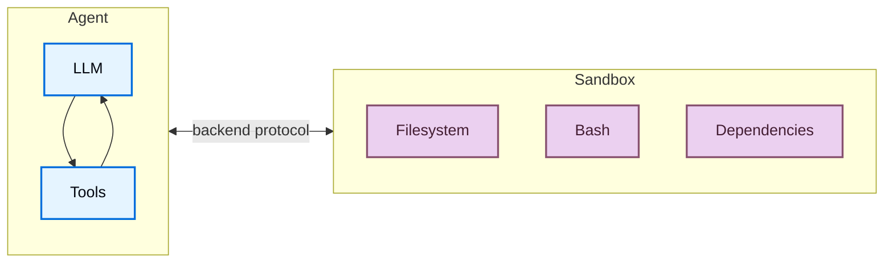
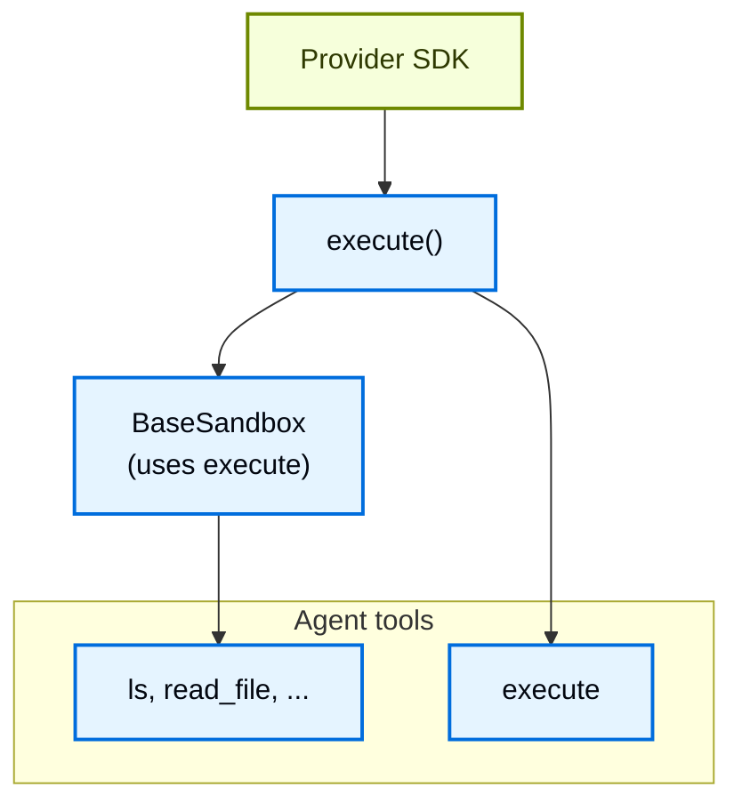
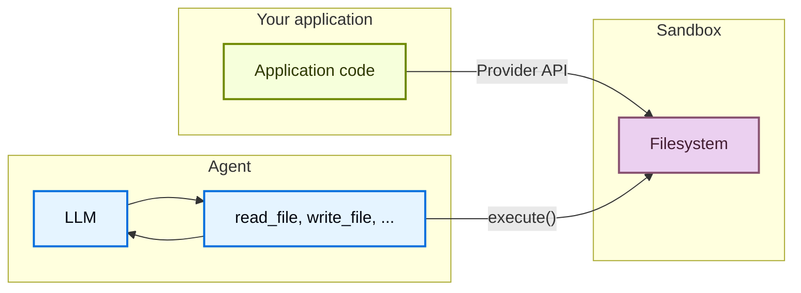

# Deep Agents 샌드박스 (Sandboxes)

> 원문: https://docs.langchain.com/oss/python/deepagents/sandboxes
>
> 격리된 환경에서 코드를 실행하기 위한 샌드박스 백엔드 사용법

---

## 📖 목차

1. [📌 샌드박스란?](#-샌드박스란)
2. [🎯 샌드박스를 왜 사용해야 할까?](#-샌드박스를-왜-사용해야-할까)
3. [🚀 기본 사용법 (Basic usage)](#-기본-사용법-basic-usage)
4. [🔌 사용 가능한 프로바이더 (Available providers)](#-사용-가능한-프로바이더-available-providers)
5. [♻️ 라이프사이클과 스코프 (Lifecycle and scoping)](#-라이프사이클과-스코프-lifecycle-and-scoping)
6. [🧩 통합 패턴 (Integration patterns)](#-통합-패턴-integration-patterns)
7. [⚙️ 샌드박스 작동 방식 (How sandboxes work)](#-샌드박스-작동-방식-how-sandboxes-work)
8. [📁 파일 다루기 (Working with files)](#-파일-다루기-working-with-files)
9. [🔒 보안 고려사항 (Security considerations)](#-보안-고려사항-security-considerations)

---

에이전트는 코드를 생성하고, 파일 시스템과 상호작용하며, 셸 명령을 실행합니다. 에이전트가 어떤 작업을 할지 예측할 수 없기 때문에, 자격 증명·파일·네트워크에 접근하지 못하도록 환경을 격리하는 것이 중요합니다. 샌드박스는 에이전트의 실행 환경과 호스트 시스템 사이에 경계를 만들어 이러한 격리를 제공합니다.

Deep Agents에서 **샌드박스는 [백엔드](https://docs.langchain.com/oss/python/deepagents/backends)** 의 한 종류로, 에이전트가 동작하는 환경을 정의합니다. 파일 작업만 노출하는 다른 백엔드(State, Filesystem, Store)와 달리, 샌드박스 백엔드는 에이전트에게 셸 명령을 실행할 수 있는 `execute` 도구도 제공합니다. 샌드박스 백엔드를 구성하면 에이전트는 다음을 갖게 됩니다.

- 모든 표준 파일 시스템 도구 (`ls`, `read_file`, `write_file`, `edit_file`, `glob`, `grep`)
- 샌드박스 내에서 임의의 셸 명령을 실행하는 `execute` 도구
- 호스트 시스템을 보호하는 안전한 경계



---

## 📌 샌드박스란?

샌드박스는 에이전트의 실행 환경과 호스트 시스템 사이에 격리 경계를 두는 백엔드입니다. 파일 시스템 도구뿐만 아니라 `execute` 도구를 통해 셸 명령 실행 능력까지 함께 제공합니다.

---

## 🎯 샌드박스를 왜 사용해야 할까?

샌드박스는 **보안**을 위해 사용합니다. 자격 증명, 로컬 파일, 호스트 시스템을 손상시키지 않으면서 에이전트가 임의의 코드를 실행하고, 파일에 접근하고, 네트워크를 사용할 수 있게 해 줍니다. 이러한 격리는 에이전트가 자율적으로 실행될 때 필수적입니다.

샌드박스는 다음과 같은 경우에 특히 유용합니다.

- **코딩 에이전트**: 자율 실행 에이전트가 셸과 git을 사용하고 리포지토리를 클론하며(많은 프로바이더는 네이티브 git API를 제공합니다. 예: [Daytona git operations](https://www.daytona.io/docs/en/git-operations/)), 빌드/테스트 파이프라인을 위해 Docker-in-Docker를 실행할 수 있습니다.
- **데이터 분석 에이전트**: 파일을 로드하고, 데이터 분석 라이브러리(pandas, numpy 등)를 설치하며, 통계 계산을 실행하고, PowerPoint 프레젠테이션 같은 결과물을 안전하고 격리된 환경에서 생성합니다.

> 💡 **Deep Agents Code 사용 중인가요?** Deep Agents Code는 `--sandbox` 플래그로 샌드박스를 기본 지원합니다. Deep Agents Code 전용 설정, 플래그(`--sandbox-id`, `--sandbox-setup`), 예시는 [Use remote sandboxes](https://docs.langchain.com/oss/python/deepagents/code/remote-sandboxes)를 참조하세요.

---

## 🚀 기본 사용법 (Basic usage)

아래 예시들은 프로바이더의 SDK로 이미 샌드박스/devbox를 생성했고 자격 증명도 설정한 상태를 가정합니다. 가입, 인증, 프로바이더별 라이프사이클 세부사항은 [사용 가능한 프로바이더](#-사용-가능한-프로바이더-available-providers)를 참고하세요.

### Modal

```bash
pip install langchain-modal
```

```python
import modal
from deepagents import create_deep_agent
from langchain_anthropic import ChatAnthropic
from langchain_modal import ModalSandbox

app = modal.App.lookup("your-app")
modal_sandbox = modal.Sandbox.create(app=app)
backend = ModalSandbox(sandbox=modal_sandbox)

agent = create_deep_agent(
    model=ChatAnthropic(model="claude-sonnet-4-6"),
    system_prompt="You are a Python coding assistant with sandbox access.",
    backend=backend,
)
try:
    result = agent.invoke(
        {
            "messages": [
                {
                    "role": "user",
                    "content": "Create a small Python package and run pytest",
                }
            ]
        }
    )
finally:
    modal_sandbox.terminate()
```

### Runloop

```bash
pip install langchain-runloop
```

```python
import os

from deepagents import create_deep_agent
from langchain_anthropic import ChatAnthropic
from langchain_runloop import RunloopSandbox
from runloop_api_client import RunloopSDK

client = RunloopSDK(bearer_token=os.environ["RUNLOOP_API_KEY"])

devbox = client.devbox.create()
backend = RunloopSandbox(devbox=devbox)

agent = create_deep_agent(
    model=ChatAnthropic(model="claude-sonnet-4-6"),
    system_prompt="You are a Python coding assistant with sandbox access.",
    backend=backend,
)

try:
    result = agent.invoke(
        {
            "messages": [
                {
                    "role": "user",
                    "content": "Create a small Python package and run pytest",
                }
            ]
        }
    )
finally:
    devbox.shutdown()
```

### Daytona

```bash
pip install langchain-daytona
```

```python
from daytona import Daytona
from deepagents import create_deep_agent
from langchain_anthropic import ChatAnthropic
from langchain_daytona import DaytonaSandbox

sandbox = Daytona().create()
backend = DaytonaSandbox(sandbox=sandbox)

agent = create_deep_agent(
    model=ChatAnthropic(model="claude-sonnet-4-6"),
    system_prompt="You are a Python coding assistant with sandbox access.",
    backend=backend,
)

try:
    result = agent.invoke(
        {
            "messages": [
                {
                    "role": "user",
                    "content": "Create a small Python package and run pytest",
                }
            ]
        }
    )
finally:
    sandbox.stop()
```

### LangSmith (Private Beta)

> ℹ️ LangSmith 샌드박스는 현재 프라이빗 베타로 제공됩니다.

```bash
pip install "langsmith[sandbox]"
```

```python
from deepagents import create_deep_agent
from deepagents.backends import LangSmithSandbox
from langchain_anthropic import ChatAnthropic
from langsmith.sandbox import SandboxClient

client = SandboxClient()
ls_sandbox = client.create_sandbox()
backend = LangSmithSandbox(sandbox=ls_sandbox)

agent = create_deep_agent(
    model=ChatAnthropic(model="claude-sonnet-4-6"),
    system_prompt="You are a Python coding assistant with sandbox access.",
    backend=backend,
)
try:
    result = agent.invoke(
        {
            "messages": [
                {
                    "role": "user",
                    "content": "Create a small Python package and run pytest",
                }
            ]
        }
    )
finally:
    client.delete_sandbox(ls_sandbox.name)
```

---

## 🔌 사용 가능한 프로바이더 (Available providers)

프로바이더별 설정, 인증, 라이프사이클 세부사항은 [sandbox integrations](https://docs.langchain.com/oss/python/integrations/sandboxes)를 참고하세요.

원하는 프로바이더가 보이지 않나요? 직접 샌드박스 백엔드를 구현할 수 있습니다. [Contributing a sandbox integration](https://docs.langchain.com/oss/python/contributing/integrations-langchain)를 확인하세요.

---

## ♻️ 라이프사이클과 스코프 (Lifecycle and scoping)

대부분의 애플리케이션은 [스레드](https://docs.langchain.com/langsmith/use-threads)별로 샌드박스를 하나 사용하거나(thread-scoped), 같은 [어시스턴트](https://docs.langchain.com/langsmith/assistants)에 속하는 모든 스레드가 하나의 샌드박스를 공유하는 방식(assistant-scoped) 중 하나를 선택합니다.

샌드박스는 자원을 소비하고 종료될 때까지 비용이 발생합니다. 더 이상 사용하지 않는 샌드박스는 반드시 종료하세요.

전체 라이프사이클 표, 비동기 [그래프 팩토리](https://docs.langchain.com/langsmith/graph-rebuild) 관련 내용, TTL 동작, LangGraph Deployment 연동, 클라이언트 측 예시는 Going to production 문서의 [Sandbox lifecycle](https://docs.langchain.com/oss/python/deepagents/going-to-production#lifecycle)을 참고하세요.

### Thread-scoped (기본값)

각 대화가 자체 샌드박스를 갖습니다. 첫 실행 시 샌드박스가 생성되고, 같은 스레드의 후속 턴은 이를 재사용합니다. 스레드가 종료되거나 샌드박스 TTL이 만료되면 환경이 사라집니다. 다음 예시처럼 프로바이더 라벨이나 메타데이터로 매핑을 저장하여, 각 실행이 동일한 샌드박스로 라우팅되도록 하세요.

> 💡 사용자가 유휴 시간이 흐른 뒤 돌아올 수 있는 경우, 프로바이더가 유휴 환경을 자동으로 삭제·아카이브하도록 샌드박스에 TTL을 설정하세요.

#### Python

```python
# agent.py
from daytona import CreateSandboxFromSnapshotParams, Daytona
from deepagents import create_deep_agent
from langchain_core.runnables import RunnableConfig
from langchain_daytona import DaytonaSandbox

client = Daytona()


async def agent(config: RunnableConfig):
    thread_id = config["configurable"]["thread_id"]
    try:
        sandbox = await client.find_one(labels={"thread_id": thread_id})
    except Exception:
        sandbox = await client.create(
            CreateSandboxFromSnapshotParams(
                labels={"thread_id": thread_id},
                auto_delete_interval=3600,  # TTL: clean up when idle
            )
        )
    return create_deep_agent(
        model="google_genai:gemini-3.1-pro-preview",
        backend=DaytonaSandbox(sandbox=sandbox)
    )
```

#### TypeScript

```typescript
// src/agent.ts
import { Daytona } from "@daytonaio/sdk";
import { DaytonaSandbox } from "@langchain/daytona";
import { createDeepAgent } from "deepagents";
import type { LangGraphRunnableConfig } from "@langchain/langgraph";

const client = new Daytona();

export async function agent(config: LangGraphRunnableConfig) {
  const threadId = config.configurable?.thread_id as string;
  let sandbox;
  try {
    sandbox = await client.findOne({ labels: { thread_id: threadId } });
  } catch {
    sandbox = await client.create({
      labels: { thread_id: threadId },
      autoDeleteInterval: 3600, // TTL: clean up when idle
    });
  }
  return createDeepAgent({
    model: "google_genai:gemini-3.1-pro-preview",
    backend: await DaytonaSandbox.fromId(sandbox.id),
  });
}
```

### Assistant-scoped

동일한 어시스턴트의 모든 스레드가 하나의 샌드박스를 재사용합니다. 파일, 설치된 패키지, 클론된 리포지토리가 대화 간에 영속됩니다.

> ⚠️ Assistant-scoped 샌드박스는 시간이 흐를수록 샌드박스 내부 상태가 누적됩니다. 샌드박스 프로바이더에 TTL을 설정하거나, 스냅샷으로 주기적으로 초기화하거나, 디스크와 메모리가 무한정 증가하지 않도록 정리 로직을 구현하세요.

#### Python

```python
# agent.py
from daytona import CreateSandboxFromSnapshotParams, Daytona
from deepagents import create_deep_agent
from langchain_core.runnables import RunnableConfig
from langchain_daytona import DaytonaSandbox

client = Daytona()


async def agent(config: RunnableConfig):
    assistant_id = config["configurable"]["assistant_id"]
    try:
        sandbox = await client.find_one(labels={"assistant_id": assistant_id})
    except Exception:
        sandbox = await client.create(
            CreateSandboxFromSnapshotParams(labels={"assistant_id": assistant_id})
        )
    return create_deep_agent(
        model="google_genai:gemini-3.1-pro-preview",
        backend=DaytonaSandbox(sandbox=sandbox)
    )
```

#### TypeScript

```typescript
// src/agent.ts
import { Daytona } from "@daytonaio/sdk";
import { DaytonaSandbox } from "@langchain/daytona";
import { createDeepAgent } from "deepagents";
import type { LangGraphRunnableConfig } from "@langchain/langgraph";

const client = new Daytona();

export async function agent(config: LangGraphRunnableConfig) {
  const assistantId = config.configurable?.assistant_id as string;
  let sandbox;
  try {
    sandbox = await client.findOne({ labels: { assistant_id: assistantId } });
  } catch {
    sandbox = await client.create({ labels: { assistant_id: assistantId } });
  }
  return createDeepAgent({
    model: "google_genai:gemini-3.1-pro-preview",
    backend: await DaytonaSandbox.fromId(sandbox.id),
  });
}
```

그래프 팩토리 외부에서 수동으로 생성·실행·해제하려면 [기본 사용법](#-기본-사용법-basic-usage)과 프로바이더별 API에 대해서는 [sandbox integrations](https://docs.langchain.com/oss/python/integrations/sandboxes)를 참고하세요.

---

## 🧩 통합 패턴 (Integration patterns)

에이전트가 실행되는 위치에 따라 샌드박스와의 통합 아키텍처는 두 가지로 나뉩니다.

### Agent in sandbox 패턴

에이전트가 샌드박스 **안에서** 실행되고, 외부에서 네트워크로 통신합니다. 에이전트 프레임워크가 사전 설치된 Docker 또는 VM 이미지를 만들고, 이를 샌드박스 안에서 실행한 뒤, 외부에서 연결하여 메시지를 보냅니다.

**장점:**

- ✅ 로컬 개발 환경과 거의 동일하게 동작
- ✅ 에이전트와 환경이 강하게 결합됨

**단점:**

- 🔴 API 키가 샌드박스 내부에 위치해야 함 (보안 위험)
- 🔴 업데이트 시 이미지 재빌드 필요
- 🔴 통신을 위한 인프라(WebSocket 또는 HTTP 레이어) 필요

샌드박스 안에서 에이전트를 실행하려면 이미지를 빌드하고 deepagents를 설치합니다.

```dockerfile
FROM python:3.11
RUN pip install deepagents-code
```

그런 다음 샌드박스 안에서 에이전트를 실행합니다. 샌드박스 내부 에이전트를 사용하려면 애플리케이션과 샌드박스 내 에이전트 간 통신을 처리하기 위한 추가 인프라를 구축해야 합니다.

### Sandbox as tool 패턴

에이전트는 **로컬 머신이나 서버**에서 실행되며, 코드 실행이 필요할 때 샌드박스 도구(`execute`, `read_file`, `write_file` 등)를 호출합니다. 이 도구들은 프로바이더 API를 호출해 원격 샌드박스에서 동작을 수행합니다.

**장점:**

- ✅ 이미지를 다시 빌드하지 않고도 에이전트 코드를 즉시 업데이트
- ✅ 에이전트 상태와 실행 환경의 깔끔한 분리
  - API 키가 샌드박스 외부에 유지됨
  - 샌드박스 장애 시에도 에이전트 상태 손실 없음
  - 여러 샌드박스에서 병렬로 작업 수행 가능
- ✅ 실행 시간만큼만 비용 지불

**단점:**

- 🔴 매 실행마다 네트워크 지연 발생

```python
# Example
from daytona import Daytona
from deepagents import create_deep_agent
from dotenv import load_dotenv
from langchain_daytona import DaytonaSandbox


load_dotenv()

# AgentCore, E2B, Runloop, Modal에서도 동일하게 가능
sandbox = Daytona().create()
backend = DaytonaSandbox(sandbox=sandbox)

agent = create_deep_agent(
    model="google_genai:gemini-3.1-pro-preview",
    backend=backend,
    system_prompt="You are a coding assistant with sandbox access. You can create and run code in the sandbox.",
)

try:
    result = agent.invoke(
        {
            "messages": [
                {
                    "role": "user",
                    "content": "Create a hello world Python script and run it",
                }
            ]
        }
    )
    print(result["messages"][-1].content)
except Exception:
    # Optional: delete the sandbox proactively on an exception
    sandbox.stop()
    raise
```

이 문서의 예시들은 모두 sandbox as tool 패턴을 사용합니다. 프로바이더의 SDK가 통신 레이어를 처리하고 프로덕션을 로컬 개발과 동일하게 만들고 싶다면 agent in sandbox 패턴을, 에이전트 로직을 빠르게 반복 개발하고 API 키를 샌드박스 외부에 유지하며 관심사를 깔끔히 분리하고 싶다면 sandbox as tool 패턴을 선택하세요.

---

## ⚙️ 샌드박스 작동 방식 (How sandboxes work)

### 격리 경계 (Isolation boundaries)

모든 샌드박스 프로바이더는 에이전트의 파일 시스템 및 셸 작업으로부터 호스트 시스템을 보호합니다. 에이전트는 로컬 파일을 읽거나, 머신의 환경 변수에 접근하거나, 다른 프로세스를 방해할 수 없습니다. 다만 샌드박스 자체는 다음을 막아주지는 **않습니다**.

- **컨텍스트 인젝션(Context injection)**: 공격자가 에이전트 입력의 일부를 통제하면, 샌드박스 내부에서 임의의 명령을 실행하라고 에이전트에게 지시할 수 있습니다. 샌드박스는 격리되지만, 에이전트는 그 안에서 전체 통제권을 가집니다.
- **네트워크 유출(Network exfiltration)**: 네트워크 접근이 차단되지 않은 한, 컨텍스트 인젝션을 당한 에이전트가 HTTP 또는 DNS를 통해 데이터를 외부로 전송할 수 있습니다. 일부 프로바이더는 네트워크 차단을 지원합니다(예: Modal의 `blockNetwork: true`).

이러한 위험을 다루는 방법은 [보안 고려사항](#-보안-고려사항-security-considerations) 섹션을 참고하세요.

### `execute` 메서드

샌드박스 백엔드는 단순한 아키텍처를 가집니다. 프로바이더가 구현해야 하는 유일한 메서드는 `execute()`로, 셸 명령을 실행하고 출력을 반환합니다. 다른 모든 파일 시스템 작업(`read`, `write`, `edit`, `ls`, `glob`, `grep`)은 [`BaseSandbox`](https://reference.langchain.com/python/deepagents/backends/sandbox/BaseSandbox) 기반 클래스가 `execute()` 위에 스크립트를 구성해 실행하는 방식으로 구축됩니다.



이 설계가 시사하는 바는 다음과 같습니다.

- **새 프로바이더 추가가 간단합니다.** `execute()`만 구현하면, 나머지는 기반 클래스가 처리합니다.
- **`execute` 도구는 조건부로 활성화됩니다.** 매 모델 호출 시 하니스는 백엔드가 [`SandboxBackendProtocol`](https://reference.langchain.com/python/deepagents/backends/protocol/SandboxBackendProtocol)을 구현했는지 확인합니다. 구현하지 않았다면 해당 도구는 필터링되어 에이전트에게 노출되지 않습니다.

에이전트가 `execute` 도구를 호출하면, `command` 문자열을 전달하고 결합된 stdout/stderr, 종료 코드, 출력이 너무 클 경우의 절단 통지를 반환받습니다.

애플리케이션 코드에서 백엔드의 `execute()` 메서드를 직접 호출할 수도 있습니다.

#### Daytona

```bash
pip install langchain-daytona
```

```python
from daytona import Daytona

from langchain_daytona import DaytonaSandbox

sandbox = Daytona().create()
backend = DaytonaSandbox(sandbox=sandbox)

result = backend.execute("python --version")
print(result.output)
```

#### Modal

```python
import modal

from langchain_modal import ModalSandbox

app = modal.App.lookup("your-app")
modal_sandbox = modal.Sandbox.create(app=app)
backend = ModalSandbox(sandbox=modal_sandbox)

result = backend.execute("python --version")
print(result.output)
```

#### Runloop

```bash
pip install langchain-runloop
```

```python
from runloop_api_client import RunloopSDK

from langchain_runloop import RunloopSandbox

api_key = "..."
client = RunloopSDK(bearer_token=api_key)

devbox = client.devbox.create()
backend = RunloopSandbox(devbox=devbox)

try:
    result = backend.execute("python --version")
    print(result.output)
finally:
    devbox.shutdown()
```

#### AgentCore

```bash
pip install langchain-agentcore-codeinterpreter
```

```python
from bedrock_agentcore.tools.code_interpreter_client import CodeInterpreter

from langchain_agentcore_codeinterpreter import AgentCoreSandbox

interpreter = CodeInterpreter(region="us-west-2")
interpreter.start()

backend = AgentCoreSandbox(interpreter=interpreter)

try:
    result = backend.execute("python3 --version")
    print(result.output)
finally:
    interpreter.stop()
```

#### LangSmith

```python
from langsmith.sandbox import SandboxClient

from deepagents.backends.langsmith import LangSmithSandbox

client = SandboxClient()
ls_sandbox = client.create_sandbox(template_name="deepagents-deploy")
backend = LangSmithSandbox(sandbox=ls_sandbox)

result = backend.execute("python --version")
print(result.output)
```

예를 들어, 다음과 같은 결과를 얻을 수 있습니다.

```
4
[Command succeeded with exit code 0]
```

```
bash: foobar: command not found
[Command failed with exit code 127]
```

명령의 출력이 매우 큰 경우, 결과는 자동으로 파일에 저장되고 에이전트는 `read_file`을 사용해 점진적으로 접근하도록 안내받습니다. 이는 컨텍스트 윈도우 초과를 방지합니다.

### 두 가지 파일 접근 경로 (Two planes of file access)

샌드박스 안팎으로 파일이 이동하는 방법은 두 가지가 있으며, 각각 언제 사용하는지 이해하는 것이 중요합니다.

**에이전트 파일 시스템 도구**: `read_file`, `write_file`, `edit_file`, `ls`, `glob`, `grep`, `execute`는 LLM이 실행 중에 호출하는 도구입니다. 이들은 샌드박스 내부에서 `execute()`를 통해 동작합니다. 에이전트는 작업의 일부로 코드 읽기, 파일 쓰기, 명령 실행에 이 도구들을 사용합니다.

**파일 전송 API**: 애플리케이션 코드가 호출하는 `uploadFiles()`와 `downloadFiles()` 메서드입니다. 이들은 프로바이더의 네이티브 파일 전송 API를 사용하며(셸 명령이 아님), 호스트 환경과 샌드박스 사이에 파일을 이동시키는 용도입니다. 다음과 같이 사용합니다.

- 에이전트 실행 전에 **샌드박스에 시드 데이터를 주입**: 소스 코드, 설정, 데이터
- 에이전트 완료 후 **결과물을 회수**: 생성된 코드, 빌드 결과물, 리포트
- 에이전트가 필요로 할 **의존성 사전 설치**



---

## 📁 파일 다루기 (Working with files)

deepagents 샌드박스 백엔드는 애플리케이션과 샌드박스 간 파일 전송을 위한 파일 전송 API를 지원합니다.

### 샌드박스에 시드 데이터 주입

`upload_files()`를 사용해 에이전트 실행 전에 샌드박스를 채워 두세요. 경로는 절대 경로여야 하고, 내용은 `bytes`입니다.

#### Daytona

```bash
pip install langchain-daytona
```

```python
from daytona import Daytona

from langchain_daytona import DaytonaSandbox

sandbox = Daytona().create()
backend = DaytonaSandbox(sandbox=sandbox)

backend.upload_files(
    [
        ("/src/index.py", b"print('Hello')\n"),
        ("/pyproject.toml", b"[project]\nname = 'my-app'\n"),
    ]
)
```

#### Modal

```python
import modal

from langchain_modal import ModalSandbox

app = modal.App.lookup("your-app")
modal_sandbox = modal.Sandbox.create(app=app)
backend = ModalSandbox(sandbox=modal_sandbox)

backend.upload_files(
    [
        ("/src/index.py", b"print('Hello')\n"),
        ("/pyproject.toml", b"[project]\nname = 'my-app'\n"),
    ]
)
```

#### Runloop

```bash
pip install langchain-runloop
```

```python
from runloop_api_client import RunloopSDK

from langchain_runloop import RunloopSandbox

api_key = "..."
client = RunloopSDK(bearer_token=api_key)

devbox = client.devbox.create()
backend = RunloopSandbox(devbox=devbox)

backend.upload_files(
    [
        ("/src/index.py", b"print('Hello')\n"),
        ("/pyproject.toml", b"[project]\nname = 'my-app'\n"),
    ]
)
```

#### AgentCore

```bash
pip install langchain-agentcore-codeinterpreter
```

```python
from bedrock_agentcore.tools.code_interpreter_client import CodeInterpreter

from langchain_agentcore_codeinterpreter import AgentCoreSandbox

interpreter = CodeInterpreter(region="us-west-2")
interpreter.start()

backend = AgentCoreSandbox(interpreter=interpreter)

backend.upload_files(
    [
        ("hello.py", b"print('Hello')\n"),
        ("data.csv", b"name,value\na,1\nb,2\n"),
    ]
)
```

#### LangSmith

```python
from langsmith.sandbox import SandboxClient

from deepagents.backends.langsmith import LangSmithSandbox

client = SandboxClient()
ls_sandbox = client.create_sandbox(template_name="deepagents-deploy")
backend = LangSmithSandbox(sandbox=ls_sandbox)

backend.upload_files(
    [
        ("/src/index.py", b"print('Hello')\n"),
        ("/pyproject.toml", b"[project]\nname = 'my-app'\n"),
    ]
)
```

### 결과물 회수하기

에이전트가 끝난 뒤 샌드박스의 파일을 가져오려면 `download_files()`를 사용합니다.

#### Daytona

```bash
pip install langchain-daytona
```

```python
from daytona import Daytona

from langchain_daytona import DaytonaSandbox

sandbox = Daytona().create()
backend = DaytonaSandbox(sandbox=sandbox)

results = backend.download_files(["/src/index.py", "/output.txt"])
for result in results:
    if result.content is not None:
        print(f"{result.path}: {result.content.decode()}")
    else:
        print(f"Failed to download {result.path}: {result.error}")
```

#### Modal

```python
import modal

from langchain_modal import ModalSandbox

app = modal.App.lookup("your-app")
modal_sandbox = modal.Sandbox.create(app=app)
backend = ModalSandbox(sandbox=modal_sandbox)

results = backend.download_files(["/src/index.py", "/output.txt"])
for result in results:
    if result.content is not None:
        print(f"{result.path}: {result.content.decode()}")
    else:
        print(f"Failed to download {result.path}: {result.error}")
```

#### Runloop

```bash
pip install langchain-runloop
```

```python
from runloop_api_client import RunloopSDK

from langchain_runloop import RunloopSandbox

api_key = "..."
client = RunloopSDK(bearer_token=api_key)

devbox = client.devbox.create()
backend = RunloopSandbox(devbox=devbox)

results = backend.download_files(["/src/index.py", "/output.txt"])
for result in results:
    if result.content is not None:
        print(f"{result.path}: {result.content.decode()}")
    else:
        print(f"Failed to download {result.path}: {result.error}")
```

#### AgentCore

```bash
pip install langchain-agentcore-codeinterpreter
```

```python
from bedrock_agentcore.tools.code_interpreter_client import CodeInterpreter

from langchain_agentcore_codeinterpreter import AgentCoreSandbox

interpreter = CodeInterpreter(region="us-west-2")
interpreter.start()

backend = AgentCoreSandbox(interpreter=interpreter)

results = backend.download_files(["hello.py"])
for result in results:
    if result.content is not None:
        print(f"{result.path}: {result.content.decode()}")
    else:
        print(f"Failed to download {result.path}: {result.error}")

interpreter.stop()
```

#### LangSmith

```python
from langsmith.sandbox import SandboxClient

from deepagents.backends.langsmith import LangSmithSandbox

client = SandboxClient()
ls_sandbox = client.create_sandbox(template_name="deepagents-deploy")
backend = LangSmithSandbox(sandbox=ls_sandbox)

results = backend.download_files(["/src/index.py", "/output.txt"])
for result in results:
    if result.content is not None:
        print(f"{result.path}: {result.content.decode()}")
    else:
        print(f"Failed to download {result.path}: {result.error}")
```

> ℹ️ 샌드박스 내부에서 에이전트는 파일 시스템 도구(`read_file`, `write_file`)를 사용합니다. `upload_files`와 `download_files` 메서드는 애플리케이션 코드가 호스트와 샌드박스 간 경계를 넘어 파일을 옮기는 용도입니다.

---

## 🔒 보안 고려사항 (Security considerations)

샌드박스는 코드 실행을 호스트 시스템으로부터 격리하지만, **컨텍스트 인젝션(context injection)**을 막아주지는 않습니다. 공격자가 에이전트 입력의 일부를 통제하면, 샌드박스 내부에서 파일을 읽거나 명령을 실행하거나 데이터를 유출하도록 에이전트에 지시할 수 있습니다. 이로 인해 샌드박스 내부의 자격 증명은 특히 위험합니다.

> ⚠️ **샌드박스 내부에 시크릿을 절대 두지 마세요.** 환경 변수, 마운트된 파일, 또는 `secrets` 옵션을 통해 샌드박스에 주입된 API 키, 토큰, 데이터베이스 자격 증명 등은 컨텍스트 인젝션을 당한 에이전트가 읽고 외부로 유출할 수 있습니다. 단기/제한된 자격 증명도 마찬가지입니다 — 에이전트가 접근할 수 있다면 공격자도 접근할 수 있습니다.

### 시크릿 안전하게 다루기

에이전트가 인증된 API를 호출하거나 보호된 자원에 접근해야 한다면 두 가지 옵션이 있습니다.

1. **시크릿은 샌드박스 외부의 도구에 보관합니다.** 호스트 환경(샌드박스 외부)에서 실행되는 도구를 정의하고, 그 도구가 인증을 처리합니다. 에이전트는 도구 이름으로 호출만 할 뿐, 자격 증명은 절대 보지 못합니다. 이것이 권장 방식입니다.

2. **자격 증명을 주입해 주는 네트워크 프록시를 사용합니다.** 일부 샌드박스 프로바이더는 샌드박스에서 나가는 HTTP 요청을 가로채 자격 증명(예: `Authorization` 헤더)을 붙인 뒤 전달하는 프록시를 지원합니다. 에이전트는 시크릿을 직접 보지 못하고, URL로 평범한 요청을 보낼 뿐입니다. 이 방식은 아직 모든 프로바이더에서 널리 지원되지는 않습니다.

> ⚠️ 만약 어쩔 수 없이 샌드박스에 시크릿을 주입해야 한다면(권장하지 않음), 다음 예방책을 취하세요.
>
> - 민감한 호출뿐 아니라 **모든** 도구 호출에 [human-in-the-loop](https://docs.langchain.com/oss/python/deepagents/human-in-the-loop) 승인을 활성화
> - 유출 경로를 줄이기 위해 샌드박스의 네트워크 접근을 차단하거나 제한
> - 가능한 가장 좁은 자격 증명 스코프와 가장 짧은 유효 기간 사용
> - 예상치 못한 외부 요청이 있는지 샌드박스 네트워크 트래픽 모니터링
>
> 이러한 안전장치를 갖추더라도, 이 방식은 여전히 안전하지 않은 우회 수단입니다. 충분히 창의적인 컨텍스트 인젝션 공격은 출력 필터링과 HITL 검토를 우회할 수 있습니다.

### 일반적인 모범 사례

- 샌드박스 출력을 애플리케이션에서 사용하기 전에 검토
- 필요하지 않을 때는 샌드박스 네트워크 접근 차단
- [미들웨어](https://docs.langchain.com/oss/python/langchain/middleware)를 사용해 도구 출력에서 민감 패턴을 필터링/마스킹
- 샌드박스 내부에서 생성된 모든 것은 신뢰할 수 없는 입력으로 취급

---

## 📚 참고

- [Backends](https://docs.langchain.com/oss/python/deepagents/backends) — 백엔드 전체 개요
- [Sandbox integrations](https://docs.langchain.com/oss/python/integrations/sandboxes) — 프로바이더별 통합 가이드
- [Going to production](https://docs.langchain.com/oss/python/deepagents/going-to-production#lifecycle) — 샌드박스 라이프사이클 운영 가이드
- [Human-in-the-loop](https://docs.langchain.com/oss/python/deepagents/human-in-the-loop) — 민감 도구 승인 워크플로
- [`deepagents` 리포지토리](https://github.com/langchain-ai/deepagents)
