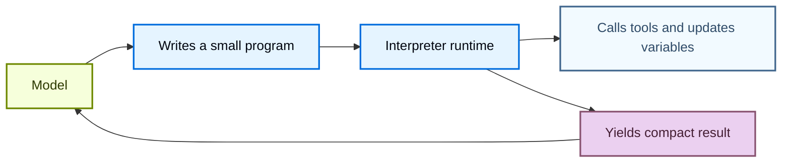
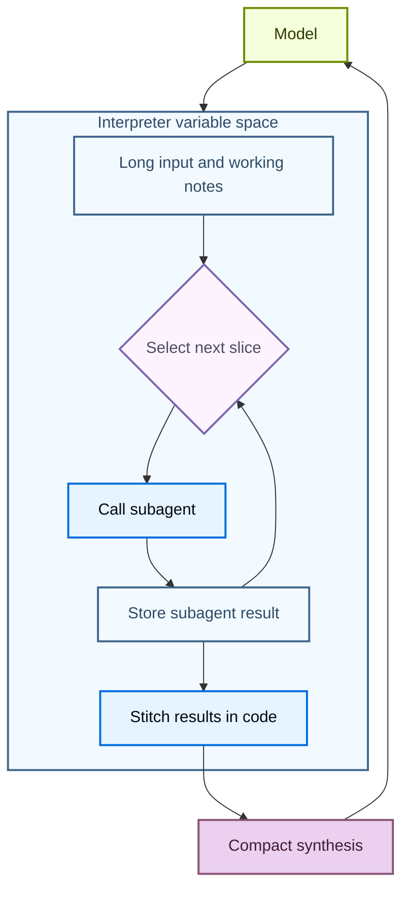

# Deep Agents 인터프리터 (Interpreters)

> 원문: https://docs.langchain.com/oss/python/deepagents/interpreters
>
> Deep Agents 내부에서 가벼운 코드를 실행하여 도구를 조합하고, 서브에이전트를 오케스트레이션하며, 구조화된 데이터를 변환합니다.

---

## 📖 목차

1. [📌 인터프리터란?](#-인터프리터란)
2. [🎯 언제 인터프리터를 사용해야 할까?](#-언제-인터프리터를-사용해야-할까)
3. [🛣️ 적절한 실행 경로 선택](#-적절한-실행-경로-선택)
4. [🚀 에이전트에 인터프리터 추가하기](#-에이전트에-인터프리터-추가하기)
5. [▶️ 인터프리터에서 코드 실행](#-인터프리터에서-코드-실행)
6. [🧩 프로그래매틱 도구 호출 (PTC)](#-프로그래매틱-도구-호출-ptc)
7. [🔁 재귀 언어 모델 (Recursive language models)](#-재귀-언어-모델-recursive-language-models)
8. [🧠 인터프리터 스킬 (Interpreter skills)](#-인터프리터-스킬-interpreter-skills)
9. [📸 스냅샷과 타임 트래블](#-스냅샷과-타임-트래블)
10. [🔒 보안과 제한 사항](#-보안과-제한-사항)
11. [⚙️ 미들웨어 옵션](#-미들웨어-옵션)

---

인터프리터는 에이전트에게 프로그래밍 가능한 작업 공간을 제공하여, 데이터를 탐색하고, 도구 호출을 조정하며, 중간 작업물을 모델 컨텍스트 밖에 둘 수 있도록 해줍니다. 에이전트는 의도를 코드로 표현하고, **인메모리(in-memory)** 런타임이 그 코드를 실행한 뒤 필요한 결과만 반환합니다.

[샌드박스](https://docs.langchain.com/oss/python/deepagents/sandboxes)가 환경에 대해 작용하는(예: 명령 실행, 의존성 설치, 파일 편집) 코드 중심 방법이라면, 인터프리터는 **에이전트 루프 내부**에서 작용하는 코드 중심 방법으로, 도구를 조합하고 상태를 보존하며 모델로 돌려보낼 정보를 결정합니다.

> ⚠️ 인터프리터는 실험적(experimental) 기능입니다. API와 라이프사이클 동작이 릴리스 사이에 변경될 수 있습니다.

> ℹ️ 인터프리터는 `langchain-quickjs>=0.1.0`과 Python `>=3.11`을 요구합니다.

---

## 📌 인터프리터란?

인터프리터는 에이전트가 작은 프로그램을 작성·실행하여 도구 호출을 조합하고, 변수에 중간 상태를 저장하며, 모델 컨텍스트로 돌려보낼 결과를 선별할 수 있게 해 주는 인메모리 코드 실행 환경입니다. [**QuickJS**](https://github.com/quickjs-ng/quickjs)라는 임베디드 실행 환경용으로 설계된 경량 JavaScript 런타임에서 코드를 실행하며, 기본적으로 호스트의 파일 시스템·네트워크·셸·패키지·시계 API를 노출하지 않습니다.

QuickJS는 인터프리터 코드의 실행 경계 역할을 합니다. 명시적인 브릿지(예: 프로그래매틱 도구 호출)가 코드에서 사용할 수 있는 기능을 결정합니다.

---

## 🎯 언제 인터프리터를 사용해야 할까?

대부분의 에이전트 작업은 모델 추론과 도구 실행 사이를 오갑니다. 단순한 동작이라면 이 방식이 잘 동작하지만, 에이전트가 여러 단계를 조합하거나 구조화된 데이터를 추론하거나 중간 상태를 관리해야 할 때는 어색해집니다.

인터프리터는 이런 작업을 위한 런타임을 에이전트에게 제공합니다. 모델이 한 도구 호출씩 다음 단계를 결정하는 대신, 에이전트가 제어 흐름을 실행하고 허용된 도구를 호출하며 변수를 저장하고 모델에게는 압축된 결과만 반환하는 작은 프로그램을 작성할 수 있습니다.

다음과 같은 경우에 인터프리터를 사용하세요.

- 코드를 사용해 여러 도구 호출을 조합하기 — 루프, 분기, 재시도, 동시성 포함
- 작업을 집중된 호출로 나누고, 결과를 저장한 뒤 코드로 최종 합성에 엮어 서브에이전트를 코드에서 조정하기
- 모든 임시 결과를 모델 컨텍스트로 되돌려 보내는 대신 중간 값을 런타임 상태에 보존하기
- 정렬, 그룹화, 파싱, 검증, 점수화, 집계 등 구조화된 데이터를 결정론적으로 변환하기
- 큰 변수 공간을 탐색하고 선별된 근거·요약·결과만 모델에 반환하기



---

## 🛣️ 적절한 실행 경로 선택

| 필요한 작업 | 권장 방법 |
|--------------|-----------|
| 한두 개의 단순한 외부 호출 | 일반적인 도구 호출(Normal tool calling) |
| 루프·분기·재시도·집계가 있는 작은 프로그램 | 인터프리터(Interpreter) |
| 코드에서 다수의 선택적 도구 호출이 필요한 경우 | 인터프리터 + 프로그래매틱 도구 호출 |
| 스레드 간 재사용 가능한 헬퍼 | 인터프리터 + [인터프리터 스킬](https://docs.langchain.com/oss/python/deepagents/skills#use-interpreter-skills) |
| 셸 명령, 패키지 설치, 테스트, 전체 OS 파일 시스템 접근 | [샌드박스](https://docs.langchain.com/oss/python/deepagents/sandboxes) |

---

## 🚀 에이전트에 인터프리터 추가하기

QuickJS 미들웨어 패키지를 설치한 다음, 에이전트 생성 시 미들웨어로 추가합니다.

```bash
pip install -U "deepagents[quickjs]"
```

```python
from deepagents import create_deep_agent
from langchain_quickjs import CodeInterpreterMiddleware

agent = create_deep_agent(
    model="openai:gpt-5.4",
    middleware=[CodeInterpreterMiddleware()],
)
```

---

## ▶️ 인터프리터에서 코드 실행

미들웨어는 에이전트에 `eval` 도구를 추가합니다. 이 도구는 영속적인 컨텍스트에서 TypeScript를 실행하고, `console.log`를 캡처하며, 마지막 표현식의 결과를 반환합니다.

에이전트는 다음과 같은 코드를 작성할 수 있습니다.

```javascript
const rows = [
  { team: "alpha", score: 8 },
  { team: "beta", score: 13 },
  { team: "alpha", score: 21 },
];

const totals = rows.reduce((acc, row) => {
  acc[row.team] = (acc[row.team] ?? 0) + row.score;
  console.log(`${row.team} score: ${acc[row.team]}`)
  return acc;
}, {});

totals;
```

기본적으로 인터프리터 상태는 매 에이전트 실행 종료 후 작업 상태를 스냅샷하고 다음 실행 직전에 복원하는 방식으로, 같은 스레드의 턴 사이에서도 영속됩니다.

---

## 🧩 프로그래매틱 도구 호출 (PTC)

프로그래매틱 도구 호출(Programmatic Tool Calling, PTC)은 선택된 에이전트 도구를 인터프리터 내부의 전역 `tools` 네임스페이스에 노출합니다. 모델이 도구 호출을 하나씩 발행하고 결과를 기다린 뒤 다음 호출을 결정하는 대신, 에이전트가 루프·분기·재시도·병렬 배치로 도구를 호출하는 코드를 직접 작성할 수 있습니다.

이는 중간 도구 결과가 다음 단계의 입력일 뿐인 경우에 유용합니다. 인터프리터가 결과를 처리·필터링·집계한 뒤에야 모델 컨텍스트로 돌려보내므로, 멀티 도구/멀티 스텝 워크플로의 토큰 효율을 높일 수 있습니다.

Deep Agents에서 PTC는 모델에 종속되지 않습니다(model-agnostic). 프로바이더 특화 코드 실행 또는 도구 호출 API가 아닌 미들웨어로 구현되어 있습니다.

### 작동 방식

1. `ptc` allowlist로 인터프리터가 호출할 수 있는 도구를 선택합니다.
2. 미들웨어가 그 도구들을 `tools` 아래에 비동기 JavaScript 함수로 노출합니다.
3. 에이전트가 `await`로 그 함수들을 호출하는 인터프리터 코드를 작성합니다.
4. 인터프리터가 도구 브릿지를 실행하고 결과를 받아 코드 실행을 이어갑니다.
5. 모델은 모든 중간 값이 아니라 최종 인터프리터 출력만 받습니다.

allowlist에 등록된 각 도구는 비동기 함수가 됩니다. 도구 이름은 카멜케이스로 변환되지만, 입력 객체는 여전히 도구의 스키마를 따릅니다. 예를 들어 `web_search` 도구는 `tools.webSearch(...)`가 됩니다.

```typescript
const result: string = await tools.webSearch({
  query: "deepagents interpreters",
});
```

### 유용한 패턴

| **패턴** | **인터프리터로 할 수 있는 것** |
|----------|---------------------------------|
| 배치 처리 | 다수의 입력에 대해 반복하며 각 항목마다 도구 호출 |
| 병렬 작업 | 독립된 호출에 대해 `Promise.all` 사용 |
| 조건부 로직 | 이전 결과를 기반으로 다음 도구 호출 결정 |
| 조기 종료 | 성공 조건이 충족되면 도구 호출 중단 |
| 데이터 필터링 | 관련된 행·스니펫·에러·요약만 모델에 반환 |
| 재귀적 오케스트레이션 | `task`를 반복 호출하고 서브에이전트 결과를 코드로 결합 |

### PTC 활성화

명시적인 allowlist로 PTC를 활성화합니다.

```python
from deepagents import create_deep_agent
from langchain_quickjs import CodeInterpreterMiddleware

agent = create_deep_agent(
    model="openai:gpt-5.4",
    middleware=[CodeInterpreterMiddleware(ptc=["task"])],
)
```

PTC가 활성화되면, 에이전트는 인터프리터 코드에서 허용된 도구를 호출할 수 있습니다. 다음 예시는 여러 서브에이전트를 병렬로 실행하고 최종 보고서를 결합하여 모델에 반환합니다.

```javascript
const topics = ["retrieval", "memory", "evaluation"];

const reports = await Promise.all(
  topics.map((topic) =>
    tools.task({
      description: `Research ${topic} in Deep Agents and return three concise findings.`,
      subagent_type: "general-purpose",
    }),
  ),
);

reports.join("\n\n");
```

코드이기 때문에 실패도 로컬에서 처리할 수 있습니다.

```javascript
try {
  const report = await tools.task({
    description: "Check the migration notes and return breaking changes.",
    subagent_type: "general-purpose",
  });
  console.log(report);
} catch (error) {
  console.log(`Subagent failed: ${error.message}`);
}
```

> ⚠️ PTC 호출은 현재 인터프리터 브릿지를 통해 실행되며 일반적인 도구 호출 경로를 거치지 않습니다. 따라서 `interrupt_on` 승인 워크플로는 PTC로 호출되는 도구마다 적용되지 **않습니다**.

---

## 🔁 재귀 언어 모델 (Recursive language models)

재귀 언어 모델은 인터프리터를 분해(decomposition)를 위한 작업 공간으로 사용합니다. 모델은 큰 입력이나 작업 집합을 런타임 변수에 보관하고, 그것을 검사·분할하는 코드를 작성하고, 작은 조각에 대해 서브에이전트나 다른 모델 도구를 호출한 뒤, 반환된 결과를 코드로 다시 엮습니다.

이 방식은 **변수 공간**과 **에이전트의 컨텍스트**를 분리합니다. 변수 공간은 인터프리터에 저장된 정보이고, 에이전트 컨텍스트는 다음 모델 호출에서 실제로 처리하는 내용입니다. 모델은 어떤 스니펫이 서브에이전트 작업이 될지, 어떤 결과가 추가 처리가 필요한지, 그리고 최종 합성이 메인 대화로 무엇을 반환해야 하는지 결정할 수 있습니다.



이 패턴의 배경은 [Recursive Language Models 논문](https://arxiv.org/abs/2512.24601)을 참고하세요.

Deep Agents에서 재귀 호출은 종종 프로그래매틱 도구 호출을 통해 노출된 `task` 도구입니다. 인터프리터는 여러 조각에 대해 서브에이전트를 호출하고, 답변을 결합한 뒤, 합성된 결과 하나를 반환할 수 있습니다.

```javascript
const candidates = notes
  .filter((note) => note.includes("migration"))
  .slice(0, 5);

const riskReports = await Promise.all(
  candidates.map((note) =>
    tools.task({
      description: `Analyze this migration note for release risk. Return risks, affected users, and recommended follow-up:\n\n${note}`,
      subagent_type: "general-purpose",
    }),
  ),
);

const releaseSummary = riskReports
  .map((report, index) => `## Candidate ${index + 1}\n${report}`)
  .join("\n\n");

releaseSummary;
```

---

## 🧠 인터프리터 스킬 (Interpreter skills)

인터프리터 스킬은 코드 모듈을 인터프리터에 노출하는 [스킬](https://docs.langchain.com/oss/python/deepagents/skills)입니다. 인터프리터 미들웨어와 함께 구성하면, 에이전트는 코드에서 이 모듈들을 import하여 결정론적인 헬퍼 로직으로 사용할 수 있습니다.

인터프리터 스킬은 정렬, 그룹화, 점수화, 파싱, 검증, 집계 같은 구조화된 데이터 워크플로용 재사용 가능한 헬퍼가 필요할 때 유용합니다. 설정 방법은 [Interpreter skills](https://docs.langchain.com/oss/python/deepagents/skills#use-interpreter-skills)을 참고하세요.

---

## 📸 스냅샷과 타임 트래블

`CodeInterpreterMiddleware`는 기본적으로 각 에이전트 실행 종료 후 인터프리터 상태를 스냅샷하고, 다음 실행 직전에 복원합니다. **스냅샷**은 에이전트가 코드 실행을 마쳤을 때 존재하는 인터프리터의 인메모리 JavaScript 상태(전역, 변수, 함수, import된 모듈)를 직렬화한 사본입니다.

대화 턴 간 라이프사이클은 다음과 같습니다.

1. 턴이 시작되면, `CodeInterpreterMiddleware`가 해당 스레드의 최신 인터프리터 스냅샷을 복원합니다.
2. 에이전트가 `eval`을 호출하고, 코드가 인터프리터 변수를 읽거나 변경할 수 있습니다.
3. 에이전트 실행이 끝나면, 미들웨어가 업데이트된 인터프리터 상태를 그래프 상태에 스냅샷합니다.
4. 다음 턴은 빈 런타임이 아니라 그 복원된 상태에서 시작됩니다.

단일 에이전트 실행 안에서 반복되는 `eval` 호출은 라이브 인터프리터 컨텍스트 객체를 사용합니다. 미들웨어는 호출 사이에 스냅샷/복원을 하지 않고, 실행이 완료될 때만 컨텍스트를 스냅샷하여 이후 턴이나 체크포인트 재생 시 복원할 수 있도록 합니다.

> ℹ️ 대화 턴 사이의 스냅샷은 합리적으로 직렬화 가능한 값만 보존합니다. 라이브 런타임 객체가 아니라 데이터에 사용하세요. 함수, 클래스, 그 외 직렬화 불가능한 값은 접근 불가능한 아티팩트로 복원됩니다. 인터프리터 코드가 복원 이후 이런 값에 접근하면, eval 도구는 `Value for 'fn' was not restored because it is not serializable (type: function).` 같은 오류를 발생시킵니다.

스냅샷은 인터프리터 메모리를 보존할 뿐, 외부 효과는 되돌리지 않습니다. PTC를 통해 인터프리터 코드가 도구를 호출했다면, 이전 인터프리터 스냅샷을 복원해도 해당 도구 호출의 부수 효과는 되돌릴 수 없습니다. 결과를 기록하거나 처리한 인터프리터 변수만 복원될 뿐입니다.

그래프가 체크포인터를 사용할 때, 이는 [LangGraph 타임 트래블](https://docs.langchain.com/oss/python/langgraph/use-time-travel)과 결합됩니다. 그래프 체크포인트를 복원하면 그래프 상태에 저장된 인터프리터 스냅샷도 복원되므로, 디버깅이나 재생 시 이전 에이전트 컨텍스트와 인터프리터 상태로 돌아갈 수 있습니다.

```python
from deepagents import create_deep_agent
from langchain_quickjs import CodeInterpreterMiddleware
from langgraph.checkpoint.memory import MemorySaver

checkpointer = MemorySaver()

agent = create_deep_agent(
    model="openai:gpt-5.4",
    checkpointer=checkpointer,
    middleware=[
        CodeInterpreterMiddleware(
            snapshot_between_turns=True,  # Default
        )
    ],
)
```

`snapshot_between_turns=False`로 설정하면 턴 간 스냅샷을 비활성화할 수 있습니다.

---

## 🔒 보안과 제한 사항

인터프리터는 QuickJS를 사용해 신뢰할 수 없는 JavaScript를 엄격한 기본 격리 하에 실행합니다. 이를 **스코프가 제한된 인터프리터 런타임**으로 다루어야 하며, 완전한 프로덕션 샌드박스 백엔드로 보아서는 안 됩니다.

PTC를 통해 노출하는 모든 도구는 인터프리터 코드가 사용할 수 있는 외부 능력입니다. PTC allowlist를 권한 경계로 취급하세요. 에이전트가 필요로 하는 도구만 노출하고, 의도하지 않는 한 민감 시스템에 접근하거나 비용을 지출하거나 데이터를 변경하거나 무제한 네트워크를 호출할 수 있는 광범위한 도구를 브릿지하지 마세요.

| 기능 | 기본 제공 | 노출 방법 |
|------|----------|-----------|
| JavaScript 실행 | 예 | 인터프리터 미들웨어 추가 |
| 최상위 `await` | 예 | 인터프리터 코드에서 Promise 사용 |
| `console.log` 캡처 | 예 | `capture_console=False`로 비활성화 |
| 에이전트 도구 | 아니요 | PTC allowlist 추가 |
| 인터프리터 스킬 모듈 | 아니요 | `module` 항목 추가 후 `skills_backend` 또는 `skillsBackend` 구성 |
| 파일 시스템 접근 | 아니요 | PTC allowlist를 통해 [기본 내장 파일 시스템 도구](https://docs.langchain.com/oss/python/deepagents/harness#virtual-filesystem-access) 추가 |
| 네트워크 접근 | 아니요 | 특정 네트워크 도구를 PTC로 노출 |
| 벽시계/날짜 접근 | 아니요 | 필요 시 명시적 시간 도구 노출 |
| 셸 명령, 패키지 설치, 테스트, OS 수준 실행 | 아니요 | [샌드박스 백엔드](https://docs.langchain.com/oss/python/deepagents/sandboxes) 사용 |

> ℹ️ **코드 실행이 동작하는 방식**
>
> 인터프리터 코드는 별도의 VM이나 프로세스가 아니라 임베디드 QuickJS 컨텍스트에서 실행됩니다. Python에서는 이 런타임을 [`quickjs-rs`](https://github.com/langchain-ai/quickjs-rs)가 제공하며, 동일 프로세스 실행 경계는 [Security guide](https://github.com/langchain-ai/quickjs-rs#security)에 문서화되어 있습니다.
>
> 인터프리터는 능력(capability) 스코프 실행 레이어로 다루어야 하며, 호스트 메모리 격리 경계로 보아서는 안 됩니다. 신뢰할 수 없거나 반신뢰 상태의 코드를 다룬다면, 에이전트를 격리된 워커 프로세스나 컨테이너에서 실행하고 PTC allowlist를 좁게 유지하세요.

---

## ⚙️ 미들웨어 옵션

`CodeInterpreterMiddleware`는 다음 옵션을 받습니다.

| 키워드 인자 | 기본값 | 용도 |
|------------|--------|------|
| `memory_limit` | `64 * 1024 * 1024` <br />(64 MB) | QuickJS 힙 메모리 한도(바이트) |
| `timeout` | `5.0` | eval당 타임아웃(초) |
| `max_ptc_calls` | `256` | eval당 최대 `tools.*` 호출 수. 신뢰된 환경에서만 `None` 사용 |
| `tool_name` | `"eval"` | 모델에 노출되는 인터프리터 도구 이름 |
| `max_result_chars` | `4000` | result/stdout 블록에서 반환되는 최대 문자 수 |
| `capture_console` | `True` | `console.log`, `console.warn`, `console.error` 출력 캡처 여부 |
| `ptc` | `None` | PTC allowlist: 도구 이름 또는 `BaseTool` 인스턴스 목록 |
| `skills_backend` | `None` | 인터프리터 스킬 모듈을 해석하는 백엔드 |
| `snapshot_between_turns` | `True` | 인터프리터 상태 스냅샷의 턴 간 유지 여부 |
| `max_snapshot_bytes` | `None` | 직렬화된 스냅샷의 최대 크기. 기본값은 `memory_limit` |

---

## 📚 참고

- [Skills](https://docs.langchain.com/oss/python/deepagents/skills) — 인터프리터 스킬 포함, 스킬 전반
- [Sandboxes](https://docs.langchain.com/oss/python/deepagents/sandboxes) — 셸/OS 수준 실행이 필요할 때
- [LangGraph 타임 트래블](https://docs.langchain.com/oss/python/langgraph/use-time-travel)
- [Recursive Language Models 논문](https://arxiv.org/abs/2512.24601)
- [`quickjs-rs` 보안 가이드](https://github.com/langchain-ai/quickjs-rs#security)
