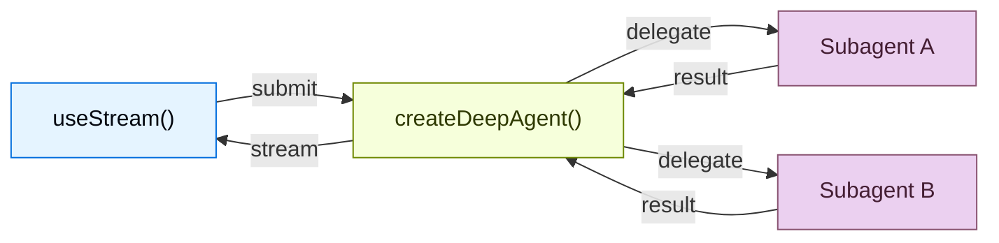

# Deep Agents Frontend: 개요 (Frontend Overview)

> 원문: https://docs.langchain.com/oss/python/deepagents/frontend/overview
>
> Deep Agents의 실시간 서브에이전트 스트림, 작업 진행 상황, 샌드박스를 표시하는 UI 구축

---

Deep Agent 워크플로를 실시간으로 시각화하는 프론트엔드를 구축하세요. 다음 패턴들은 `createDeepAgent`로 생성된 에이전트에서 서브에이전트의 진행 상황, 작업 계획, 스트리밍 콘텐츠, IDE와 같은 샌드박스 경험을 어떻게 렌더링하는지 보여줍니다.

---

## 🧩 아키텍처 (Architecture)

Deep Agents는 **코디네이터-워커(coordinator-worker)** 아키텍처를 사용합니다. 메인 에이전트가 작업을 계획하고, 격리된 환경에서 실행되는 전문화된 서브에이전트들에게 작업을 위임합니다. 프론트엔드에서는 `useStream`이 코디네이터의 메시지와 각 서브에이전트의 스트리밍 상태를 모두 표면화(surface)합니다.



```python
from deepagents import create_deep_agent

agent = create_deep_agent(
    model="google_genai:gemini-3.1-pro-preview",
    tools=[get_weather],
    system_prompt="You are a helpful assistant",
    subagents=[
        {
            "name": "researcher",
            "description": "Research assistant",
        }
    ],
)
```

프론트엔드에서는 `createAgent`와 동일한 방식으로 `useStream`을 사용해 연결합니다. Deep Agent 패턴에서는 `stream.subagents`, `stream.values.todos`, `filterSubagentMessages` 등 `useStream`의 추가 기능을 사용하여 서브에이전트 전용 UI를 렌더링합니다.

```ts
import { useStream } from "@langchain/react";

function App() {
  const stream = useStream<typeof agent>({
    apiUrl: "http://localhost:2024",
    assistantId: "agent",
  });

  // 메시지 외의 Deep Agent 상태
  const todos = stream.values?.todos;
  const subagents = stream.subagents;
}
```

---

## 🎨 패턴 (Patterns)

| 패턴 | 설명 |
|------|------|
| [**Subagent streaming**](https://docs.langchain.com/oss/python/deepagents/frontend/subagent-streaming) | 스트리밍 콘텐츠, 진행 상황 추적, 접을 수 있는 카드와 함께 전문 서브에이전트(specialist subagent)를 표시 |
| [**Todo list**](https://docs.langchain.com/oss/python/deepagents/frontend/todo-list) | 에이전트 상태에서 동기화된 실시간 todo 리스트로 에이전트 진행 상황 추적 |
| [**Sandbox**](https://docs.langchain.com/oss/python/deepagents/frontend/sandbox) | 파일 브라우저, 코드 뷰어, 샌드박스 기반 diff 패널을 갖춘 IDE 스타일 UI 구축 |

---

## 📚 관련 패턴 (Related patterns)

마크다운 메시지, 도구 호출, Human-in-the-loop 등 [LangChain 프론트엔드 패턴](https://docs.langchain.com/oss/python/langchain/frontend/overview)들은 모두 Deep Agents에서도 동작합니다. Deep Agents는 동일한 LangGraph 런타임 위에 구축되어 있어, `useStream`은 동일한 핵심 API를 제공합니다.
