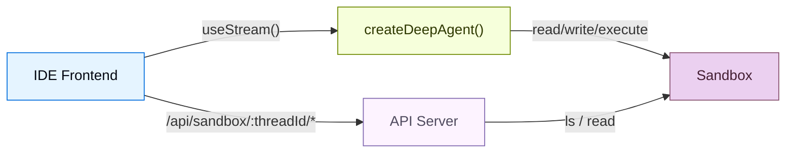
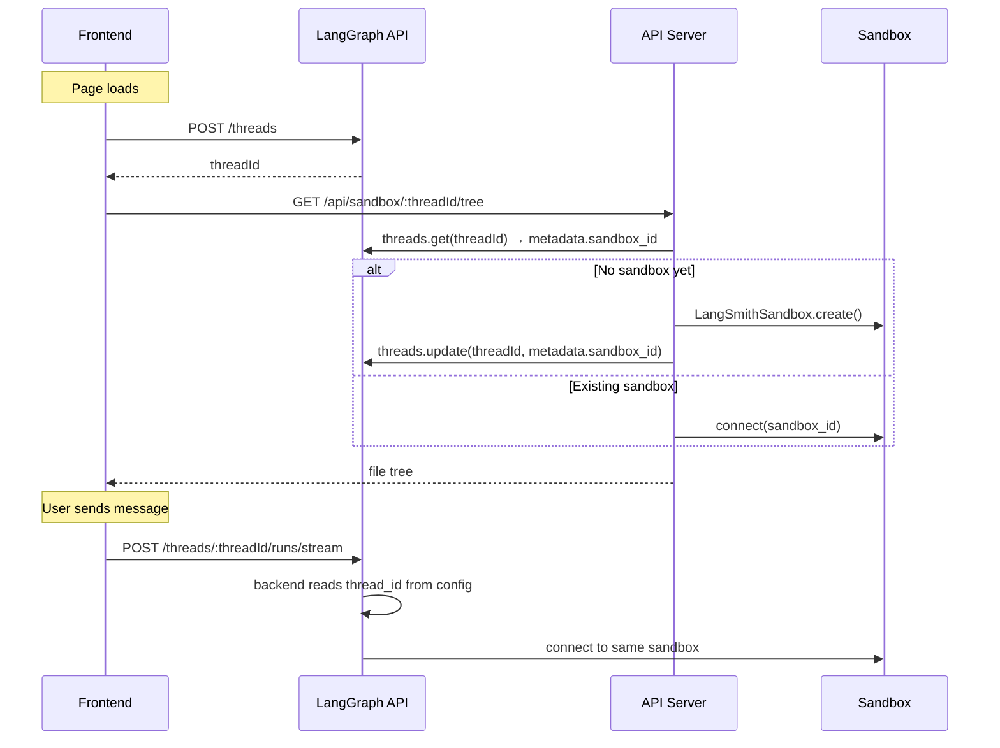

# Deep Agents Frontend: 샌드박스 (Sandbox)

> 원문: https://docs.langchain.com/oss/python/deepagents/frontend/sandbox
>
> 샌드박스 환경에 연결된 코딩 에이전트를 위한 IDE 스타일 UI 구축

---

## 📖 목차

1. [개요](#개요)
2. [🧩 아키텍처](#-아키텍처-architecture)
3. [⚙️ 샌드박스 라이프사이클](#️-샌드박스-라이프사이클-sandbox-lifecycle)
4. [🛠️ 에이전트 설정](#️-에이전트-설정-setting-up-the-agent)
5. [📡 파일 브라우징 API 추가](#-파일-브라우징-api-추가-adding-the-file-browsing-api)
6. [🎨 프론트엔드 구축](#-프론트엔드-구축-building-the-frontend)
7. [🖥️ 세 패널 레이아웃](#️-세-패널-레이아웃-the-three-panel-layout)
8. [💡 사용 사례](#-사용-사례-use-cases)
9. [📝 모범 사례](#-모범-사례-best-practices)

---

## 개요

코딩 에이전트에는 채팅 창 이상의 것이 필요합니다. 파일 브라우저, 코드 뷰어, diff 패널 등 **IDE 경험**이 필요합니다. 이 패턴은 deep agent를 [샌드박스(sandbox)](https://docs.langchain.com/oss/python/deepagents/sandboxes)에 연결하여 격리된 환경에서 코드를 읽고, 쓰고, 실행할 수 있게 한 다음, 커스텀 API 서버를 통해 샌드박스 파일 시스템을 노출하여 에이전트가 작업하는 동안 프론트엔드가 파일을 실시간으로 표시할 수 있도록 합니다.

---

## 🧩 아키텍처 (Architecture)

샌드박스 패턴은 세 개의 계층(layer)으로 구성됩니다.

1. **샌드박스 백엔드가 연결된 deep agent**: 에이전트가 샌드박스로부터 파일 시스템 도구(`read_file`, `write_file`, `edit_file`, `execute`)를 자동으로 부여받습니다.
2. **커스텀 API 서버**: `langgraph.json`의 `http.app` 필드를 통해 노출되는 FastAPI 애플리케이션으로, 프론트엔드가 호출할 수 있는 파일 브라우징 엔드포인트를 제공합니다.
3. **IDE 프론트엔드**: 세 개의 패널 레이아웃(파일 트리, 코드/diff 뷰어, 채팅)으로 구성되어 있으며, 에이전트가 변경 사항을 만들 때마다 파일을 실시간으로 동기화합니다.



---

## ⚙️ 샌드박스 라이프사이클 (Sandbox lifecycle)

코드를 살펴보기 전에 샌드박스가 어떻게 **스코프(scope)** 되는지 이해하는 것이 중요합니다. 스코프 전략은 누가 샌드박스를 공유하는지, 얼마나 오래 유지되는지, 런타임에 어떻게 결정되는지를 결정합니다.

### 스레드 스코프 샌드박스 (권장)

각 LangGraph 스레드(thread)는 자신만의 샌드박스를 가집니다. 샌드박스 ID는 스레드의 메타데이터에 저장되며, 런타임에 `getConfig()`를 통해 해결(resolve)됩니다. 대부분의 애플리케이션에서 권장되는 접근 방식입니다.

* 대화가 격리됨 — 한 스레드의 파일 변경이 다른 스레드에 영향을 주지 않습니다.
* 페이지 새로고침 후에도 샌드박스 상태가 유지됩니다(같은 스레드 = 같은 샌드박스).
* 정리(cleanup)가 간단합니다. 스레드가 삭제되면 그 샌드박스도 함께 삭제할 수 있습니다.



### 에이전트 스코프 샌드박스

같은 어시스턴트(assistant) 아래의 모든 스레드가 하나의 샌드박스를 공유합니다. 대화를 넘어 변경 사항을 유지하고 싶은 영속적인 프로젝트 환경에 유용합니다.

```python
from langgraph.config import get_config

def get_sandbox_backend_for_assistant():
    config = get_config()
    assistant_id = config.get("metadata", {}).get("assistant_id")
    return get_or_create_sandbox_for_assistant(assistant_id)
```

### 사용자 스코프 샌드박스

각 사용자가 자신의 모든 스레드에 걸쳐 자신만의 샌드박스를 사용합니다. 커스텀 인증과 사용자 식별이 필요합니다.

```python
from langgraph.config import get_config

def get_sandbox_backend_for_user():
    config = get_config()
    user_id = config.get("configurable", {}).get("user_id")
    return get_or_create_sandbox_for_user(user_id)
```

### 세션 스코프 샌드박스 (클라이언트 측)

LangGraph 스레드 없이 더 단순한 앱에서는 프론트엔드가 세션 ID를 생성해 직접 전달할 수 있습니다. 이 방식은 브라우저 세션 간에는 유지되지 않으며, 데모나 프로토타이핑에 적합합니다.

```python
import uuid
import urllib.parse
import urllib.request

session_id = str(uuid.uuid4())
query = urllib.parse.urlencode({"sessionId": session_id})
urllib.request.urlopen(f"http://localhost:2024/api/sandbox/tree?{query}")
```

> 이 가이드의 나머지 부분은 **스레드 스코프 샌드박스**를 기본 예시로 사용합니다.

---

## 🛠️ 에이전트 설정 (Setting up the agent)

### 샌드박스 프로바이더 선택

Deep Agents는 여러 [샌드박스 프로바이더](https://docs.langchain.com/oss/python/integrations/sandboxes)를 지원합니다. `SandboxBackendProtocol`을 구현한 프로바이더라면 어떤 것이든 동작합니다.

```python
from deepagents import create_deep_agent
from deepagents.sandbox import LangSmithSandbox  # 또는 DaytonaSandbox 등

sandbox = LangSmithSandbox.create()
agent = create_deep_agent(model="google_genai:gemini-3.1-pro-preview", backend=sandbox)
```

에이전트는 자동으로 파일 시스템 도구(`read_file`, `write_file`, `edit_file`, `ls`, `glob`, `grep`)와 셸 명령 실행을 위한 `execute` 도구를 부여받습니다. 별도의 도구 설정이 필요하지 않습니다.

### 스레드별 샌드박스 결정 (Resolve)

모듈 레벨에서 샌드박스를 생성하면 모든 스레드가 공유하게 되고 만료될 수 있으므로, 런타임에 스레드별로 샌드박스를 해결(resolve)하는 것이 좋습니다. 샌드박스는 `getConfig()`를 통해 LangGraph config에서 `thread_id`를 읽습니다.

```python
from deepagents import create_deep_agent
from deepagents.sandbox import LangSmithSandbox
from langgraph.config import get_config


def get_or_create_sandbox_for_thread(thread_id: str) -> LangSmithSandbox:
    # thread_id 기반으로 샌드박스를 찾거나 생성
    ...


sandbox = LangSmithSandbox(
    resolve=lambda: get_or_create_sandbox_for_thread(
        get_config()["configurable"]["thread_id"]
    ),
)

agent = create_deep_agent(
    model="google_genai:gemini-3.1-pro-preview",
    backend=sandbox,
)
```

### 샌드박스 시드 (Seed)

에이전트가 실행되기 전에 `uploadFiles`를 사용해 프로젝트 파일로 샌드박스를 채워둡니다.

> ℹ️ **LangSmith** 샌드박스의 경우 컨테이너 이미지와 리소스 제한은 [샌드박스 스냅샷](https://docs.langchain.com/langsmith/sandbox-snapshots)에서 가져옵니다. 샌드박스 생성 시 `templateName`을 전달하세요(위의 `get_or_create_sandbox_for_thread` 참고). `upload_files`는 해당 이미지 위에서 런타임에 프로젝트 파일을 시드하거나 업데이트합니다.

```ts
const SEED_FILES: Record<string, string> = {
  "package.json": JSON.stringify({ name: "my-app", version: "1.0.0" }, null, 2),
  "src/index.js": 'console.log("Hello");',
};

const encoder = new TextEncoder();
await sandbox.uploadFiles(
  Object.entries(SEED_FILES).map(([path, content]) => [`/app/${path}`, encoder.encode(content)]),
);
```

> 💡 `package.json`을 업로드한 후 `sandbox.execute("cd /app && npm install")`를 실행해, 에이전트가 시작되기 전에 의존성을 설치하세요.

---

## 📡 파일 브라우징 API 추가 (Adding the file browsing API)

에이전트는 파일을 읽고 쓸 수 있지만, 프론트엔드도 샌드박스 파일 시스템을 직접 탐색할 수 있어야 합니다. 커스텀 [FastAPI](https://fastapi.tiangolo.com) API 서버를 추가하고 `langgraph.json`의 `http.app` 필드를 통해 노출하세요.

### API 서버 생성

샌드박스 API 엔드포인트는 스레드 ID를 URL 경로 파라미터로 사용합니다. 이를 통해 프론트엔드는 항상 현재 대화에 대한 올바른 샌드박스에 접근하며, 에이전트 백엔드와 동일한 `get_or_create_sandbox_for_thread` 함수를 사용합니다.

```python
# src/api/server.py
from fastapi import FastAPI, Query, Path
from utils import get_or_create_sandbox_for_thread

app = FastAPI()

@app.get("/api/sandbox/{thread_id}/tree")
async def list_tree(
    thread_id: str = Path(...),
    path: str = Query("/app"),
):
    sandbox = await get_or_create_sandbox_for_thread(thread_id)
    result = await sandbox.aexecute(
        f"find {path} -printf '%y\\t%s\\t%p\\n' 2>/dev/null | sort"
    )
    entries = []
    for line in result.output.strip().split("\n"):
        if not line:
            continue
        type_char, size_str, full_path = line.split("\t")
        entries.append({
            "name": full_path.split("/")[-1],
            "type": "directory" if type_char == "d" else "file",
            "path": full_path,
            "size": int(size_str),
        })
    return {"path": path, "entries": entries, "sandbox_id": sandbox.id}

@app.get("/api/sandbox/{thread_id}/file")
async def read_file(
    thread_id: str = Path(...),
    path: str = Query(...),
):
    sandbox = await get_or_create_sandbox_for_thread(thread_id)
    results = await sandbox.adownload_files([path])
    return {"path": path, "content": results[0].content.decode()}
```

> 📝 에이전트 백엔드와 API 서버 모두 동일한 `get_or_create_sandbox_for_thread` 함수를 호출합니다. 이렇게 하면 주어진 스레드에 대해 항상 동일한 샌드박스로 해결됩니다. 스레드 메타데이터의 샌드박스 ID가 단일 진실 공급원(single source of truth)이며, 인메모리 캐시가 필요하지 않습니다.

### `langgraph.json` 설정

에이전트 그래프와 API 서버를 모두 등록합니다. `http.app` 필드는 LangGraph 플랫폼에 기본 라우트와 함께 커스텀 라우트를 제공하도록 지시합니다.

```json
{
  "graphs": {
    "coding_agent": "./src/agents/my_agent.py:agent"
  },
  "env": ".env",
  "http": {
    "app": "./src/api/server.py:app"
  }
}
```

커스텀 라우트는 LangGraph API와 같은 호스트에서 사용할 수 있습니다. `langgraph dev`를 사용하는 로컬 개발 환경에서는 `http://localhost:2024`입니다.

> 📝 `http.app`에 정의된 커스텀 라우트가 기본 LangGraph 라우트보다 우선합니다. 즉 필요한 경우 기본 엔드포인트를 가릴 수 있지만, `/threads`나 `/runs` 같은 라우트를 실수로 덮어쓰지 않도록 주의해야 합니다.

---

## 🎨 프론트엔드 구축 (Building the frontend)

프론트엔드는 세 개의 패널을 가집니다. 파일 트리 사이드바, 코드/diff 뷰어, 채팅 패널입니다. 에이전트 대화에는 `useStream`을, 파일 브라우징에는 커스텀 API 엔드포인트를 사용합니다.

### 스레드 생성

페이지가 로드될 때 LangGraph 스레드를 생성하고, 그 ID를 `sessionStorage`에 영속화하여 페이지 새로고침 시 같은 샌드박스에 다시 연결되도록 합니다.

```tsx
const THREAD_KEY = "sandbox-thread-id";

function IDEPreview() {
  const [threadId, setThreadId] = useState<string | null>(
    () => sessionStorage.getItem(THREAD_KEY),
  );

  const updateThreadId = useCallback((id: string | null) => {
    setThreadId(id);
    if (id) sessionStorage.setItem(THREAD_KEY, id);
    else sessionStorage.removeItem(THREAD_KEY);
  }, []);

  const stream = useStream<typeof myAgent>({
    apiUrl: AGENT_URL,
    assistantId: "coding_agent",
    threadId,
    onThreadId: updateThreadId,
  });

  // 최초 마운트 시 스레드 생성
  useEffect(() => {
    if (threadId) return;
    stream.client.threads.create().then((t) => updateThreadId(t.thread_id));
  }, [stream.client, threadId, updateThreadId]);

  // 샌드박스 파일 훅에 threadId 전달
  const { tree, files } = useSandboxFiles(threadId);
  // ...
}
```

"새 스레드" 버튼은 저장된 ID를 지워, 다음 마운트 시 새로운 스레드(및 샌드박스)가 생성되도록 합니다.

```tsx
function handleNewThread() {
  stream.switchThread(null);
  updateThreadId(null);
}
```

### 파일 상태 관리

샌드박스 파일 시스템의 두 스냅샷을 추적합니다. **원본 상태**(에이전트 실행 전)와 **현재 상태**(실시간으로 업데이트). API URL에 스레드 ID가 포함되어 있어 요청은 항상 올바른 샌드박스에 도달합니다.

```ts
const AGENT_URL = "http://localhost:2024";

async function fetchTree(threadId: string): Promise<FileEntry[]> {
  const res = await fetch(
    `${AGENT_URL}/api/sandbox/${encodeURIComponent(threadId)}/tree?filePath=/app`,
  );
  const data = await res.json();
  return data.entries.filter((e: FileEntry) => !e.path.includes("node_modules"));
}

async function fetchFile(threadId: string, path: string): Promise<string | null> {
  const res = await fetch(
    `${AGENT_URL}/api/sandbox/${encodeURIComponent(threadId)}/file?filePath=${encodeURIComponent(path)}`,
  );
  const data = await res.json();
  return data.content ?? null;
}
```

### 실시간 파일 동기화

IDE 경험의 핵심은 에이전트가 끝난 **후**가 아니라, **작업하는 동안** 파일을 업데이트하는 것입니다. 파일을 변경하는 도구의 `ToolMessage` 인스턴스에 대해 스트림 메시지를 감시하세요. `write_file`이나 `edit_file` 도구 호출이 완료되면 해당 파일을 새로고침합니다. `execute`가 완료되면 모든 것을 새로고침합니다(셸 명령이 어떤 파일이든 수정할 수 있기 때문).

**React**

```tsx
import { useStream } from "@langchain/react";
import { ToolMessage, AIMessage } from "langchain";

const FILE_MUTATING_TOOLS = new Set(["write_file", "edit_file", "execute"]);

export function IDEPreview() {
  const stream = useStream<typeof myAgent>({
    apiUrl: AGENT_URL,
    assistantId: "coding_agent",
  });

  const processedIds = useRef(new Set<string>());

  useEffect(() => {
    // AI 메시지로부터 파일 변경 도구 호출 맵을 구성
    const toolCallMap = new Map();
    for (const msg of stream.messages) {
      if (!AIMessage.isInstance(msg)) continue;
      for (const tc of msg.tool_calls ?? []) {
        if (tc.id && FILE_MUTATING_TOOLS.has(tc.name)) {
          toolCallMap.set(tc.id, { name: tc.name, args: tc.args });
        }
      }
    }

    // 파일 변경 도구에 대한 ToolMessage가 도착하면 새로고침
    for (const msg of stream.messages) {
      if (!ToolMessage.isInstance(msg)) continue;
      const id = msg.id ?? msg.tool_call_id;
      if (!id || processedIds.current.has(id)) continue;

      const call = toolCallMap.get(msg.tool_call_id);
      if (!call) continue;
      processedIds.current.add(id);

      if (call.name === "write_file" || call.name === "edit_file") {
        refreshSingleFile(call.args.path);
      } else if (call.name === "execute") {
        refreshAllFiles();
      }
    }
  }, [stream.messages]);
}
```

**Vue**

```vue
<script setup lang="ts">
import { useStream } from "@langchain/vue";
import { ToolMessage, AIMessage } from "langchain";
import { watch } from "vue";

const FILE_MUTATING_TOOLS = new Set(["write_file", "edit_file", "execute"]);
const processedIds = new Set<string>();

const stream = useStream<typeof myAgent>({
  apiUrl: AGENT_URL,
  assistantId: "coding_agent",
});

watch(
  () => stream.messages.value,
  (messages) => {
    const toolCallMap = new Map();
    for (const msg of messages) {
      if (AIMessage.isInstance(msg)) {
        for (const tc of msg.tool_calls ?? []) {
          if (tc.id && FILE_MUTATING_TOOLS.has(tc.name)) {
            toolCallMap.set(tc.id, { name: tc.name, args: tc.args });
          }
        }
      }
    }

    for (const msg of messages) {
      if (!ToolMessage.isInstance(msg)) continue;
      const id = msg.id ?? msg.tool_call_id;
      if (!id || processedIds.has(id)) continue;

      const call = toolCallMap.get(msg.tool_call_id);
      if (!call) continue;
      processedIds.add(id);

      if (call.name === "write_file" || call.name === "edit_file") {
        refreshSingleFile(call.args.path);
      } else if (call.name === "execute") {
        refreshAllFiles();
      }
    }
  },
  { deep: true },
);
</script>
```

**Svelte**

```svelte
<script lang="ts">
  import { useStream } from "@langchain/svelte";
  import { ToolMessage, AIMessage } from "langchain";

  const FILE_MUTATING_TOOLS = new Set(["write_file", "edit_file", "execute"]);
  const processedIds = new Set<string>();

  const { messages, submit } = useStream<typeof myAgent>({
    apiUrl: AGENT_URL,
    assistantId: "coding_agent",
  });

  $effect(() => {
    const msgs = $messages;
    const toolCallMap = new Map();
    for (const msg of msgs) {
      if (AIMessage.isInstance(msg)) {
        for (const tc of msg.tool_calls ?? []) {
          if (tc.id && FILE_MUTATING_TOOLS.has(tc.name)) {
            toolCallMap.set(tc.id, { name: tc.name, args: tc.args });
          }
        }
      }
    }

    for (const msg of msgs) {
      if (!ToolMessage.isInstance(msg)) continue;
      const id = msg.id ?? msg.tool_call_id;
      if (!id || processedIds.has(id)) continue;

      const call = toolCallMap.get(msg.tool_call_id);
      if (!call) continue;
      processedIds.add(id);

      if (call.name === "write_file" || call.name === "edit_file") {
        refreshSingleFile(call.args.path);
      } else if (call.name === "execute") {
        refreshAllFiles();
      }
    }
  });
</script>
```

**Angular**

```ts
import { Component, effect } from "@angular/core";
import { useStream } from "@langchain/angular";
import { ToolMessage, AIMessage } from "langchain";

const FILE_MUTATING_TOOLS = new Set(["write_file", "edit_file", "execute"]);

@Component({
  selector: "app-ide-preview",
  template: `<!-- ... -->`,
})
export class IdePreviewComponent {
  stream = useStream<typeof myAgent>({
    apiUrl: AGENT_URL,
    assistantId: "coding_agent",
  });

  private processedIds = new Set<string>();

  constructor() {
    effect(() => {
      const messages = this.stream.messages();
      const toolCallMap = new Map();
      for (const msg of messages) {
        if (AIMessage.isInstance(msg)) {
          for (const tc of (msg as AIMessage).tool_calls ?? []) {
            if (tc.id && FILE_MUTATING_TOOLS.has(tc.name)) {
              toolCallMap.set(tc.id, { name: tc.name, args: tc.args });
            }
          }
        }
      }

      for (const msg of messages) {
        if (!ToolMessage.isInstance(msg)) continue;
        const id = (msg as ToolMessage).id ?? (msg as ToolMessage).tool_call_id;
        if (!id || this.processedIds.has(id)) continue;

        const call = toolCallMap.get((msg as ToolMessage).tool_call_id);
        if (!call) continue;
        this.processedIds.add(id);

        if (call.name === "write_file" || call.name === "edit_file") {
          this.refreshSingleFile(call.args.path);
        } else if (call.name === "execute") {
          this.refreshAllFiles();
        }
      }
    });
  }
}
```

### 변경된 파일 감지

각 에이전트 실행 전에 현재 파일 내용의 스냅샷을 찍습니다. 파일이 새로고침된 후 그 스냅샷과 비교하여 어떤 파일이 변경되었는지 식별합니다.

```ts
function detectChanges(current: FileSnapshot, original: FileSnapshot): Set<string> {
  const changed = new Set<string>();
  for (const [path, content] of Object.entries(current)) {
    if (original[path] !== content) changed.add(path);
  }
  for (const path of Object.keys(original)) {
    if (!(path in current)) changed.add(path);
  }
  return changed;
}
```

사용자가 변경된 파일을 선택하면 기본적으로 diff 뷰로 전환하여, 에이전트가 무엇을 수정했는지 즉시 볼 수 있게 하세요.

### Diff 표시

각 프레임워크에 맞는 diff 라이브러리를 사용해 통합(unified) diff를 렌더링합니다.

| Framework | Library                                                                    | Component                                                       |
| --------- | -------------------------------------------------------------------------- | --------------------------------------------------------------- |
| React     | [`@pierre/diffs`](https://diffs.com)                                       | `<FileDiff>` + `parseDiffFromFile`                              |
| Vue       | [`@git-diff-view/vue`](https://github.com/MrWangJustToDo/git-diff-view)    | `<DiffView>` + `@git-diff-view/file`의 `generateDiffFile`       |
| Svelte    | [`@git-diff-view/svelte`](https://github.com/MrWangJustToDo/git-diff-view) | `<DiffView>` + `@git-diff-view/file`의 `generateDiffFile`       |
| Angular   | [`ngx-diff`](https://github.com/rars/ngx-diff)                             | `<ngx-unified-diff>` + `[before]` / `[after]`                   |

`@pierre/diffs` 예시 (React):

```tsx
import { FileDiff } from "@pierre/diffs/react";
import { parseDiffFromFile } from "@pierre/diffs";

function DiffPanel({ original, current, fileName }) {
  const diff = parseDiffFromFile(
    { name: fileName, contents: original },
    { name: fileName, contents: current },
  );

  return (
    <FileDiff
      fileDiff={diff}
      options={{ theme: "github-dark", diffStyle: "unified", diffIndicators: "bars" }}
    />
  );
}
```

### 변경된 파일 요약

수정된 모든 파일의 줄 단위 추가/삭제 카운트와 함께 요약을 보여줍니다. `git status`처럼 에이전트의 영향을 빠르게 개관할 수 있게 해 줍니다.

```tsx
function ChangedFilesSummary({ changedFiles, files, originalFiles, onSelect }) {
  const stats = [...changedFiles].map((path) => {
    const oldLines = (originalFiles[path] ?? "").split("\n");
    const newLines = (files[path] ?? "").split("\n");
    // 줄을 비교하여 추가/삭제를 계산
    return { path, additions, deletions };
  });

  return (
    <div>
      <h3>{stats.length} Files Changed</h3>
      {stats.map((file) => (
        <button key={file.path} onClick={() => onSelect(file.path)}>
          {file.path}
          <span className="text-green-400">+{file.additions}</span>
          <span className="text-red-400">-{file.deletions}</span>
        </button>
      ))}
    </div>
  );
}
```

---

## 🖥️ 세 패널 레이아웃 (The three-panel layout)

IDE 레이아웃은 세 패널을 나란히 배치합니다.

| 패널        | 너비           | 용도                                       |
| ----------- | -------------- | ------------------------------------------ |
| 파일 트리    | 고정 (208px)   | 샌드박스 파일 탐색, 변경 표시 확인           |
| 코드 / Diff | 가변(Flexible) | 파일 내용 또는 통합 diff 표시               |
| 채팅        | 고정 (320px)   | 에이전트와의 상호작용                       |

```tsx
<div className="flex h-screen">
  <div className="w-52 shrink-0">
    <FileTree />
    <ChangedFilesSummary />
  </div>

  <CodePanel /* flex-1 */ />

  <div className="w-80 shrink-0">
    <ChatPanel />
  </div>
</div>
```

파일 트리에는 ([`@iconify-json/vscode-icons`](https://www.npmjs.com/package/@iconify-json/vscode-icons)를 사용한) VS Code 스타일 아이콘과 수정된 파일에 표시되는 황색(amber) 점이 표시됩니다. 수정된 파일을 선택하면 자동으로 diff 탭으로 전환됩니다.

---

## 💡 사용 사례 (Use cases)

다음과 같은 경우에 샌드박스가 올바른 선택입니다.

* **코딩 에이전트**가 코드를 만들고, 수정하고, 실행할 때 채팅 이상의 시각적 인터페이스가 필요한 경우
* **코드 리뷰 워크플로**에서 에이전트가 변경을 제안하고 사용자가 수락 전에 diff를 검토하는 경우
* **튜토리얼 또는 학습 앱**에서 AI 어시스턴트가 사용자가 프로젝트를 단계별로 만드는 것을 도우면서 컨텍스트 안에서 변경 사항을 보여주는 경우
* **프로토타이핑 도구**에서 사용자가 자연어로 기능을 설명하고 에이전트가 실시간으로 구현하는 것을 지켜보는 경우

---

## 📝 모범 사례 (Best practices)

* **프로덕션 앱에는 스레드 스코프 샌드박스를 사용하세요.** 샌드박스 ID를 스레드 메타데이터에 저장하고, 런타임에 `getConfig()`를 통해 결정합니다. 모듈 레벨 상태를 피하면서 대화별로 샌드박스를 격리합니다.
* **에이전트 백엔드와 API 서버 간에 `getOrCreateSandboxForThread`를 공유하세요.** 둘 다 동일한 방식(스레드 메타데이터를 통해)으로 샌드박스를 해결해야 하므로, 단일 진실 공급원이 되며 인메모리 캐시가 필요하지 않습니다.
* **`threadId`를 `sessionStorage`에 영속화하세요.** 페이지 새로고침 시 새 스레드와 샌드박스를 만드는 대신 같은 스레드/샌드박스에 다시 연결됩니다.
* **실행이 끝난 후가 아니라 관련 도구 호출마다 파일을 동기화하세요.** 이렇게 하면 IDE가 "살아 있는" 느낌을 줍니다. `write_file`, `edit_file`, `execute` 도구 메시지를 감시하고 즉시 새로고침하세요.
* **변경된 파일은 diff 뷰를 기본값으로 하세요.** 사용자가 에이전트가 수정한 파일을 클릭하면 먼저 diff를 보여주세요. 그것이 사용자가 관심 있는 부분입니다.
* **읽기 전용 작업은 콤팩트한 도구 결과를 표시하세요.** 채팅에 `read_file` 전체 출력을 쏟아내는 대신 `Read router.js L1-42` 같은 한 줄짜리 표시를 사용하세요. 전체 출력 표시는 변경(mutating) 도구에 한정하세요.
* **샌드박스를 실제 프로젝트로 시드하세요.** 빈 샌드박스에서 시작하면 혼란스럽습니다. 작동하는 스타터 프로젝트를 업로드해 사용자(와 에이전트)가 곧바로 컨텍스트를 가질 수 있게 하세요.
* **파일 트리에서 `node_modules`를 필터링하세요.** 수천 개의 의존성 파일을 둘러보고 싶은 사람은 없습니다. 트리를 가져올 때 필터링하세요.
